GDP Prediction
================
Nikhil Gupta
2020-03-23 10:45:01

-   [Setup](#setup)
-   [CCF Analysis](#ccf-analysis)
-   [Usig tswgewrapped](#usig-tswgewrapped)
    -   [Multivariate Compare Object](#multivariate-compare-object)
        -   [AIC BIC Full Data](#aic-bic-full-data)
        -   [Tabular Metrics](#tabular-metrics)
        -   [Remove unwanted models](#remove-unwanted-models)
        -   [Simple Forecasts](#simple-forecasts)
        -   [Batch Forecasts](#batch-forecasts)
        -   [Batch ASEs](#batch-ases)
        -   [ASE Histograms](#ase-histograms)
        -   [Statistical Compare](#statistical-compare)
-   [Manual Method](#manual-method)
    -   [VARselect](#varselect)
    -   [VAR Model](#var-model)
    -   [Predictions](#predictions)
        -   [ASE](#ase)
        -   [Plots](#plots)

Setup
-----

``` r
library(tswge)
library(tswgewrapped)
library(tidyverse)
library(ggplot2)
library(tseries)
library(RColorBrewer)
```

``` r
data = read.csv("../data/economic_indicators_all_ex_3mo_china.csv")
data %>% glimpse()
```

    ## Observations: 195
    ## Variables: 15
    ## $ date            <fct> 1971 Q1, 1971 Q2, 1971 Q3, 1971 Q4, 1972 Q1, 1...
    ## $ gdp_change      <dbl> 18.2, 7.7, 7.6, 4.4, 14.3, 12.1, 7.9, 12.4, 15...
    ## $ unrate          <dbl> 6.0, 5.9, 6.0, 6.0, 5.8, 5.7, 5.5, 5.2, 4.9, 4...
    ## $ nfjobs          <int> 70860, 71254, 71614, 72109, 72944, 73758, 7426...
    ## $ treas10yr       <dbl> 5.53, 6.70, 6.00, 5.89, 6.12, 6.15, 6.54, 6.41...
    ## $ fedintrate      <dbl> 3.71, 4.91, 5.55, 4.14, 3.83, 4.46, 4.87, 5.33...
    ## $ personincomechg <dbl> 4.7, 4.9, 3.8, 5.2, 3.6, 3.2, 4.7, 7.6, 7.9, 7...
    ## $ cpi             <dbl> 40.0, 40.6, 40.8, 41.1, 41.4, 41.7, 42.1, 42.5...
    ## $ population      <int> 206960, 207562, 208230, 208829, 209299, 209811...
    ## $ corpprofitchg   <dbl> 12.7497657, 3.7704482, 6.6068568, 3.2925583, 5...
    ## $ crude_wti       <dbl> 3.56, 3.56, 3.56, 3.56, 3.56, 3.56, 3.56, 3.56...
    ## $ ppi             <dbl> 37.8, 38.2, 38.3, 38.6, 39.2, 39.7, 40.2, 41.1...
    ## $ gold            <dbl> 38.800, 40.200, 42.475, 43.500, 48.375, 64.100...
    ## $ japan           <dbl> 357.5187, 357.4118, 338.0210, 320.0727, 302.53...
    ## $ uk              <dbl> 2.4187, 2.4188, 2.4694, 2.5266, 2.6181, 2.5691...

``` r
data = data %>% dplyr::select(-date, fedintrate)
```

CCF Analysis
============

``` r
lag.max = 12
```

``` r
var_interest = 'gdp_change'

for (name in colnames(data)){
  # By convention, the X2 variable comes first
  c = ccf(data[name], data[var_interest], lag.max = lag.max)
  index = which(abs(c$acf[,1,1]) == max(abs(c$acf[,1,1])))
  max_ccf = c$lag[,1,1][index] 
  cat(paste("\nFor variable: ", name, " , max cross-correlation is at lag: ", max_ccf, sep = ""))
}
```

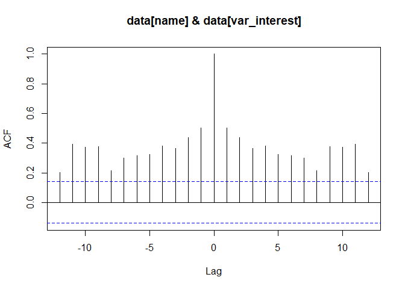

    ## 
    ## For variable: gdp_change , max cross-correlation is at lag: 0

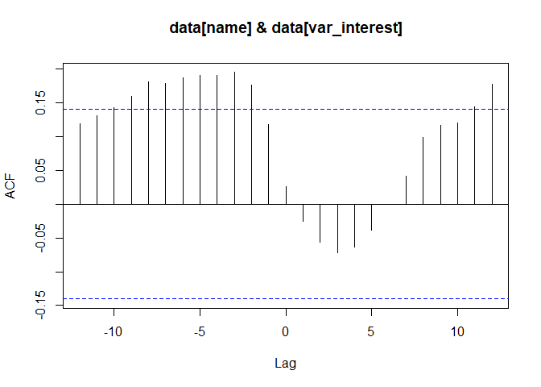

    ## 
    ## For variable: unrate , max cross-correlation is at lag: -3

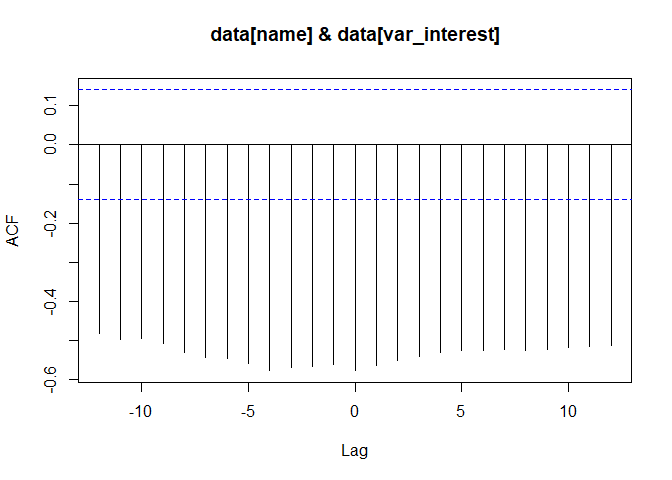

    ## 
    ## For variable: nfjobs , max cross-correlation is at lag: 0

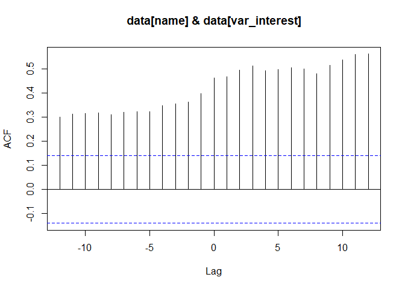

    ## 
    ## For variable: treas10yr , max cross-correlation is at lag: 12

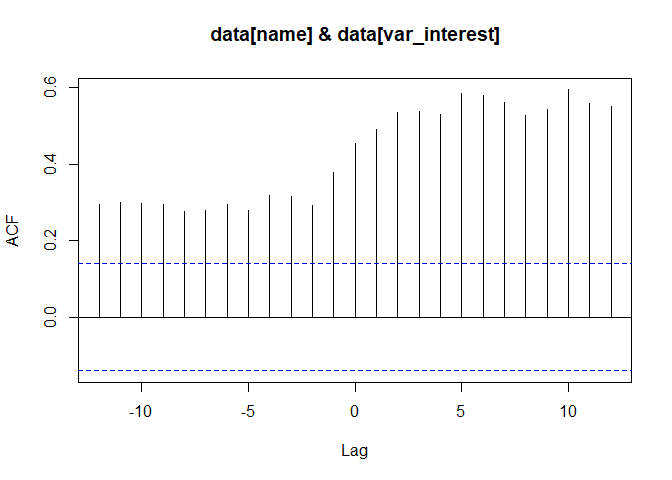

    ## 
    ## For variable: fedintrate , max cross-correlation is at lag: 10

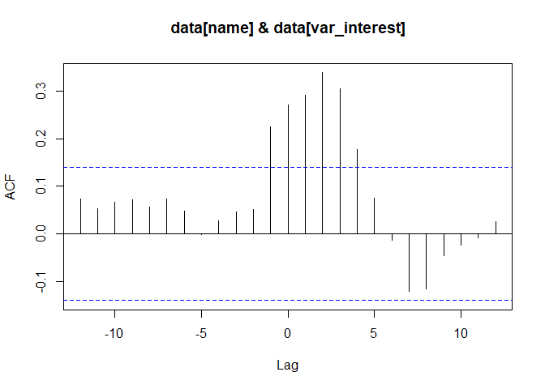

    ## 
    ## For variable: personincomechg , max cross-correlation is at lag: 2

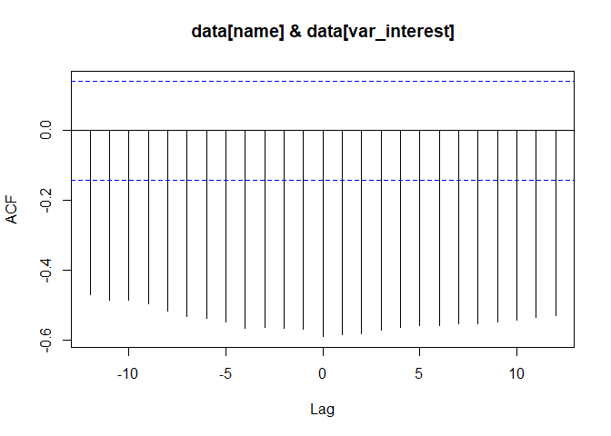

    ## 
    ## For variable: cpi , max cross-correlation is at lag: 0

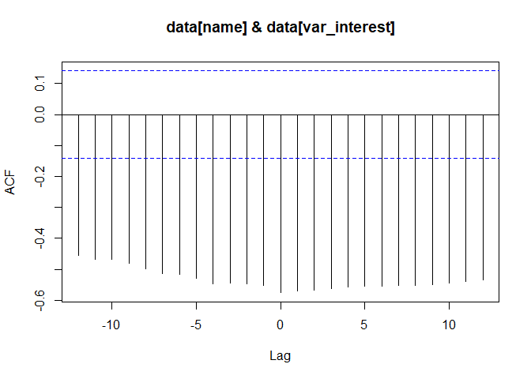

    ## 
    ## For variable: population , max cross-correlation is at lag: 0

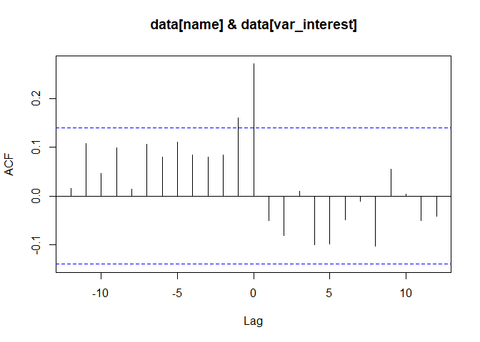

    ## 
    ## For variable: corpprofitchg , max cross-correlation is at lag: 0

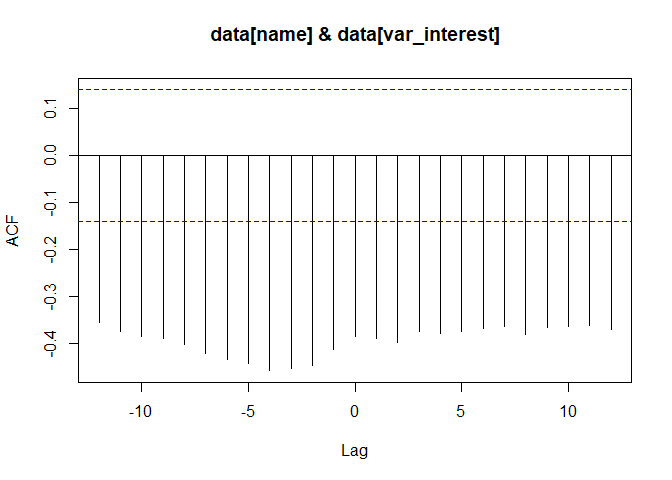

    ## 
    ## For variable: crude_wti , max cross-correlation is at lag: -4

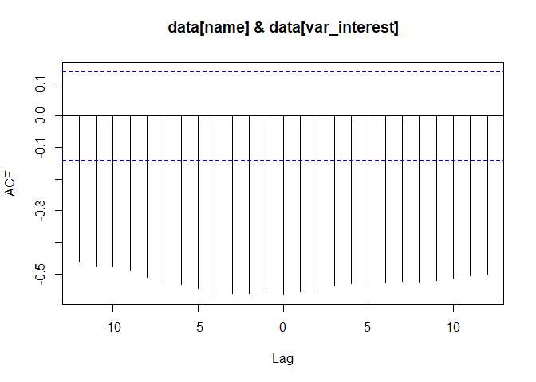

    ## 
    ## For variable: ppi , max cross-correlation is at lag: -4

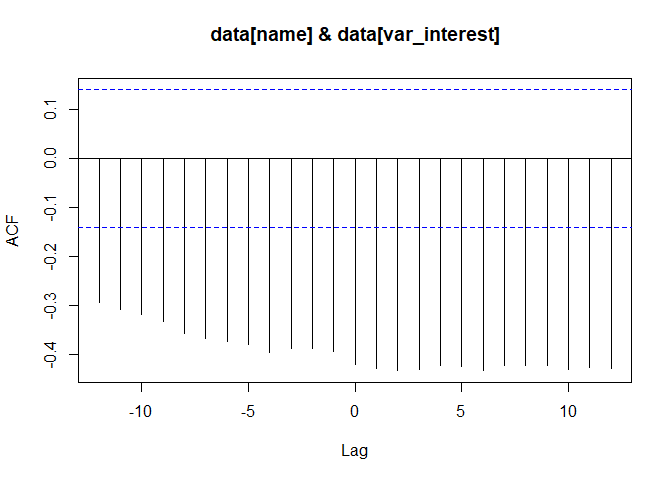

    ## 
    ## For variable: gold , max cross-correlation is at lag: 6

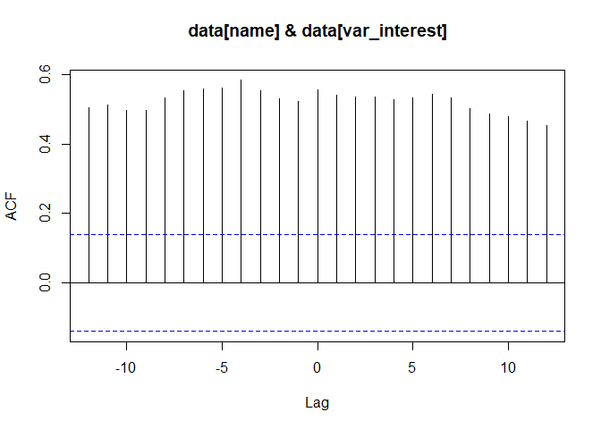

    ## 
    ## For variable: japan , max cross-correlation is at lag: -4

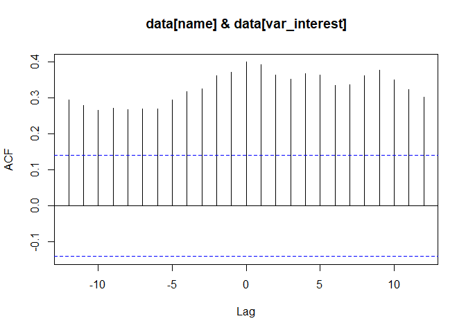

    ## 
    ## For variable: uk , max cross-correlation is at lag: 0

-   TODO: Add some notes here

-   We will use lag.max = 12 in VARselect to give it enough room to pick the best model.

Usig tswgewrapped
=================

Multivariate Compare Object
---------------------------

``` r
lag.max = 12 # Increased since AIC is hitting its limit

models = list(
  # "VARS AIC Both A" = list(type = "VAR", select = "aic", trend_type = "both", lag.max = lag.max, sliding_ase = FALSE),
  # "VARS BIC Both A" = list(type = "VAR", select = "bic", trend_type = "both", lag.max = lag.max, sliding_ase = FALSE),
  "VARS AIC Both B" = list(type = "VAR", select = "aic", trend_type = "both", lag.max = lag.max, sliding_ase = TRUE),
  "VARS AIC Trend B" = list(type = "VAR", select = "aic", trend_type = "trend", lag.max = lag.max, sliding_ase = TRUE),
  "VARS AIC Const B" = list(type = "VAR", select = "aic", trend_type = "const", lag.max = lag.max, sliding_ase = TRUE),
  "VARS AIC None B" = list(type = "VAR", select = "aic", trend_type = "none", lag.max = lag.max, sliding_ase = TRUE),
  "VARS BIC Both B" = list(type = "VAR", select = "bic", trend_type = "both", lag.max = lag.max, sliding_ase = TRUE),
  "VARS BIC Trend B" = list(type = "VAR", select = "bic", trend_type = "trend", lag.max = lag.max, sliding_ase = TRUE),
  "VARS BIC Const B" = list(type = "VAR", select = "bic", trend_type = "const", lag.max = lag.max, sliding_ase = TRUE),
  "VARS BIC None B" = list(type = "VAR", select = "bic", trend_type = "none", lag.max = lag.max, sliding_ase = TRUE)
)
```

``` r
n.ahead = 2
batch_size = 50 ## 12 years to predict the next 2 quarters
```

``` r
mdl_compare = ModelCompareMultivariateVAR$new(data = data, mdl_list = models, var_interest = var_interest,
                                              n.ahead = n.ahead, batch_size = batch_size, verbose = 1)
```

    ## 
    ## 
    ## 
    ## Model:  VARS AIC Both B 
    ## Trend type:  both

    ## Warning in log(sigma.det): NaNs produced

    ## Warning in log(sigma.det): NaNs produced

    ## Warning in log(sigma.det): NaNs produced

    ## 
    ## VARselect Object:
    ## $selection
    ## AIC(n)  HQ(n)  SC(n) FPE(n) 
    ##     11     11      1     12 
    ## 
    ## $criteria
    ##                   1            2            3            4            5
    ## AIC(n) 3.361241e+01 3.259699e+01 3.220341e+01 3.075216e+01 3.033507e+01
    ## HQ(n)  3.520485e+01 3.558281e+01 3.658260e+01 3.652474e+01 3.750103e+01
    ## SC(n)  3.754096e+01 3.996302e+01 4.300692e+01 4.499316e+01 4.801355e+01
    ## FPE(n) 3.984802e+14 1.495700e+14 1.106985e+14 3.111178e+13 2.799208e+13
    ##                   6            7            8            9           10
    ## AIC(n) 2.923257e+01 2.843556e+01 2.674593e+01 2.484765e+01 2.090656e+01
    ## HQ(n)  3.779191e+01 3.838828e+01 3.809203e+01 3.758713e+01 3.503942e+01
    ## SC(n)  5.034853e+01 5.298901e+01 5.473686e+01 5.627606e+01 5.577245e+01
    ## FPE(n) 1.522721e+13 1.453386e+13 8.223893e+12 6.595373e+12 1.702852e+12
    ##                  11            12
    ## AIC(n) 1.573239e+01           NaN
    ## HQ(n)  3.125863e+01           NaN
    ## SC(n)  5.403577e+01           NaN
    ## FPE(n) 7.080806e+11 -1.003126e-07
    ## 
    ## Lag K to use for the VAR Model:  11

    ## Warning in private$validate_k(k): Although the lag value k: 11 selected
    ## by VARselect will work for your full dataset, is too large for your batch
    ## size. Reducing k to allow Batch ASE calculations. New k: 2 If you do not
    ## want to reduce the k value, increase the batch size or make sliding_ase =
    ## FALSE for this model in the model list

    ## 
    ## 
    ## Printing summary of the VAR fit for the variable of interest: gdp_change
    ## 
    ## Call:
    ## lm(formula = y ~ -1 + ., data = datamat)
    ## 
    ## Residuals:
    ##     Min      1Q  Median      3Q     Max 
    ## -8.9630 -1.5295 -0.0009  1.3863 12.5959 
    ## 
    ## Coefficients:
    ##                      Estimate Std. Error t value Pr(>|t|)    
    ## gdp_change.l1      -1.677e-01  8.728e-02  -1.921 0.056473 .  
    ## unrate.l1          -4.064e-01  1.209e+00  -0.336 0.737298    
    ## nfjobs.l1           3.067e-03  8.733e-04   3.512 0.000576 ***
    ## treas10yr.l1       -2.877e-01  3.980e-01  -0.723 0.470722    
    ## fedintrate.l1       2.594e-01  2.129e-01   1.218 0.224914    
    ## personincomechg.l1  4.840e-01  1.715e-01   2.822 0.005361 ** 
    ## cpi.l1             -2.249e-01  2.849e-01  -0.790 0.430942    
    ## population.l1      -3.034e-03  2.385e-03  -1.272 0.205239    
    ## corpprofitchg.l1    3.216e-02  3.661e-02   0.878 0.381091    
    ## crude_wti.l1       -2.273e-02  5.137e-02  -0.443 0.658698    
    ## ppi.l1              1.472e-01  1.747e-01   0.842 0.400802    
    ## gold.l1            -8.739e-04  3.860e-03  -0.226 0.821177    
    ## japan.l1            5.153e-04  2.757e-02   0.019 0.985114    
    ## uk.l1               1.762e+00  3.100e+00   0.568 0.570515    
    ## gdp_change.l2      -3.613e-02  7.284e-02  -0.496 0.620511    
    ## unrate.l2           1.627e+00  1.136e+00   1.432 0.154111    
    ## nfjobs.l2          -2.538e-03  8.426e-04  -3.012 0.003008 ** 
    ## treas10yr.l2        6.457e-01  4.176e-01   1.546 0.123991    
    ## fedintrate.l2      -5.399e-01  2.208e-01  -2.446 0.015518 *  
    ## personincomechg.l2 -7.358e-01  1.726e-01  -4.262 3.42e-05 ***
    ## cpi.l2             -2.326e-01  2.739e-01  -0.849 0.397161    
    ## population.l2       2.964e-03  2.404e-03   1.233 0.219478    
    ## corpprofitchg.l2   -6.811e-03  3.325e-02  -0.205 0.837972    
    ## crude_wti.l2       -5.559e-02  5.112e-02  -1.087 0.278425    
    ## ppi.l2             -1.165e-02  1.355e-01  -0.086 0.931586    
    ## gold.l2             2.776e-03  3.901e-03   0.712 0.477757    
    ## japan.l2            2.231e-02  2.741e-02   0.814 0.416730    
    ## uk.l2               3.477e+00  3.090e+00   1.125 0.262140    
    ## const              -2.738e+01  5.096e+01  -0.537 0.591772    
    ## trend               2.671e-01  2.321e-01   1.151 0.251461    
    ## ---
    ## Signif. codes:  0 '***' 0.001 '**' 0.01 '*' 0.05 '.' 0.1 ' ' 1
    ## 
    ## Residual standard error: 2.638 on 163 degrees of freedom
    ## Multiple R-squared:  0.6369, Adjusted R-squared:  0.5723 
    ## F-statistic: 9.858 on 29 and 163 DF,  p-value: < 2.2e-16
    ## 
    ## 
    ## 
    ## 
    ## Model:  VARS AIC Trend B 
    ## Trend type:  trend 
    ## 
    ## VARselect Object:
    ## $selection
    ## AIC(n)  HQ(n)  SC(n) FPE(n) 
    ##     12     12      1     12 
    ## 
    ## $criteria
    ##                   1            2            3            4            5
    ## AIC(n) 3.379931e+01 3.275837e+01 3.233900e+01 3.090022e+01 3.046891e+01
    ## HQ(n)  3.529222e+01 3.564466e+01 3.661867e+01 3.657327e+01 3.753534e+01
    ## SC(n)  3.748233e+01 3.987887e+01 4.289698e+01 4.489569e+01 4.790186e+01
    ## FPE(n) 4.798381e+14 1.750484e+14 1.256173e+14 3.547708e+13 3.113090e+13
    ##                   6            7            8            9           10
    ## AIC(n) 2.945995e+01 2.886201e+01 2.734562e+01 2.546440e+01 2.142329e+01
    ## HQ(n)  3.791976e+01 3.871520e+01 3.859219e+01 3.810435e+01 3.545662e+01
    ## SC(n)  5.033038e+01 5.316992e+01 5.509101e+01 5.664728e+01 5.604365e+01
    ## FPE(n) 1.831525e+13 2.087828e+13 1.361372e+13 1.057797e+13 2.273988e+12
    ##                  11            12
    ## AIC(n) 1.645094e+01 -2.066843e+00
    ## HQ(n)  3.187765e+01  1.475325e+01
    ## SC(n)  5.450878e+01  3.942848e+01
    ## FPE(n) 9.761406e+11  3.007689e+07
    ## 
    ## Lag K to use for the VAR Model:  12

    ## Warning in private$validate_k(k): Although the lag value k: 12 selected
    ## by VARselect will work for your full dataset, is too large for your batch
    ## size. Reducing k to allow Batch ASE calculations. New k: 2 If you do not
    ## want to reduce the k value, increase the batch size or make sliding_ase =
    ## FALSE for this model in the model list

    ## 
    ## 
    ## Printing summary of the VAR fit for the variable of interest: gdp_change
    ## 
    ## Call:
    ## lm(formula = y ~ -1 + ., data = datamat)
    ## 
    ## Residuals:
    ##     Min      1Q  Median      3Q     Max 
    ## -9.1214 -1.4977  0.0164  1.3540 12.5519 
    ## 
    ## Coefficients:
    ##                      Estimate Std. Error t value Pr(>|t|)    
    ## gdp_change.l1      -0.1688617  0.0870671  -1.939  0.05416 .  
    ## unrate.l1          -0.2897932  1.1872215  -0.244  0.80746    
    ## nfjobs.l1           0.0031053  0.0008685   3.575  0.00046 ***
    ## treas10yr.l1       -0.2909263  0.3970725  -0.733  0.46480    
    ## fedintrate.l1       0.2858317  0.2067440   1.383  0.16869    
    ## personincomechg.l1  0.4924568  0.1704202   2.890  0.00438 ** 
    ## cpi.l1             -0.2032933  0.2813927  -0.722  0.47104    
    ## population.l1      -0.0029375  0.0023734  -1.238  0.21761    
    ## corpprofitchg.l1    0.0304093  0.0363886   0.836  0.40455    
    ## crude_wti.l1       -0.0116312  0.0469320  -0.248  0.80458    
    ## ppi.l1              0.1069737  0.1575378   0.679  0.49807    
    ## gold.l1            -0.0009724  0.0038475  -0.253  0.80080    
    ## japan.l1            0.0020602  0.0273643   0.075  0.94008    
    ## uk.l1               1.8435019  3.0900792   0.597  0.55161    
    ## gdp_change.l2      -0.0349932  0.0726519  -0.482  0.63069    
    ## unrate.l2           1.5753419  1.1298796   1.394  0.16513    
    ## nfjobs.l2          -0.0025915  0.0008349  -3.104  0.00225 ** 
    ## treas10yr.l2        0.5979912  0.4071662   1.469  0.14384    
    ## fedintrate.l2      -0.5197522  0.2170715  -2.394  0.01778 *  
    ## personincomechg.l2 -0.7152961  0.1679943  -4.258 3.47e-05 ***
    ## cpi.l2             -0.2426138  0.2727026  -0.890  0.37495    
    ## population.l2       0.0027419  0.0023634   1.160  0.24768    
    ## corpprofitchg.l2   -0.0093576  0.0328431  -0.285  0.77607    
    ## crude_wti.l2       -0.0438274  0.0460934  -0.951  0.34309    
    ## ppi.l2             -0.0183902  0.1346439  -0.137  0.89153    
    ## gold.l2             0.0027544  0.0038919   0.708  0.48012    
    ## japan.l2            0.0206439  0.0271712   0.760  0.44848    
    ## uk.l2               3.4329204  3.0819601   1.114  0.26696    
    ## trend               0.3759538  0.1129048   3.330  0.00107 ** 
    ## ---
    ## Signif. codes:  0 '***' 0.001 '**' 0.01 '*' 0.05 '.' 0.1 ' ' 1
    ## 
    ## Residual standard error: 2.632 on 164 degrees of freedom
    ## Multiple R-squared:  0.8951, Adjusted R-squared:  0.8766 
    ## F-statistic: 48.26 on 29 and 164 DF,  p-value: < 2.2e-16
    ## 
    ## 
    ## 
    ## 
    ## Model:  VARS AIC Const B 
    ## Trend type:  const 
    ## 
    ## VARselect Object:
    ## $selection
    ## AIC(n)  HQ(n)  SC(n) FPE(n) 
    ##     12     12      1     12 
    ## 
    ## $criteria
    ##                   1            2            3            4            5
    ## AIC(n) 3.385924e+01 3.273844e+01 3.238950e+01 3.090135e+01 3.047701e+01
    ## HQ(n)  3.535214e+01 3.562473e+01 3.666917e+01 3.657440e+01 3.754344e+01
    ## SC(n)  3.754225e+01 3.985894e+01 4.294748e+01 4.489681e+01 4.790996e+01
    ## FPE(n) 5.094723e+14 1.715948e+14 1.321242e+14 3.551702e+13 3.138407e+13
    ##                   6            7            8            9           10
    ## AIC(n) 2.959225e+01 2.895842e+01 2.746664e+01 2.558196e+01 2.158572e+01
    ## HQ(n)  3.805206e+01 3.881161e+01 3.871321e+01 3.822192e+01 3.561905e+01
    ## SC(n)  5.046268e+01 5.326633e+01 5.521203e+01 5.676484e+01 5.620608e+01
    ## FPE(n) 2.090599e+13 2.299143e+13 1.536506e+13 1.189760e+13 2.675038e+12
    ##                  11            12
    ## AIC(n) 1.656534e+01 -2.385864e+00
    ## HQ(n)  3.199206e+01  1.443423e+01
    ## SC(n)  5.462319e+01  3.910946e+01
    ## FPE(n) 1.094454e+12  2.186169e+07
    ## 
    ## Lag K to use for the VAR Model:  12

    ## Warning in private$validate_k(k): Although the lag value k: 12 selected
    ## by VARselect will work for your full dataset, is too large for your batch
    ## size. Reducing k to allow Batch ASE calculations. New k: 2 If you do not
    ## want to reduce the k value, increase the batch size or make sliding_ase =
    ## FALSE for this model in the model list

    ## 
    ## 
    ## Printing summary of the VAR fit for the variable of interest: gdp_change
    ## 
    ## Call:
    ## lm(formula = y ~ -1 + ., data = datamat)
    ## 
    ## Residuals:
    ##     Min      1Q  Median      3Q     Max 
    ## -8.5823 -1.4643  0.0104  1.4547 12.9754 
    ## 
    ## Coefficients:
    ##                      Estimate Std. Error t value Pr(>|t|)    
    ## gdp_change.l1      -1.518e-01  8.627e-02  -1.760 0.080339 .  
    ## unrate.l1          -5.732e-01  1.202e+00  -0.477 0.634080    
    ## nfjobs.l1           2.982e-03  8.711e-04   3.423 0.000782 ***
    ## treas10yr.l1       -3.151e-01  3.977e-01  -0.792 0.429225    
    ## fedintrate.l1       2.224e-01  2.107e-01   1.056 0.292723    
    ## personincomechg.l1  4.691e-01  1.712e-01   2.741 0.006814 ** 
    ## cpi.l1             -2.431e-01  2.847e-01  -0.854 0.394362    
    ## population.l1      -3.708e-03  2.315e-03  -1.602 0.111030    
    ## corpprofitchg.l1    3.518e-02  3.655e-02   0.962 0.337323    
    ## crude_wti.l1       -4.341e-02  4.818e-02  -0.901 0.368910    
    ## ppi.l1              2.196e-01  1.631e-01   1.346 0.180121    
    ## gold.l1            -2.045e-04  3.820e-03  -0.054 0.957377    
    ## japan.l1            4.086e-04  2.760e-02   0.015 0.988206    
    ## uk.l1               1.604e+00  3.100e+00   0.517 0.605712    
    ## gdp_change.l2      -2.772e-02  7.254e-02  -0.382 0.702877    
    ## unrate.l2           1.650e+00  1.137e+00   1.450 0.148881    
    ## nfjobs.l2          -2.416e-03  8.367e-04  -2.888 0.004407 ** 
    ## treas10yr.l2        7.075e-01  4.145e-01   1.707 0.089784 .  
    ## fedintrate.l2      -5.895e-01  2.167e-01  -2.720 0.007229 ** 
    ## personincomechg.l2 -7.870e-01  1.670e-01  -4.713 5.18e-06 ***
    ## cpi.l2             -1.771e-01  2.699e-01  -0.656 0.512581    
    ## population.l2       3.867e-03  2.275e-03   1.700 0.090969 .  
    ## corpprofitchg.l2   -2.939e-03  3.312e-02  -0.089 0.929396    
    ## crude_wti.l2       -7.745e-02  4.751e-02  -1.630 0.104970    
    ## ppi.l2             -5.479e-03  1.355e-01  -0.040 0.967803    
    ## gold.l2             2.623e-03  3.902e-03   0.672 0.502472    
    ## japan.l2            2.312e-02  2.743e-02   0.843 0.400355    
    ## uk.l2               3.355e+00  3.091e+00   1.085 0.279386    
    ## const              -7.859e+01  2.487e+01  -3.160 0.001881 ** 
    ## ---
    ## Signif. codes:  0 '***' 0.001 '**' 0.01 '*' 0.05 '.' 0.1 ' ' 1
    ## 
    ## Residual standard error: 2.641 on 164 degrees of freedom
    ## Multiple R-squared:  0.6339, Adjusted R-squared:  0.5714 
    ## F-statistic: 10.14 on 28 and 164 DF,  p-value: < 2.2e-16
    ## 
    ## 
    ## 
    ## 
    ## Model:  VARS AIC None B 
    ## Trend type:  none 
    ## 
    ## VARselect Object:
    ## $selection
    ## AIC(n)  HQ(n)  SC(n) FPE(n) 
    ##     12     12      1     12 
    ## 
    ## $criteria
    ##                   1            2            3            4            5
    ## AIC(n) 3.411512e+01 3.283955e+01 3.245817e+01 3.093522e+01 3.052794e+01
    ## HQ(n)  3.550850e+01 3.562632e+01 3.663831e+01 3.650875e+01 3.749484e+01
    ## SC(n)  3.755260e+01 3.971452e+01 4.277062e+01 4.468515e+01 4.771535e+01
    ## FPE(n) 6.573969e+14 1.891314e+14 1.402862e+14 3.615330e+13 3.215463e+13
    ##                   6            7            8            9           10
    ## AIC(n) 2.968394e+01 2.916217e+01 2.761888e+01 2.584841e+01 2.198150e+01
    ## HQ(n)  3.804422e+01 3.891584e+01 3.876592e+01 3.838884e+01 3.591531e+01
    ## SC(n)  5.030883e+01 5.322455e+01 5.511874e+01 5.678575e+01 5.635633e+01
    ## FPE(n) 2.198280e+13 2.648193e+13 1.630351e+13 1.350097e+13 3.190092e+12
    ##                  11           12
    ## AIC(n) 1.707770e+01 1.000430e+00
    ## HQ(n)  3.240489e+01 1.772100e+01
    ## SC(n)  5.489001e+01 4.225022e+01
    ## FPE(n) 1.249645e+12 2.754222e+08
    ## 
    ## Lag K to use for the VAR Model:  12

    ## Warning in private$validate_k(k): Although the lag value k: 12 selected
    ## by VARselect will work for your full dataset, is too large for your batch
    ## size. Reducing k to allow Batch ASE calculations. New k: 2 If you do not
    ## want to reduce the k value, increase the batch size or make sliding_ase =
    ## FALSE for this model in the model list

    ## 
    ## 
    ## Printing summary of the VAR fit for the variable of interest: gdp_change
    ## 
    ## Call:
    ## lm(formula = y ~ -1 + ., data = datamat)
    ## 
    ## Residuals:
    ##     Min      1Q  Median      3Q     Max 
    ## -8.6208 -1.3273 -0.0102  1.3619 14.3124 
    ## 
    ## Coefficients:
    ##                      Estimate Std. Error t value Pr(>|t|)    
    ## gdp_change.l1      -0.0880346  0.0861331  -1.022 0.308241    
    ## unrate.l1           0.0134872  1.2193711   0.011 0.991188    
    ## nfjobs.l1           0.0030253  0.0008943   3.383 0.000896 ***
    ## treas10yr.l1       -0.4885049  0.4044379  -1.208 0.228829    
    ## fedintrate.l1       0.3593826  0.2117512   1.697 0.091546 .  
    ## personincomechg.l1  0.4972610  0.1755462   2.833 0.005192 ** 
    ## cpi.l1             -0.0718392  0.2870001  -0.250 0.802659    
    ## population.l1      -0.0058654  0.0022709  -2.583 0.010666 *  
    ## corpprofitchg.l1    0.0289599  0.0374817   0.773 0.440840    
    ## crude_wti.l1       -0.0111129  0.0483452  -0.230 0.818481    
    ## ppi.l1              0.0907254  0.1622043   0.559 0.576696    
    ## gold.l1             0.0019018  0.0038623   0.492 0.623083    
    ## japan.l1            0.0185351  0.0277238   0.669 0.504708    
    ## uk.l1               1.8001798  3.1831104   0.566 0.572474    
    ## gdp_change.l2       0.0274663  0.0723024   0.380 0.704523    
    ## unrate.l2           1.1341536  1.1558763   0.981 0.327927    
    ## nfjobs.l2          -0.0024624  0.0008591  -2.866 0.004694 ** 
    ## treas10yr.l2        0.4354473  0.4164031   1.046 0.297213    
    ## fedintrate.l2      -0.5900195  0.2225496  -2.651 0.008803 ** 
    ## personincomechg.l2 -0.7907720  0.1714711  -4.612 7.97e-06 ***
    ## cpi.l2             -0.0259280  0.2728000  -0.095 0.924395    
    ## population.l2       0.0056388  0.0022636   2.491 0.013725 *  
    ## corpprofitchg.l2   -0.0146281  0.0337929  -0.433 0.665670    
    ## crude_wti.l2       -0.0429643  0.0474808  -0.905 0.366850    
    ## ppi.l2             -0.0564486  0.1381981  -0.408 0.683465    
    ## gold.l2             0.0016161  0.0039936   0.405 0.686246    
    ## japan.l2            0.0069442  0.0276667   0.251 0.802131    
    ## uk.l2               2.2250702  3.1527091   0.706 0.481330    
    ## ---
    ## Signif. codes:  0 '***' 0.001 '**' 0.01 '*' 0.05 '.' 0.1 ' ' 1
    ## 
    ## Residual standard error: 2.712 on 165 degrees of freedom
    ## Multiple R-squared:  0.888,  Adjusted R-squared:  0.869 
    ## F-statistic: 46.73 on 28 and 165 DF,  p-value: < 2.2e-16
    ## 
    ## 
    ## 
    ## 
    ## Model:  VARS BIC Both B 
    ## Trend type:  both

    ## Warning in log(sigma.det): NaNs produced

    ## Warning in log(sigma.det): NaNs produced

    ## Warning in log(sigma.det): NaNs produced

    ## 
    ## VARselect Object:
    ## $selection
    ## AIC(n)  HQ(n)  SC(n) FPE(n) 
    ##     11     11      1     12 
    ## 
    ## $criteria
    ##                   1            2            3            4            5
    ## AIC(n) 3.361241e+01 3.259699e+01 3.220341e+01 3.075216e+01 3.033507e+01
    ## HQ(n)  3.520485e+01 3.558281e+01 3.658260e+01 3.652474e+01 3.750103e+01
    ## SC(n)  3.754096e+01 3.996302e+01 4.300692e+01 4.499316e+01 4.801355e+01
    ## FPE(n) 3.984802e+14 1.495700e+14 1.106985e+14 3.111178e+13 2.799208e+13
    ##                   6            7            8            9           10
    ## AIC(n) 2.923257e+01 2.843556e+01 2.674593e+01 2.484765e+01 2.090656e+01
    ## HQ(n)  3.779191e+01 3.838828e+01 3.809203e+01 3.758713e+01 3.503942e+01
    ## SC(n)  5.034853e+01 5.298901e+01 5.473686e+01 5.627606e+01 5.577245e+01
    ## FPE(n) 1.522721e+13 1.453386e+13 8.223893e+12 6.595373e+12 1.702852e+12
    ##                  11            12
    ## AIC(n) 1.573239e+01           NaN
    ## HQ(n)  3.125863e+01           NaN
    ## SC(n)  5.403577e+01           NaN
    ## FPE(n) 7.080806e+11 -1.003126e-07
    ## 
    ## Lag K to use for the VAR Model:  1 
    ## 
    ## 
    ## Printing summary of the VAR fit for the variable of interest: gdp_change
    ## 
    ## Call:
    ## lm(formula = y ~ -1 + ., data = datamat)
    ## 
    ## Residuals:
    ##     Min      1Q  Median      3Q     Max 
    ## -7.8932 -1.6981  0.0371  1.6092 13.4125 
    ## 
    ## Coefficients:
    ##                      Estimate Std. Error t value Pr(>|t|)    
    ## gdp_change.l1       0.1203339  0.0777755   1.547 0.123592    
    ## unrate.l1           0.6802801  0.3785291   1.797 0.074004 .  
    ## nfjobs.l1           0.0001446  0.0001876   0.771 0.441667    
    ## treas10yr.l1        0.1440403  0.3215874   0.448 0.654767    
    ## fedintrate.l1      -0.0180622  0.2069950  -0.087 0.930564    
    ## personincomechg.l1  0.3968296  0.1446655   2.743 0.006709 ** 
    ## cpi.l1             -0.4435616  0.1158982  -3.827 0.000179 ***
    ## population.l1      -0.0003413  0.0002460  -1.387 0.167088    
    ## corpprofitchg.l1    0.0461864  0.0359222   1.286 0.200206    
    ## crude_wti.l1        0.0193360  0.0453866   0.426 0.670601    
    ## ppi.l1              0.0014208  0.1057837   0.013 0.989299    
    ## gold.l1             0.0003690  0.0024308   0.152 0.879503    
    ## japan.l1            0.0010592  0.0109848   0.096 0.923291    
    ## uk.l1               2.4913192  1.4935657   1.668 0.097067 .  
    ## const              70.1346199 48.5656607   1.444 0.150463    
    ## trend               0.6532383  0.2171264   3.009 0.003005 ** 
    ## ---
    ## Signif. codes:  0 '***' 0.001 '**' 0.01 '*' 0.05 '.' 0.1 ' ' 1
    ## 
    ## Residual standard error: 3.052 on 178 degrees of freedom
    ## Multiple R-squared:  0.4696, Adjusted R-squared:  0.4249 
    ## F-statistic: 10.51 on 15 and 178 DF,  p-value: < 2.2e-16
    ## 
    ## 
    ## 
    ## 
    ## Model:  VARS BIC Trend B 
    ## Trend type:  trend 
    ## 
    ## VARselect Object:
    ## $selection
    ## AIC(n)  HQ(n)  SC(n) FPE(n) 
    ##     12     12      1     12 
    ## 
    ## $criteria
    ##                   1            2            3            4            5
    ## AIC(n) 3.379931e+01 3.275837e+01 3.233900e+01 3.090022e+01 3.046891e+01
    ## HQ(n)  3.529222e+01 3.564466e+01 3.661867e+01 3.657327e+01 3.753534e+01
    ## SC(n)  3.748233e+01 3.987887e+01 4.289698e+01 4.489569e+01 4.790186e+01
    ## FPE(n) 4.798381e+14 1.750484e+14 1.256173e+14 3.547708e+13 3.113090e+13
    ##                   6            7            8            9           10
    ## AIC(n) 2.945995e+01 2.886201e+01 2.734562e+01 2.546440e+01 2.142329e+01
    ## HQ(n)  3.791976e+01 3.871520e+01 3.859219e+01 3.810435e+01 3.545662e+01
    ## SC(n)  5.033038e+01 5.316992e+01 5.509101e+01 5.664728e+01 5.604365e+01
    ## FPE(n) 1.831525e+13 2.087828e+13 1.361372e+13 1.057797e+13 2.273988e+12
    ##                  11            12
    ## AIC(n) 1.645094e+01 -2.066843e+00
    ## HQ(n)  3.187765e+01  1.475325e+01
    ## SC(n)  5.450878e+01  3.942848e+01
    ## FPE(n) 9.761406e+11  3.007689e+07
    ## 
    ## Lag K to use for the VAR Model:  1 
    ## 
    ## 
    ## Printing summary of the VAR fit for the variable of interest: gdp_change
    ## 
    ## Call:
    ## lm(formula = y ~ -1 + ., data = datamat)
    ## 
    ## Residuals:
    ##     Min      1Q  Median      3Q     Max 
    ## -8.0270 -1.7522 -0.0179  1.6041 13.4586 
    ## 
    ## Coefficients:
    ##                      Estimate Std. Error t value Pr(>|t|)    
    ## gdp_change.l1       1.215e-01  7.801e-02   1.558 0.121065    
    ## unrate.l1           5.277e-01  3.646e-01   1.447 0.149557    
    ## nfjobs.l1           1.723e-04  1.872e-04   0.920 0.358649    
    ## treas10yr.l1        2.882e-01  3.066e-01   0.940 0.348508    
    ## fedintrate.l1      -1.192e-01  1.954e-01  -0.610 0.542695    
    ## personincomechg.l1  3.439e-01  1.404e-01   2.450 0.015255 *  
    ## cpi.l1             -4.611e-01  1.156e-01  -3.989 9.68e-05 ***
    ## population.l1      -1.183e-05  9.233e-05  -0.128 0.898214    
    ## corpprofitchg.l1    5.398e-02  3.562e-02   1.515 0.131425    
    ## crude_wti.l1       -2.589e-02  3.295e-02  -0.786 0.432972    
    ## ppi.l1              9.058e-02  8.616e-02   1.051 0.294533    
    ## gold.l1             9.689e-04  2.402e-03   0.403 0.687211    
    ## japan.l1            2.877e-04  1.101e-02   0.026 0.979177    
    ## uk.l1               2.153e+00  1.480e+00   1.455 0.147359    
    ## trend               3.787e-01  1.052e-01   3.600 0.000412 ***
    ## ---
    ## Signif. codes:  0 '***' 0.001 '**' 0.01 '*' 0.05 '.' 0.1 ' ' 1
    ## 
    ## Residual standard error: 3.061 on 179 degrees of freedom
    ## Multiple R-squared:  0.846,  Adjusted R-squared:  0.8331 
    ## F-statistic: 65.56 on 15 and 179 DF,  p-value: < 2.2e-16
    ## 
    ## 
    ## 
    ## 
    ## Model:  VARS BIC Const B 
    ## Trend type:  const 
    ## 
    ## VARselect Object:
    ## $selection
    ## AIC(n)  HQ(n)  SC(n) FPE(n) 
    ##     12     12      1     12 
    ## 
    ## $criteria
    ##                   1            2            3            4            5
    ## AIC(n) 3.385924e+01 3.273844e+01 3.238950e+01 3.090135e+01 3.047701e+01
    ## HQ(n)  3.535214e+01 3.562473e+01 3.666917e+01 3.657440e+01 3.754344e+01
    ## SC(n)  3.754225e+01 3.985894e+01 4.294748e+01 4.489681e+01 4.790996e+01
    ## FPE(n) 5.094723e+14 1.715948e+14 1.321242e+14 3.551702e+13 3.138407e+13
    ##                   6            7            8            9           10
    ## AIC(n) 2.959225e+01 2.895842e+01 2.746664e+01 2.558196e+01 2.158572e+01
    ## HQ(n)  3.805206e+01 3.881161e+01 3.871321e+01 3.822192e+01 3.561905e+01
    ## SC(n)  5.046268e+01 5.326633e+01 5.521203e+01 5.676484e+01 5.620608e+01
    ## FPE(n) 2.090599e+13 2.299143e+13 1.536506e+13 1.189760e+13 2.675038e+12
    ##                  11            12
    ## AIC(n) 1.656534e+01 -2.385864e+00
    ## HQ(n)  3.199206e+01  1.443423e+01
    ## SC(n)  5.462319e+01  3.910946e+01
    ## FPE(n) 1.094454e+12  2.186169e+07
    ## 
    ## Lag K to use for the VAR Model:  1 
    ## 
    ## 
    ## Printing summary of the VAR fit for the variable of interest: gdp_change
    ## 
    ## Call:
    ## lm(formula = y ~ -1 + ., data = datamat)
    ## 
    ## Residuals:
    ##     Min      1Q  Median      3Q     Max 
    ## -8.7444 -1.7134  0.0957  1.5989 14.3093 
    ## 
    ## Coefficients:
    ##                      Estimate Std. Error t value Pr(>|t|)   
    ## gdp_change.l1       1.461e-01  7.902e-02   1.849  0.06611 . 
    ## unrate.l1           3.103e-01  3.660e-01   0.848  0.39756   
    ## nfjobs.l1           1.995e-04  1.909e-04   1.046  0.29719   
    ## treas10yr.l1        2.580e-01  3.265e-01   0.790  0.43031   
    ## fedintrate.l1      -1.783e-01  2.045e-01  -0.872  0.38429   
    ## personincomechg.l1  2.791e-01  1.424e-01   1.960  0.05151 . 
    ## cpi.l1             -3.285e-01  1.118e-01  -2.937  0.00375 **
    ## population.l1       2.530e-04  1.499e-04   1.688  0.09317 . 
    ## corpprofitchg.l1    5.738e-02  3.652e-02   1.571  0.11794   
    ## crude_wti.l1       -5.870e-02  3.807e-02  -1.542  0.12494   
    ## ppi.l1              1.313e-01  9.873e-02   1.330  0.18535   
    ## gold.l1             2.543e-03  2.373e-03   1.072  0.28520   
    ## japan.l1            1.242e-03  1.123e-02   0.111  0.91208   
    ## uk.l1               1.198e+00  1.462e+00   0.820  0.41354   
    ## const              -5.781e+01  2.398e+01  -2.411  0.01693 * 
    ## ---
    ## Signif. codes:  0 '***' 0.001 '**' 0.01 '*' 0.05 '.' 0.1 ' ' 1
    ## 
    ## Residual standard error: 3.12 on 179 degrees of freedom
    ## Multiple R-squared:  0.4426, Adjusted R-squared:  0.399 
    ## F-statistic: 10.15 on 14 and 179 DF,  p-value: < 2.2e-16
    ## 
    ## 
    ## 
    ## 
    ## Model:  VARS BIC None B 
    ## Trend type:  none 
    ## 
    ## VARselect Object:
    ## $selection
    ## AIC(n)  HQ(n)  SC(n) FPE(n) 
    ##     12     12      1     12 
    ## 
    ## $criteria
    ##                   1            2            3            4            5
    ## AIC(n) 3.411512e+01 3.283955e+01 3.245817e+01 3.093522e+01 3.052794e+01
    ## HQ(n)  3.550850e+01 3.562632e+01 3.663831e+01 3.650875e+01 3.749484e+01
    ## SC(n)  3.755260e+01 3.971452e+01 4.277062e+01 4.468515e+01 4.771535e+01
    ## FPE(n) 6.573969e+14 1.891314e+14 1.402862e+14 3.615330e+13 3.215463e+13
    ##                   6            7            8            9           10
    ## AIC(n) 2.968394e+01 2.916217e+01 2.761888e+01 2.584841e+01 2.198150e+01
    ## HQ(n)  3.804422e+01 3.891584e+01 3.876592e+01 3.838884e+01 3.591531e+01
    ## SC(n)  5.030883e+01 5.322455e+01 5.511874e+01 5.678575e+01 5.635633e+01
    ## FPE(n) 2.198280e+13 2.648193e+13 1.630351e+13 1.350097e+13 3.190092e+12
    ##                  11           12
    ## AIC(n) 1.707770e+01 1.000430e+00
    ## HQ(n)  3.240489e+01 1.772100e+01
    ## SC(n)  5.489001e+01 4.225022e+01
    ## FPE(n) 1.249645e+12 2.754222e+08
    ## 
    ## Lag K to use for the VAR Model:  1 
    ## 
    ## 
    ## Printing summary of the VAR fit for the variable of interest: gdp_change
    ## 
    ## Call:
    ## lm(formula = y ~ -1 + ., data = datamat)
    ## 
    ## Residuals:
    ##    Min     1Q Median     3Q    Max 
    ## -8.840 -1.604 -0.064  1.602 15.478 
    ## 
    ## Coefficients:
    ##                      Estimate Std. Error t value Pr(>|t|)  
    ## gdp_change.l1       1.802e-01  7.878e-02   2.288   0.0233 *
    ## unrate.l1           3.002e-01  3.708e-01   0.810   0.4192  
    ## nfjobs.l1           1.835e-04  1.933e-04   0.949   0.3437  
    ## treas10yr.l1       -8.203e-02  2.983e-01  -0.275   0.7836  
    ## fedintrate.l1      -5.912e-02  2.010e-01  -0.294   0.7690  
    ## personincomechg.l1  2.914e-01  1.442e-01   2.021   0.0447 *
    ## cpi.l1             -9.567e-02  5.713e-02  -1.675   0.0958 .
    ## population.l1      -2.849e-05  9.523e-05  -0.299   0.7651  
    ## corpprofitchg.l1    4.646e-02  3.672e-02   1.265   0.2075  
    ## crude_wti.l1       -1.477e-02  3.387e-02  -0.436   0.6634  
    ## ppi.l1              9.079e-03  8.585e-02   0.106   0.9159  
    ## gold.l1             3.653e-03  2.358e-03   1.549   0.1232  
    ## japan.l1            4.239e-03  1.131e-02   0.375   0.7082  
    ## uk.l1               4.736e-01  1.450e+00   0.327   0.7444  
    ## ---
    ## Signif. codes:  0 '***' 0.001 '**' 0.01 '*' 0.05 '.' 0.1 ' ' 1
    ## 
    ## Residual standard error: 3.161 on 180 degrees of freedom
    ## Multiple R-squared:  0.8349, Adjusted R-squared:  0.822 
    ## F-statistic:    65 on 14 and 180 DF,  p-value: < 2.2e-16
    ## 
    ## 
    ## 
    ## 
    ## Computing metrics for:  VARS AIC Both B 
    ## Number of batches expected:  73 
    ## 
    ## 
    ## 
    ## Computing metrics for:  VARS AIC Trend B 
    ## Number of batches expected:  73 
    ## 
    ## 
    ## 
    ## Computing metrics for:  VARS AIC Const B 
    ## Number of batches expected:  73 
    ## 
    ## 
    ## 
    ## Computing metrics for:  VARS AIC None B 
    ## Number of batches expected:  73 
    ## 
    ## 
    ## 
    ## Computing metrics for:  VARS BIC Both B 
    ## Number of batches expected:  73 
    ## 
    ## 
    ## 
    ## Computing metrics for:  VARS BIC Trend B 
    ## Number of batches expected:  73 
    ## 
    ## 
    ## 
    ## Computing metrics for:  VARS BIC Const B 
    ## Number of batches expected:  73 
    ## 
    ## 
    ## 
    ## Computing metrics for:  VARS BIC None B 
    ## Number of batches expected:  73

### AIC BIC Full Data

``` r
mdl_compare$get_xIC() 
```

    ## # A tibble: 8 x 3
    ##   Model            AIC   BIC  
    ##   <chr>            <lgl> <lgl>
    ## 1 VARS AIC Both B  NA    NA   
    ## 2 VARS AIC Trend B NA    NA   
    ## 3 VARS AIC Const B NA    NA   
    ## 4 VARS AIC None B  NA    NA   
    ## 5 VARS BIC Both B  NA    NA   
    ## 6 VARS BIC Trend B NA    NA   
    ## 7 VARS BIC Const B NA    NA   
    ## 8 VARS BIC None B  NA    NA

### Tabular Metrics

``` r
ASEs = mdl_compare$get_tabular_metrics() 

ASEs %>% 
  group_by(Model) %>% 
  summarise(ASE_mean = mean(ASE),
            ASE_median = median(ASE),
            ASE_sd = sd(ASE),
            num_batches = n())
```

    ## # A tibble: 8 x 5
    ##   Model            ASE_mean ASE_median ASE_sd num_batches
    ##   <chr>               <dbl>      <dbl>  <dbl>       <int>
    ## 1 VARS AIC Both B      27.8       8.99   51.7          73
    ## 2 VARS AIC Const B     24.2       9.25   42.6          73
    ## 3 VARS AIC None B      23.5      10.9    39.3          73
    ## 4 VARS AIC Trend B     22.6       8.27   42.4          73
    ## 5 VARS BIC Both B      11.7       6.67   13.9          73
    ## 6 VARS BIC Const B     10.9       7.04   11.9          73
    ## 7 VARS BIC None B      10.7       8.12   10.3          73
    ## 8 VARS BIC Trend B     10.4       6.32   11.8          73

``` r
mdl_compare$get_tabular_metrics(ases = FALSE) %>% 
  na.omit()
```

    ## # A tibble: 1,363 x 5
    ##    Model            Time      f      ll    ul
    ##    <chr>           <dbl>  <dbl>   <dbl> <dbl>
    ##  1 VARS AIC Both B    49 28.5    22.1   34.9 
    ##  2 VARS AIC Both B    50 21.2    11.5   30.9 
    ##  3 VARS AIC Both B    51 21.3    14.2   28.3 
    ##  4 VARS AIC Both B    52  4.16   -4.93  13.2 
    ##  5 VARS AIC Both B    53 15.4     9.00  21.7 
    ##  6 VARS AIC Both B    54  8.48    0.172 16.8 
    ##  7 VARS AIC Both B    55  4.62   -1.46  10.7 
    ##  8 VARS AIC Both B    56  0.243  -7.80   8.28
    ##  9 VARS AIC Both B    57 -4.97  -11.8    1.84
    ## 10 VARS AIC Both B    58  2.15   -5.94  10.2 
    ## # ... with 1,353 more rows

### Remove unwanted models

``` r
mdls_to_remove = c("VARS AIC Both B", "VARS AIC Const B", "VARS AIC None B", "VARS AIC Trend B")
mdl_compare$remove_models(mdl_names = mdls_to_remove)
```

    ## 
    ## Model: 'VARS AIC Both B' found in object. This will be removed.
    ## Model: 'VARS AIC Const B' found in object. This will be removed.
    ## Model: 'VARS AIC None B' found in object. This will be removed.
    ## Model: 'VARS AIC Trend B' found in object. This will be removed.

### Simple Forecasts

``` r
mdl_compare$plot_simple_forecasts(lastn = TRUE, limits = TRUE)
```


``` r
mdl_compare$plot_simple_forecasts(lastn = FALSE, limits = TRUE)
```

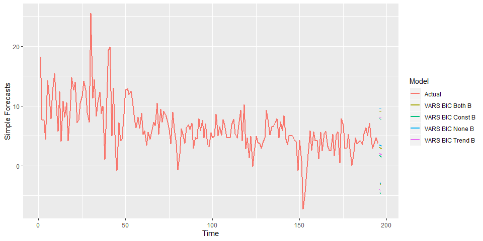

### Batch Forecasts

``` r
mdl_compare$plot_batch_forecasts(only_sliding = FALSE)
```

    ## Warning: Removed 196 rows containing missing values (geom_path).

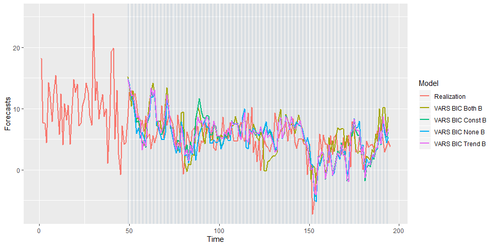

    ## Warning: Removed 196 rows containing missing values (geom_path).

    ## Warning: Removed 196 rows containing missing values (geom_path).

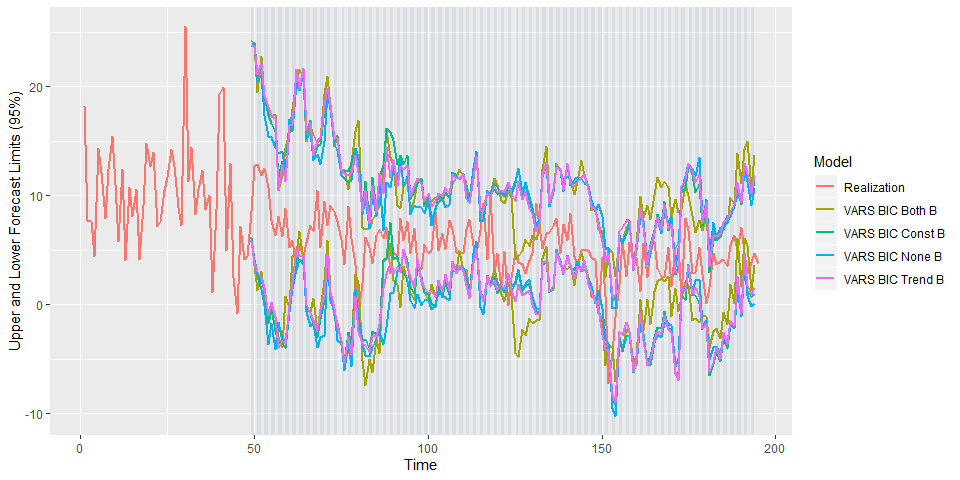

### Batch ASEs

``` r
mdl_compare$plot_batch_ases(only_sliding = FALSE)
```

    ## Loading required namespace: patchwork

    ## Warning: Removed 192 rows containing missing values (geom_path).

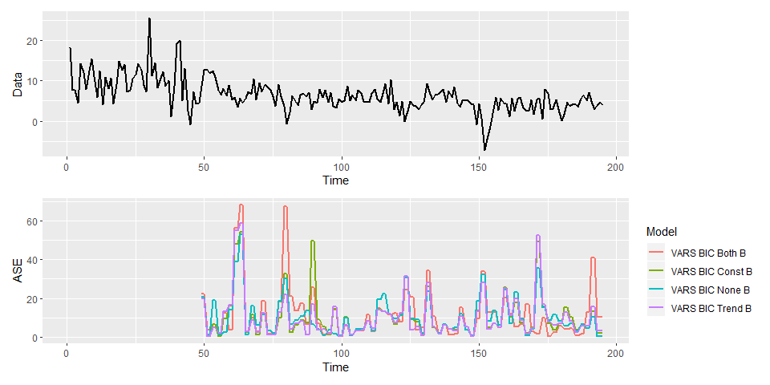

### ASE Histograms

``` r
mdl_compare$plot_histogram_ases()  # Same function as univariate
```

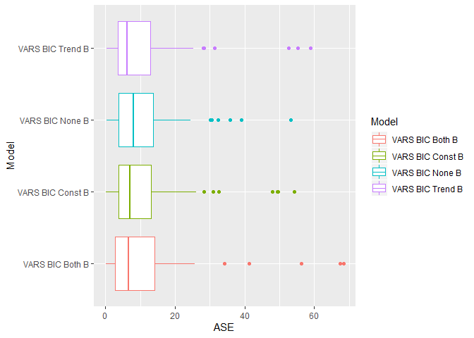

### Statistical Compare

``` r
mdl_compare$statistical_compare() 
```

    ##              Df Sum Sq Mean Sq F value Pr(>F)
    ## Model         3     70   23.24    0.16  0.923
    ## Residuals   288  41888  145.45               
    ## 
    ## 
    ##   Tukey multiple comparisons of means
    ##     95% family-wise confidence level
    ## 
    ## Fit: aov(formula = ASE ~ Model, data = results)
    ## 
    ## $Model
    ##                                         diff       lwr      upr     p adj
    ## VARS BIC Const B-VARS BIC Both B  -0.8007952 -5.959149 4.357559 0.9781180
    ## VARS BIC None B-VARS BIC Both B   -1.0572433 -6.215597 4.101111 0.9518344
    ## VARS BIC Trend B-VARS BIC Both B  -1.2992646 -6.457619 3.859089 0.9151890
    ## VARS BIC None B-VARS BIC Const B  -0.2564481 -5.414802 4.901906 0.9992412
    ## VARS BIC Trend B-VARS BIC Const B -0.4984694 -5.656823 4.659884 0.9945235
    ## VARS BIC Trend B-VARS BIC None B  -0.2420213 -5.400375 4.916333 0.9993618

    ## Call:
    ##    aov(formula = ASE ~ Model, data = results)
    ## 
    ## Terms:
    ##                    Model Residuals
    ## Sum of Squares     69.71  41888.16
    ## Deg. of Freedom        3       288
    ## 
    ## Residual standard error: 12.06006
    ## Estimated effects may be unbalanced

Manual Method
=============

``` r
n = nrow(data)
train_data = data %>% dplyr::filter(row_number() <= (n - n.ahead))
test_data = data %>% dplyr::filter(row_number() > (n - n.ahead))
```

VARselect
---------

``` r
library(vars)
```

    ## Warning: package 'vars' was built under R version 3.5.3

    ## Loading required package: MASS

    ## Warning: package 'MASS' was built under R version 3.5.3

    ## 
    ## Attaching package: 'MASS'

    ## The following object is masked from 'package:dplyr':
    ## 
    ##     select

    ## Loading required package: strucchange

    ## Warning: package 'strucchange' was built under R version 3.5.3

    ## Loading required package: zoo

    ## Warning: package 'zoo' was built under R version 3.5.3

    ## 
    ## Attaching package: 'zoo'

    ## The following objects are masked from 'package:base':
    ## 
    ##     as.Date, as.Date.numeric

    ## Loading required package: sandwich

    ## Warning: package 'sandwich' was built under R version 3.5.3

    ## 
    ## Attaching package: 'strucchange'

    ## The following object is masked from 'package:stringr':
    ## 
    ##     boundary

    ## Loading required package: urca

    ## Warning: package 'urca' was built under R version 3.5.3

    ## Loading required package: lmtest

    ## Warning: package 'lmtest' was built under R version 3.5.3

``` r
# VARselect will select the best K for this VAR model
# Looks at the cross correlation structure (ccf) to figure this out 
vselect = VARselect(data, lag.max = lag.max, type = "both", season = NULL, exogen = NULL)
```

    ## Warning in log(sigma.det): NaNs produced

    ## Warning in log(sigma.det): NaNs produced

    ## Warning in log(sigma.det): NaNs produced

``` r
vselect # Gives AIC values for various K values
```

    ## $selection
    ## AIC(n)  HQ(n)  SC(n) FPE(n) 
    ##     11     11      1     12 
    ## 
    ## $criteria
    ##                   1            2            3            4            5
    ## AIC(n) 3.361241e+01 3.259699e+01 3.220341e+01 3.075216e+01 3.033507e+01
    ## HQ(n)  3.520485e+01 3.558281e+01 3.658260e+01 3.652474e+01 3.750103e+01
    ## SC(n)  3.754096e+01 3.996302e+01 4.300692e+01 4.499316e+01 4.801355e+01
    ## FPE(n) 3.984802e+14 1.495700e+14 1.106985e+14 3.111178e+13 2.799208e+13
    ##                   6            7            8            9           10
    ## AIC(n) 2.923257e+01 2.843556e+01 2.674593e+01 2.484765e+01 2.090656e+01
    ## HQ(n)  3.779191e+01 3.838828e+01 3.809203e+01 3.758713e+01 3.503942e+01
    ## SC(n)  5.034853e+01 5.298901e+01 5.473686e+01 5.627606e+01 5.577245e+01
    ## FPE(n) 1.522721e+13 1.453386e+13 8.223893e+12 6.595373e+12 1.702852e+12
    ##                  11            12
    ## AIC(n) 1.573239e+01           NaN
    ## HQ(n)  3.125863e+01           NaN
    ## SC(n)  5.403577e+01           NaN
    ## FPE(n) 7.080806e+11 -1.003126e-07

``` r
k = vselect$selection[["AIC(n)"]]  # BIC = SC(n)
k
```

    ## [1] 11

AIC picks a VAR(10) model

VAR Model
---------

``` r
varfit = VAR(train_data, p=k, type="both")
stats::AIC(varfit)
```

    ## [1] 9892.83

``` r
print(summary(varfit)$varresult[[var_interest]])
```

    ## 
    ## Call:
    ## lm(formula = y ~ -1 + ., data = datamat)
    ## 
    ## Residuals:
    ##     Min      1Q  Median      3Q     Max 
    ## -3.3246 -0.6723  0.1097  0.7165  2.8392 
    ## 
    ## Coefficients:
    ##                       Estimate Std. Error t value Pr(>|t|)  
    ## gdp_change.l1       -4.469e-01  2.569e-01  -1.739   0.0938 .
    ## unrate.l1            2.731e+00  4.035e+00   0.677   0.5045  
    ## nfjobs.l1            1.510e-03  3.027e-03   0.499   0.6220  
    ## treas10yr.l1         1.382e+00  1.266e+00   1.092   0.2849  
    ## fedintrate.l1        1.254e+00  1.110e+00   1.129   0.2693  
    ## personincomechg.l1   1.395e+00  6.749e-01   2.067   0.0488 *
    ## cpi.l1              -3.966e-01  1.269e+00  -0.313   0.7571  
    ## population.l1       -3.839e-02  1.772e-02  -2.167   0.0396 *
    ## corpprofitchg.l1    -4.852e-02  1.015e-01  -0.478   0.6366  
    ## crude_wti.l1         8.105e-02  1.691e-01   0.479   0.6358  
    ## ppi.l1               4.646e-01  4.818e-01   0.964   0.3438  
    ## gold.l1             -2.450e-03  1.139e-02  -0.215   0.8314  
    ## japan.l1            -5.355e-03  7.740e-02  -0.069   0.9454  
    ## uk.l1                6.424e+00  1.023e+01   0.628   0.5355  
    ## gdp_change.l2       -4.304e-01  3.101e-01  -1.388   0.1770  
    ## unrate.l2            3.283e+00  4.300e+00   0.764   0.4520  
    ## nfjobs.l2           -1.128e-05  4.425e-03  -0.003   0.9980  
    ## treas10yr.l2         1.855e-01  1.328e+00   0.140   0.8900  
    ## fedintrate.l2       -7.802e-01  7.859e-01  -0.993   0.3300  
    ## personincomechg.l2  -4.671e-01  6.849e-01  -0.682   0.5012  
    ## cpi.l2               4.739e-01  1.284e+00   0.369   0.7150  
    ## population.l2        2.914e-02  3.100e-02   0.940   0.3558  
    ## corpprofitchg.l2    -1.217e-01  1.539e-01  -0.791   0.4361  
    ## crude_wti.l2        -3.382e-01  2.003e-01  -1.689   0.1033  
    ## ppi.l2               5.463e-01  5.483e-01   0.996   0.3283  
    ## gold.l2             -2.555e-02  1.712e-02  -1.492   0.1477  
    ## japan.l2            -2.730e-02  1.049e-01  -0.260   0.7967  
    ## uk.l2                1.332e+01  1.168e+01   1.140   0.2647  
    ## gdp_change.l3       -6.563e-01  3.918e-01  -1.675   0.1059  
    ## unrate.l3            2.495e-01  4.200e+00   0.059   0.9531  
    ## nfjobs.l3           -3.094e-03  3.887e-03  -0.796   0.4332  
    ## treas10yr.l3         7.459e-01  1.299e+00   0.574   0.5706  
    ## fedintrate.l3        1.514e+00  8.202e-01   1.846   0.0762 .
    ## personincomechg.l3   1.597e+00  7.745e-01   2.062   0.0493 *
    ## cpi.l3              -4.606e-01  1.210e+00  -0.381   0.7066  
    ## population.l3       -3.256e-03  3.259e-02  -0.100   0.9212  
    ## corpprofitchg.l3    -9.635e-02  1.644e-01  -0.586   0.5628  
    ## crude_wti.l3         6.180e-02  2.548e-01   0.243   0.8102  
    ## ppi.l3               1.035e-01  6.644e-01   0.156   0.8774  
    ## gold.l3              1.351e-05  1.529e-02   0.001   0.9993  
    ## japan.l3             7.998e-02  1.109e-01   0.721   0.4773  
    ## uk.l3               -7.217e-01  1.096e+01  -0.066   0.9480  
    ## gdp_change.l4       -4.016e-01  3.997e-01  -1.005   0.3243  
    ## unrate.l4            5.685e+00  4.053e+00   1.403   0.1725  
    ## nfjobs.l4            2.372e-03  3.764e-03   0.630   0.5341  
    ## treas10yr.l4        -1.699e+00  1.521e+00  -1.117   0.2742  
    ## fedintrate.l4        4.946e-02  7.872e-01   0.063   0.9504  
    ## personincomechg.l4   6.485e-01  7.734e-01   0.839   0.4094  
    ## cpi.l4               2.051e+00  1.645e+00   1.247   0.2236  
    ## population.l4        1.336e-02  3.360e-02   0.398   0.6941  
    ## corpprofitchg.l4    -1.631e-01  1.806e-01  -0.904   0.3746  
    ## crude_wti.l4        -6.743e-02  1.842e-01  -0.366   0.7173  
    ## ppi.l4              -2.404e-01  5.683e-01  -0.423   0.6758  
    ## gold.l4             -1.353e-02  1.692e-02  -0.800   0.4312  
    ## japan.l4            -9.883e-03  9.157e-02  -0.108   0.9149  
    ## uk.l4                3.557e+00  1.142e+01   0.311   0.7580  
    ## gdp_change.l5       -4.098e-01  4.249e-01  -0.965   0.3437  
    ## unrate.l5           -7.672e+00  4.347e+00  -1.765   0.0893 .
    ## nfjobs.l5           -8.740e-04  4.144e-03  -0.211   0.8346  
    ## treas10yr.l5        -1.565e+00  1.393e+00  -1.123   0.2716  
    ## fedintrate.l5       -7.985e-01  9.063e-01  -0.881   0.3864  
    ## personincomechg.l5   1.109e+00  9.134e-01   1.214   0.2355  
    ## cpi.l5              -7.491e-01  1.440e+00  -0.520   0.6072  
    ## population.l5       -2.220e-03  3.848e-02  -0.058   0.9544  
    ## corpprofitchg.l5    -1.726e-01  1.893e-01  -0.912   0.3704  
    ## crude_wti.l5        -8.760e-02  1.757e-01  -0.499   0.6223  
    ## ppi.l5               6.545e-01  5.404e-01   1.211   0.2367  
    ## gold.l5             -2.229e-02  1.828e-02  -1.219   0.2337  
    ## japan.l5             3.386e-02  8.404e-02   0.403   0.6903  
    ## uk.l5               -9.594e+00  1.220e+01  -0.786   0.4389  
    ## gdp_change.l6       -4.965e-01  4.843e-01  -1.025   0.3147  
    ## unrate.l6            1.339e+00  4.181e+00   0.320   0.7513  
    ## nfjobs.l6           -4.541e-03  3.868e-03  -1.174   0.2511  
    ## treas10yr.l6        -5.190e-01  1.629e+00  -0.319   0.7526  
    ## fedintrate.l6       -1.648e-01  8.195e-01  -0.201   0.8422  
    ## personincomechg.l6  -3.161e-01  7.067e-01  -0.447   0.6584  
    ## cpi.l6               5.711e-01  1.333e+00   0.428   0.6719  
    ## population.l6        4.023e-02  3.953e-02   1.018   0.3182  
    ## corpprofitchg.l6    -2.191e-01  1.763e-01  -1.243   0.2251  
    ## crude_wti.l6        -4.111e-02  1.591e-01  -0.258   0.7981  
    ## ppi.l6              -3.643e-01  5.835e-01  -0.624   0.5379  
    ## gold.l6             -6.742e-03  1.857e-02  -0.363   0.7195  
    ## japan.l6            -3.322e-02  8.182e-02  -0.406   0.6880  
    ## uk.l6                3.338e+00  1.024e+01   0.326   0.7469  
    ## gdp_change.l7       -5.355e-01  5.211e-01  -1.028   0.3136  
    ## unrate.l7            6.914e-01  4.114e+00   0.168   0.8678  
    ## nfjobs.l7            5.200e-03  4.294e-03   1.211   0.2368  
    ## treas10yr.l7        -8.860e-01  1.309e+00  -0.677   0.5044  
    ## fedintrate.l7       -9.494e-01  1.056e+00  -0.899   0.3768  
    ## personincomechg.l7   1.606e+00  7.651e-01   2.099   0.0457 *
    ## cpi.l7               5.215e-01  1.261e+00   0.414   0.6826  
    ## population.l7       -6.731e-02  4.494e-02  -1.498   0.1463  
    ## corpprofitchg.l7    -6.771e-02  1.694e-01  -0.400   0.6927  
    ## crude_wti.l7        -2.251e-01  1.603e-01  -1.404   0.1721  
    ## ppi.l7               4.832e-02  6.400e-01   0.076   0.9404  
    ## gold.l7             -1.289e-02  1.521e-02  -0.848   0.4044  
    ## japan.l7             2.833e-03  7.805e-02   0.036   0.9713  
    ## uk.l7                1.579e+00  1.012e+01   0.156   0.8772  
    ## gdp_change.l8       -9.666e-01  5.731e-01  -1.686   0.1037  
    ## unrate.l8            4.241e+00  4.079e+00   1.040   0.3080  
    ## nfjobs.l8            2.491e-03  4.130e-03   0.603   0.5517  
    ## treas10yr.l8        -2.742e-01  1.502e+00  -0.183   0.8565  
    ## fedintrate.l8       -1.434e-01  7.765e-01  -0.185   0.8549  
    ## personincomechg.l8   4.637e-01  7.086e-01   0.654   0.5186  
    ## cpi.l8              -2.143e+00  1.478e+00  -1.450   0.1589  
    ## population.l8        4.363e-02  4.230e-02   1.031   0.3119  
    ## corpprofitchg.l8    -9.137e-02  1.339e-01  -0.683   0.5010  
    ## crude_wti.l8        -1.730e-01  1.977e-01  -0.875   0.3895  
    ## ppi.l8               9.309e-01  6.984e-01   1.333   0.1941  
    ## gold.l8              4.526e-03  1.312e-02   0.345   0.7328  
    ## japan.l8             2.178e-02  9.194e-02   0.237   0.8146  
    ## uk.l8               -5.529e+00  1.088e+01  -0.508   0.6158  
    ## gdp_change.l9       -2.692e-01  4.723e-01  -0.570   0.5736  
    ## unrate.l9           -4.234e+00  5.163e+00  -0.820   0.4196  
    ## nfjobs.l9           -1.298e-03  4.264e-03  -0.304   0.7632  
    ## treas10yr.l9        -2.213e+00  1.769e+00  -1.251   0.2221  
    ## fedintrate.l9       -1.058e-01  7.015e-01  -0.151   0.8813  
    ## personincomechg.l9   1.148e-01  7.084e-01   0.162   0.8725  
    ## cpi.l9               1.728e-02  1.421e+00   0.012   0.9904  
    ## population.l9       -1.902e-02  3.702e-02  -0.514   0.6118  
    ## corpprofitchg.l9    -4.866e-02  1.202e-01  -0.405   0.6889  
    ## crude_wti.l9         2.596e-02  2.278e-01   0.114   0.9101  
    ## ppi.l9              -6.243e-01  7.266e-01  -0.859   0.3981  
    ## gold.l9              5.163e-03  1.412e-02   0.366   0.7176  
    ## japan.l9            -1.969e-02  9.363e-02  -0.210   0.8351  
    ## uk.l9                7.196e+00  1.139e+01   0.632   0.5331  
    ## gdp_change.l10      -4.113e-01  4.135e-01  -0.995   0.3291  
    ## unrate.l10           3.167e+00  3.653e+00   0.867   0.3940  
    ## nfjobs.l10          -1.919e-04  4.156e-03  -0.046   0.9635  
    ## treas10yr.l10        9.933e-01  1.344e+00   0.739   0.4666  
    ## fedintrate.l10      -7.224e-01  6.992e-01  -1.033   0.3110  
    ## personincomechg.l10 -1.095e+00  7.128e-01  -1.537   0.1364  
    ## cpi.l10             -1.691e+00  1.157e+00  -1.462   0.1558  
    ## population.l10      -1.085e-02  3.549e-02  -0.306   0.7621  
    ## corpprofitchg.l10   -8.443e-02  1.208e-01  -0.699   0.4908  
    ## crude_wti.l10       -3.179e-01  2.089e-01  -1.522   0.1400  
    ## ppi.l10              1.412e+00  5.702e-01   2.476   0.0201 *
    ## gold.l10            -9.323e-03  1.508e-02  -0.618   0.5417  
    ## japan.l10            2.085e-02  9.120e-02   0.229   0.8210  
    ## uk.l10               3.224e+00  1.106e+01   0.291   0.7730  
    ## gdp_change.l11      -9.037e-02  3.014e-01  -0.300   0.7667  
    ## unrate.l11           1.676e-01  3.762e+00   0.045   0.9648  
    ## nfjobs.l11          -2.221e-03  3.400e-03  -0.653   0.5194  
    ## treas10yr.l11       -7.879e-01  1.287e+00  -0.612   0.5458  
    ## fedintrate.l11       9.313e-01  6.887e-01   1.352   0.1879  
    ## personincomechg.l11  4.373e-01  6.238e-01   0.701   0.4895  
    ## cpi.l11             -6.343e-01  1.013e+00  -0.626   0.5367  
    ## population.l11       1.647e-02  2.389e-02   0.689   0.4968  
    ## corpprofitchg.l11    3.426e-02  8.262e-02   0.415   0.6818  
    ## crude_wti.l11       -7.262e-02  1.931e-01  -0.376   0.7099  
    ## ppi.l11             -1.214e-01  4.781e-01  -0.254   0.8016  
    ## gold.l11             9.412e-03  1.223e-02   0.770   0.4485  
    ## japan.l11           -7.423e-02  8.633e-02  -0.860   0.3977  
    ## uk.l11              -4.009e+00  8.771e+00  -0.457   0.6514  
    ## const               -3.383e+02  4.428e+02  -0.764   0.4517  
    ## trend                1.145e-01  2.801e+00   0.041   0.9677  
    ## ---
    ## Signif. codes:  0 '***' 0.001 '**' 0.01 '*' 0.05 '.' 0.1 ' ' 1
    ## 
    ## Residual standard error: 2.664 on 26 degrees of freedom
    ## Multiple R-squared:  0.9356, Adjusted R-squared:  0.5514 
    ## F-statistic: 2.435 on 155 and 26 DF,  p-value: 0.004819

Predictions
-----------

``` r
preds = stats::predict(varfit, n.ahead=n.ahead)

results = preds$fcst[[var_interest]] %>% 
  dplyr::as_tibble() %>% 
  dplyr::mutate(Time = seq(n-n.ahead+1,n,1)) 

results
```

    ## # A tibble: 2 x 5
    ##    fcst lower upper    CI  Time
    ##   <dbl> <dbl> <dbl> <dbl> <dbl>
    ## 1  7.65  2.43 12.9   5.22   194
    ## 2 -2.17 -8.33  4.00  6.16   195

### ASE

``` r
ASE_data = data %>% 
  dplyr::mutate(Time = dplyr::row_number()) %>% 
  dplyr::full_join(results, by = "Time") %>% 
  na.omit()

ASE_data
```

    ##     gdp_change unrate nfjobs treas10yr fedintrate personincomechg     cpi
    ## 194        4.7    3.7 150759      2.00       2.38             3.0 256.143
    ## 195        3.8    3.5 151368      1.68       2.04             2.7 256.759
    ##     population corpprofitchg crude_wti   ppi   gold    japan     uk Time
    ## 194     328404      3.316189     54.66 200.3 1413.2 108.0685 1.2675  194
    ## 195     328897     -1.242270     56.95 198.4 1487.6 107.5400 1.2369  195
    ##          fcst     lower     upper       CI
    ## 194  7.650030  2.428072 12.871989 5.221959
    ## 195 -2.166451 -8.329202  3.996299 6.162750

``` r
ASE = mean((ASE_data[[var_interest]] - ASE_data$fcst)^2, na.rm = TRUE)
ASE
```

    ## [1] 22.15061

### Plots

``` r
results = results %>% 
  dplyr::mutate(!!var_interest := fcst) %>% 
  dplyr::mutate(Model = 'VAR Model') %>% 
  dplyr::select(Model, Time, !!var_interest)

combined_data = data %>% 
  dplyr::mutate(Time = dplyr::row_number()) %>% 
  mutate(Model = 'Realization') %>% 
  dplyr::select(Model, Time, !!var_interest) %>% 
  bind_rows(results) %>% 
  mutate(Model = as.factor(Model))

combined_data
```

    ##           Model Time gdp_change
    ## 1   Realization    1  18.200000
    ## 2   Realization    2   7.700000
    ## 3   Realization    3   7.600000
    ## 4   Realization    4   4.400000
    ## 5   Realization    5  14.300000
    ## 6   Realization    6  12.100000
    ## 7   Realization    7   7.900000
    ## 8   Realization    8  12.400000
    ## 9   Realization    9  15.400000
    ## 10  Realization   10  11.000000
    ## 11  Realization   11   5.800000
    ## 12  Realization   12  12.400000
    ## 13  Realization   13   4.100000
    ## 14  Realization   14  10.800000
    ## 15  Realization   15   8.100000
    ## 16  Realization   16  10.600000
    ## 17  Realization   17   4.200000
    ## 18  Realization   18   9.100000
    ## 19  Realization   19  14.800000
    ## 20  Realization   20  12.700000
    ## 21  Realization   21  14.000000
    ## 22  Realization   22   7.200000
    ## 23  Realization   23   7.600000
    ## 24  Realization   24  10.500000
    ## 25  Realization   25  11.700000
    ## 26  Realization   26  14.200000
    ## 27  Realization   27  12.700000
    ## 28  Realization   28   8.900000
    ## 29  Realization   29   7.300000
    ## 30  Realization   30  25.500000
    ## 31  Realization   31  11.300000
    ## 32  Realization   32  14.400000
    ## 33  Realization   33   8.300000
    ## 34  Realization   34  10.600000
    ## 35  Realization   35  12.300000
    ## 36  Realization   36   8.700000
    ## 37  Realization   37  10.000000
    ## 38  Realization   38   1.100000
    ## 39  Realization   39   8.700000
    ## 40  Realization   40  19.300000
    ## 41  Realization   41  19.900000
    ## 42  Realization   42   5.000000
    ## 43  Realization   43  13.000000
    ## 44  Realization   44   2.500000
    ## 45  Realization   45  -0.800000
    ## 46  Realization   46   7.200000
    ## 47  Realization   47   4.200000
    ## 48  Realization   48   4.400000
    ## 49  Realization   49   8.600000
    ## 50  Realization   50  12.700000
    ## 51  Realization   51  12.900000
    ## 52  Realization   52  11.900000
    ## 53  Realization   53  12.500000
    ## 54  Realization   54  10.800000
    ## 55  Realization   55   7.700000
    ## 56  Realization   56   6.400000
    ## 57  Realization   57   8.100000
    ## 58  Realization   58   6.300000
    ## 59  Realization   59   8.800000
    ## 60  Realization   60   5.300000
    ## 61  Realization   61   5.900000
    ## 62  Realization   62   3.400000
    ## 63  Realization   63   5.600000
    ## 64  Realization   64   4.400000
    ## 65  Realization   65   5.700000
    ## 66  Realization   66   7.300000
    ## 67  Realization   67   6.700000
    ## 68  Realization   68  10.500000
    ## 69  Realization   69   5.300000
    ## 70  Realization   70   9.500000
    ## 71  Realization   71   7.300000
    ## 72  Realization   72   9.100000
    ## 73  Realization   73   8.500000
    ## 74  Realization   74   7.600000
    ## 75  Realization   75   6.000000
    ## 76  Realization   76   3.700000
    ## 77  Realization   77   9.000000
    ## 78  Realization   78   6.100000
    ## 79  Realization   79   3.700000
    ## 80  Realization   80  -0.700000
    ## 81  Realization   81   2.000000
    ## 82  Realization   82   6.200000
    ## 83  Realization   83   5.300000
    ## 84  Realization   84   3.800000
    ## 85  Realization   85   6.400000
    ## 86  Realization   86   6.900000
    ## 87  Realization   87   6.100000
    ## 88  Realization   88   7.100000
    ## 89  Realization   89   2.900000
    ## 90  Realization   90   4.800000
    ## 91  Realization   91   4.400000
    ## 92  Realization   92   7.900000
    ## 93  Realization   93   5.900000
    ## 94  Realization   94   7.600000
    ## 95  Realization   95   4.700000
    ## 96  Realization   96   7.000000
    ## 97  Realization   97   3.600000
    ## 98  Realization   98   3.200000
    ## 99  Realization   99   5.500000
    ## 100 Realization  100   4.700000
    ## 101 Realization  101   5.000000
    ## 102 Realization  102   8.600000
    ## 103 Realization  103   5.000000
    ## 104 Realization  104   6.500000
    ## 105 Realization  105   5.100000
    ## 106 Realization  106   7.700000
    ## 107 Realization  107   6.900000
    ## 108 Realization  108   4.800000
    ## 109 Realization  109   4.700000
    ## 110 Realization  110   4.700000
    ## 111 Realization  111   6.900000
    ## 112 Realization  112   7.800000
    ## 113 Realization  113   5.400000
    ## 114 Realization  114   4.600000
    ## 115 Realization  115   6.800000
    ## 116 Realization  116   9.300000
    ## 117 Realization  117   4.200000
    ## 118 Realization  118  10.200000
    ## 119 Realization  119   2.800000
    ## 120 Realization  120   4.700000
    ## 121 Realization  121   1.300000
    ## 122 Realization  122   4.900000
    ## 123 Realization  123  -0.100000
    ## 124 Realization  124   2.400000
    ## 125 Realization  125   4.900000
    ## 126 Realization  126   3.900000
    ## 127 Realization  127   3.700000
    ## 128 Realization  128   2.900000
    ## 129 Realization  129   4.100000
    ## 130 Realization  130   4.700000
    ## 131 Realization  131   9.300000
    ## 132 Realization  132   7.200000
    ## 133 Realization  133   5.200000
    ## 134 Realization  134   6.500000
    ## 135 Realization  135   6.600000
    ## 136 Realization  136   7.300000
    ## 137 Realization  137   7.900000
    ## 138 Realization  138   4.700000
    ## 139 Realization  139   7.400000
    ## 140 Realization  140   5.900000
    ## 141 Realization  141   8.400000
    ## 142 Realization  142   4.400000
    ## 143 Realization  143   3.500000
    ## 144 Realization  144   5.000000
    ## 145 Realization  145   5.000000
    ## 146 Realization  146   5.000000
    ## 147 Realization  147   4.300000
    ## 148 Realization  148   4.100000
    ## 149 Realization  149  -0.800000
    ## 150 Realization  150   4.300000
    ## 151 Realization  151   0.800000
    ## 152 Realization  152  -7.200000
    ## 153 Realization  153  -4.500000
    ## 154 Realization  154  -1.200000
    ## 155 Realization  155   1.900000
    ## 156 Realization  156   5.900000
    ## 157 Realization  157   2.600000
    ## 158 Realization  158   5.700000
    ## 159 Realization  159   4.200000
    ## 160 Realization  160   4.300000
    ## 161 Realization  161   1.200000
    ## 162 Realization  162   5.600000
    ## 163 Realization  163   2.500000
    ## 164 Realization  164   5.400000
    ## 165 Realization  165   5.800000
    ## 166 Realization  166   3.300000
    ## 167 Realization  167   2.600000
    ## 168 Realization  168   2.500000
    ## 169 Realization  169   5.300000
    ## 170 Realization  170   1.700000
    ## 171 Realization  171   5.200000
    ## 172 Realization  172   5.700000
    ## 173 Realization  173   0.500000
    ## 174 Realization  174   7.900000
    ## 175 Realization  175   6.800000
    ## 176 Realization  176   2.900000
    ## 177 Realization  177   3.000000
    ## 178 Realization  178   5.300000
    ## 179 Realization  179   2.800000
    ## 180 Realization  180   0.100000
    ## 181 Realization  181   1.600000
    ## 182 Realization  182   4.700000
    ## 183 Realization  183   3.700000
    ## 184 Realization  184   4.000000
    ## 185 Realization  185   4.200000
    ## 186 Realization  186   3.500000
    ## 187 Realization  187   5.400000
    ## 188 Realization  188   6.400000
    ## 189 Realization  189   5.000000
    ## 190 Realization  190   7.100000
    ## 191 Realization  191   4.800000
    ## 192 Realization  192   2.900000
    ## 193 Realization  193   3.900000
    ## 194 Realization  194   4.700000
    ## 195 Realization  195   3.800000
    ## 196   VAR Model  194   7.650030
    ## 197   VAR Model  195  -2.166451

``` r
p = ggplot2::ggplot() + 
  ggplot2::geom_line(data = combined_data, mapping = ggplot2::aes_string(x = "Time", y = var_interest, color = "Model"))

print(p)
```

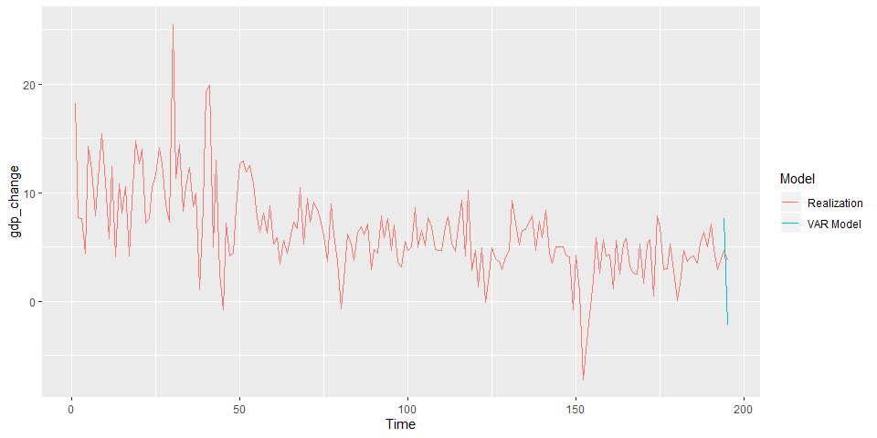

``` r
plot(seq(1,n,1), data[[var_interest]], type = "b")
points(seq(n-n.ahead+1,n,1), preds$fcst[[var_interest]][,'fcst'], type = "b", pch = 15)
```

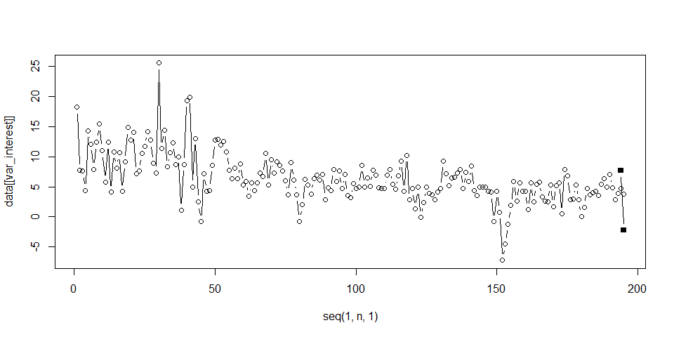

``` r
fanchart(preds, colors = brewer.pal(n = 8, name = "Blues"), names = var_interest) 
```

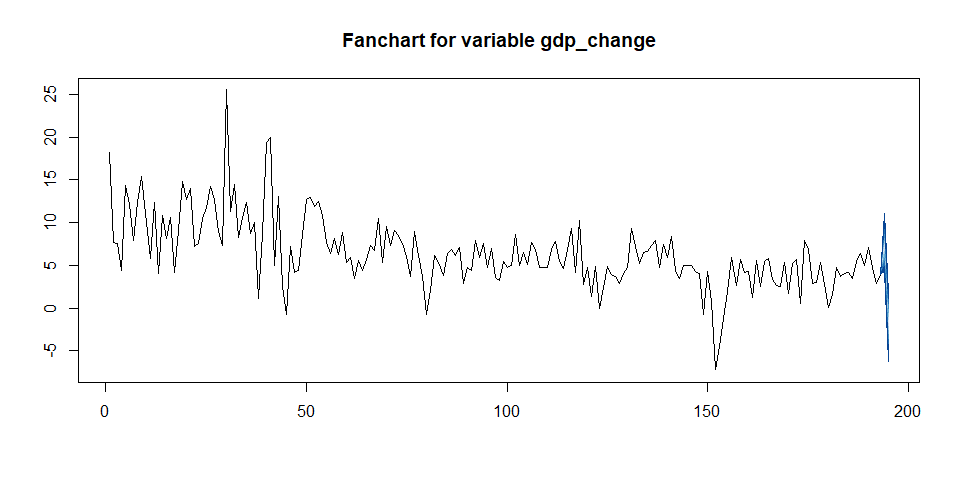
