GDP Prediction
================
Nikhil Gupta
2020-03-19 06:41:51

-   [Setup](#setup)
-   [Stationarity](#stationarity)
    -   [Condition 1](#condition-1)
    -   [Condition 2](#condition-2)
    -   [Condition 3](#condition-3)
    -   [Conclusion](#conclusion)
-   [Stationary Model](#stationary-model)
    -   [Setup](#setup-1)
    -   [Model ID](#model-id)
    -   [ARMA(2,1) Parameter Estimation](#arma21-parameter-estimation)
-   [Non Stationary Model](#non-stationary-model)
    -   [Model ID](#model-id-1)
    -   [MA(1) Parameter Estimation](#ma1-parameter-estimation)
-   [Visualizing Model Comparison](#visualizing-model-comparison)
    -   [Compare Residuals for White Noise](#compare-residuals-for-white-noise)
    -   [Compare Multiple Realizations](#compare-multiple-realizations)
    -   [Compare Simple Forecasts](#compare-simple-forecasts)
    -   [ASE values across Batches](#ase-values-across-batches)
    -   [Forecasts across Batches](#forecasts-across-batches)
    -   [Statistical Comparison](#statistical-comparison)
-   [Higher ordered Models](#higher-ordered-models)
    -   [Stationary Model](#stationary-model-1)
        -   [ARMA(13, 1) Parameter Estimation](#arma13-1-parameter-estimation)
        -   [Factored Form](#factored-form)
    -   [Non Stationary Model](#non-stationary-model-1)
        -   [AR(11) Parameter Estimation](#ar11-parameter-estimation)
        -   [Factored Form](#factored-form-1)
-   [Visualizing Model Comparison](#visualizing-model-comparison-1)
    -   [Compare Residuals for White Noise](#compare-residuals-for-white-noise-1)
    -   [Compare Multiple Realizations](#compare-multiple-realizations-1)
    -   [Compare Simple Forecasts](#compare-simple-forecasts-1)
    -   [ASE values across Batches](#ase-values-across-batches-1)
    -   [Forecasts across Batches](#forecasts-across-batches-1)
    -   [Statistical Comparison](#statistical-comparison-1)

Setup
-----

``` r
library(tswge)
library(tswgewrapped)
library(tidyverse)
library(ggplot2)
library(tseries)
```

``` r
data = read.csv("../data/economic_indicators_all_ex_3mo_china.csv")
data %>% glimpse()
```

    ## Observations: 195
    ## Variables: 15
    ## $ date            <fct> 1971 Q1, 1971 Q2, 1971 Q3, 1971 Q4, 1972 Q1, 1...
    ## $ gdp_change      <dbl> 18.2, 7.7, 7.6, 4.4, 14.3, 12.1, 7.9, 12.4, 15...
    ## $ unrate          <dbl> 6.0, 5.9, 6.0, 6.0, 5.8, 5.7, 5.5, 5.2, 4.9, 4...
    ## $ nfjobs          <int> 70860, 71254, 71614, 72109, 72944, 73758, 7426...
    ## $ treas10yr       <dbl> 5.53, 6.70, 6.00, 5.89, 6.12, 6.15, 6.54, 6.41...
    ## $ fedintrate      <dbl> 3.71, 4.91, 5.55, 4.14, 3.83, 4.46, 4.87, 5.33...
    ## $ personincomechg <dbl> 4.7, 4.9, 3.8, 5.2, 3.6, 3.2, 4.7, 7.6, 7.9, 7...
    ## $ cpi             <dbl> 40.0, 40.6, 40.8, 41.1, 41.4, 41.7, 42.1, 42.5...
    ## $ population      <int> 206960, 207562, 208230, 208829, 209299, 209811...
    ## $ corpprofitchg   <dbl> 12.7497657, 3.7704482, 6.6068568, 3.2925583, 5...
    ## $ crude_wti       <dbl> 3.56, 3.56, 3.56, 3.56, 3.56, 3.56, 3.56, 3.56...
    ## $ ppi             <dbl> 37.8, 38.2, 38.3, 38.6, 39.2, 39.7, 40.2, 41.1...
    ## $ gold            <dbl> 38.800, 40.200, 42.475, 43.500, 48.375, 64.100...
    ## $ japan           <dbl> 357.5187, 357.4118, 338.0210, 320.0727, 302.53...
    ## $ uk              <dbl> 2.4187, 2.4188, 2.4694, 2.5266, 2.6181, 2.5691...

``` r
x = data$gdp_change
```

``` r
px = plotts.sample.wge(x)
```


Stationarity
------------

``` r
tswgewrapped::check_stationarity(x)
```

    ## Loading required namespace: ggfortify

    ## Loading required namespace: patchwork


    ## [1] TRUE

### Condition 1

-   Looks like there is a slight trend in the data with the mean moving down over time. This would be expected. As a country is growing, its GDP is expected to be high. As it becomes a more developed economy, the GDP settles at a lower but steadier value.
-   The ACF plots shows extended autocorrelations although there is also a hint of exponentially decaying behavior. Hence, this trend (wanderig behavior) could be a result of a stationary AR process with positive phi values or it could be a result of a non-stationaty ARIMA like process.
-   **In summary, the mean is changing over time (wandering behavior) and based on the ACFs, this could be coming from either a stationary or a non stationary process.**

### Condition 2

-   Since we have only 1 realization, it is hard to say whether the varaince is different at different time points.
-   However we can make some important observations from this realization and domain knowledge. We see that in the initial part of the graph there is more volatility in the GDP numbers compared to the second half of the graph. This is again expected based on domain knowledge. Just as a developing economy has a higher GDP change value per quarter in general, this comes with a higher volatility. As an economy becomes more developed, not only does the GDP settle to a lower value in general but also the volatility decreases as well.
-   Given the above observations, there may be some hints that condition 2 has not been met

### Condition 3

-   Both the first half and second half ACFs show a damped exponential behavior for the first few lags although the second half ACFs take longer to die down. Also, the 1st half ACF shows higher values at lags of 9, 10 and 11 compared to the second half. It is also interesting to see that neither the firs half nor the second half ACF matches the full data ACF. There is enough evience here to indicate that the data is not stationary.

### Conclusion

-   Given the above analysis, there is a good chance that this data is not coming from a stationary process, although there were some hints (when looking at the mean) that it could have resulted from a stationary AR process. In order to completely eliminate the possibility that this may be coming from a stationary process, we will conduct an initial analysis with a stationary model.

Stationary Model
----------------

### Setup

``` r
n.ahead = 2
batch_size = 50 ## 12 years to predict the next 2 quarters
```

### Model ID

``` r
aicbic(x, p = 0:5, q = 0:2, merge = TRUE, sort_by = 'bic', silent = TRUE)
```

    ##   p q      aic      bic
    ## 1 2 1 2.400740 2.467879
    ## 2 1 2 2.407727 2.474865
    ## 3 1 1       NA 2.477624
    ## 4 3 1 2.405507 2.489430
    ## 5 2 2 2.408653 2.492576
    ## 6 4 1 2.414109       NA

### ARMA(2,1) Parameter Estimation

``` r
est.arma.2.1 = est.arma.wge(x, p = 2, q = 1)
```

    ## 
    ## Coefficients of Original polynomial:  
    ## 1.2175 -0.2239 
    ## 
    ## Factor                 Roots                Abs Recip    System Freq 
    ## 1-0.9917B              1.0084               0.9917       0.0000
    ## 1-0.2257B              4.4298               0.2257       0.0000
    ##   
    ## 

``` r
est.arma.2.1$theta
```

    ## [1] 0.9128495

**OBSERVATIONS**

-   This clears a lot of confusion. **Even when fitting a stationary ARMA model, we get an estimated root of 0.9928 in the factor table which is very close to 1 (non stationary)**. Hence the confusion that we had before can be cleared now. The data most definitely is coming from a non stationary process. For the sake of completeness, we will continue modeling with this stationary model and see how well it performs.

Non Stationary Model
--------------------

Next we will evaluate this as a non stationary model.

### Model ID

An overfit table should show the non-stationary characteristics. The overfit table with *p* = 15 has a root with absolute reciprocal of 0.9676, which is suggestive of a unit root.

``` r
vals = overfit(x, p = 15, type = 'burg')
```

    ## 
    ## Coefficients of Original polynomial:  
    ## 0.3320 0.1846 0.0307 0.0407 -0.0252 0.0879 0.0014 -0.1740 0.2440 0.1282 0.1421 -0.2603 0.0362 0.1418 -0.0473 
    ## 
    ## Factor                 Roots                Abs Recip    System Freq 
    ## 1-0.9676B              1.0334               0.9676       0.0000
    ## 1-0.5635B+0.8922B^2    0.3158+-1.0105i      0.9445       0.2018
    ## 1+0.5196B+0.8727B^2   -0.2977+-1.0283i      0.9342       0.2948
    ## 1+1.7598B+0.8611B^2   -1.0218+-0.3423i      0.9280       0.4486
    ## 1+1.1471B+0.7932B^2   -0.7231+-0.8590i      0.8906       0.3614
    ## 1-1.3917B+0.6867B^2    1.0133+-0.6553i      0.8287       0.0914
    ## 1-1.1513B+0.5479B^2    1.0507+-0.8493i      0.7402       0.1082
    ## 1+0.6765B             -1.4782               0.6765       0.5000
    ## 1-0.3609B              2.7705               0.3609       0.0000
    ##   
    ## 

Because of the extended autocorrelations in the data, we will take the first difference and check the resultant data for stationarity.

``` r
dif1 = artrans.wge(x, phi.tr = 1)
```


``` r
px = plotts.sample.wge(dif1)
```


-   ACF is indicatove of a MA(1) model with positive theta since most ACFs die down after lag = 1 and there is a dip in the Spectral Density at f = 0.

``` r
tswgewrapped::check_stationarity(dif1)
```


    ## [1] TRUE

``` r
aicbic(dif1, p = 0:5, q = 0:2, merge = TRUE, sort_by = 'bic', silent = TRUE)
```

    ##   p q      aic      bic
    ## 1 0 1 2.414572 2.448261
    ## 2 1 1 2.410123 2.460657
    ## 3 0 2 2.473242 2.523776
    ## 4 3 0       NA 2.567351
    ## 5 4 0 2.496508 2.580732
    ## 6 5 0 2.490651       NA

### MA(1) Parameter Estimation

``` r
est.arima.0.1.1.0 = est.arma.wge(dif1, p = 0, q = 1)
```

``` r
est.arima.0.1.1.0$theta
```

    ## [1] 0.8880551

Visualizing Model Comparison
----------------------------

``` r
models = list("ARMA(2,1)" = list(phi = est.arma.2.1$phi,
                                 theta = est.arma.2.1$theta,
                                 vara = est.arma.2.1$avar,
                                 res = est.arma.2.1$res,
                                 sliding_ase = TRUE),
              "ARIMA(0,1,1) s = 0" = list(phi = est.arima.0.1.1.0$phi,
                                     theta = est.arima.0.1.1.0$theta,
                                     d = 1,
                                     s = 0,
                                     vara = est.arima.0.1.1.0$avar,
                                     res = est.arima.0.1.1.0$res,
                                     sliding_ase = TRUE)
              )
```

``` r
mdl_compare = tswgewrapped::ModelCompareUnivariate$new(x = x, mdl_list = models,
                                                       n.ahead = n.ahead, batch_size = batch_size)
```

    ## 
    ## 
    ## 
    ## Computing metrics for:  ARMA(2,1) 
    ## Number of batches expected:  73 
    ## 
    ## 
    ## 
    ## Computing metrics for:  ARIMA(0,1,1) s = 0 
    ## Number of batches expected:  73

### Compare Residuals for White Noise

``` r
table = mdl_compare$evaluate_residuals()
```

    ## 
    ## 
    ## Evaluating residuals for model: 'ARMA(2,1)'

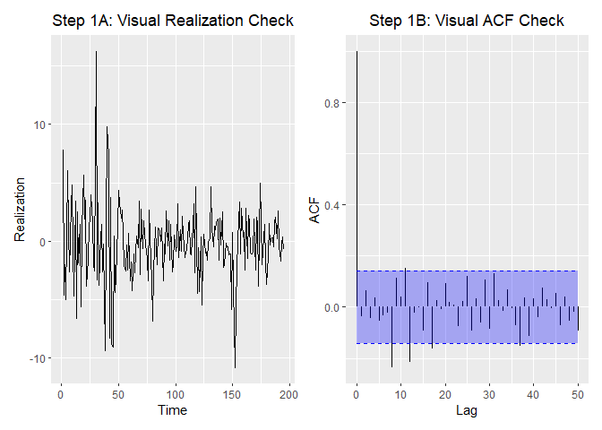

    ## At least one of the 'ljung_box' tests rejected the null hypothesis that the data is consistent with white noise at an significance level of  0.05  
    ## 
    ## 
    ## Evaluating residuals for model: 'ARIMA(0,1,1) s = 0'

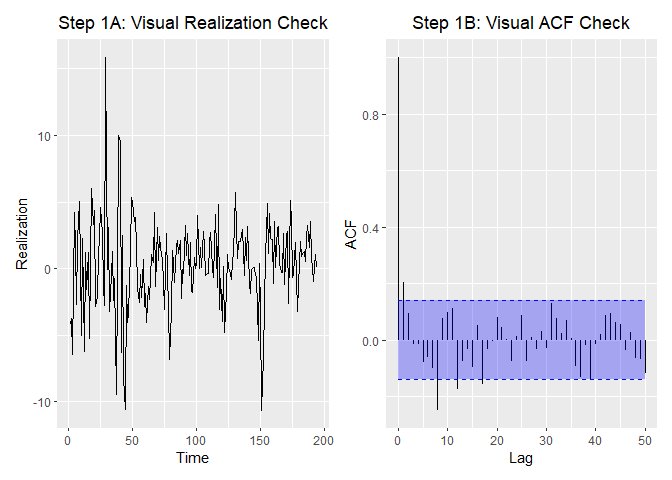

    ## At least one of the 'ljung_box' tests rejected the null hypothesis that the data is consistent with white noise at an significance level of  0.05

``` r
print(table)
```

    ## # A tibble: 4 x 7
    ##   test              K chi.square    df     pval Model            Decision  
    ##   <chr>         <dbl>      <dbl> <dbl>    <dbl> <chr>            <chr>     
    ## 1 Ljung-Box te~    24       45.0    21 0.00174  ARMA(2,1)        REJECT NU~
    ## 2 Ljung-Box te~    48       76.8    45 0.00219  ARMA(2,1)        REJECT NU~
    ## 3 Ljung-Box te~    24       52.1    23 0.000491 ARIMA(0,1,1) s ~ REJECT NU~
    ## 4 Ljung-Box te~    48       81.0    47 0.00150  ARIMA(0,1,1) s ~ REJECT NU~

**It looks like the residuals are not white noise so we have not captured all the signal in the model. Maybe we can do better by looking at higher ordered models.**

### Compare Multiple Realizations

``` r
mdl_compare$plot_multiple_realizations(n.realizations = 4, seed = 100, plot = "realization", scales = 'fixed')
```

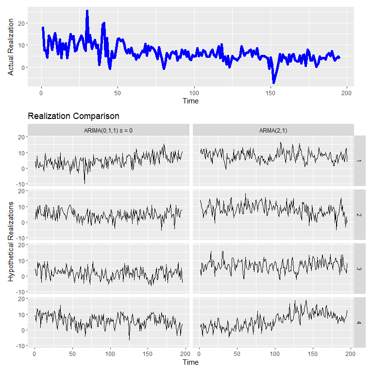

``` r
mdl_compare$plot_multiple_realizations(n.realizations = 4, seed = 100, plot = c("acf", "spectrum"), scales = 'fixed')
```

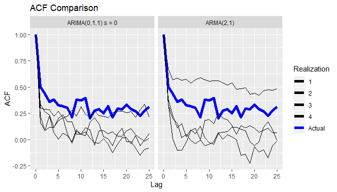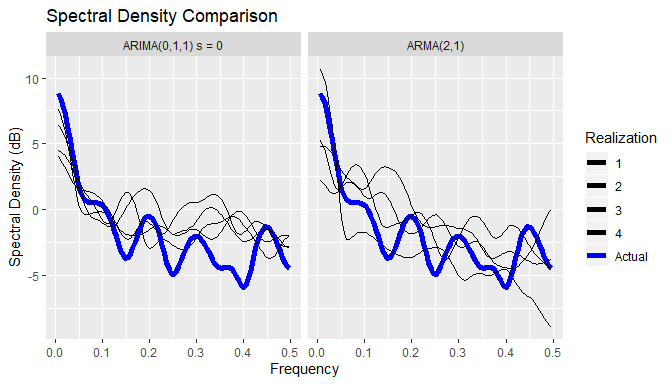

### Compare Simple Forecasts

``` r
mdl_compare$plot_simple_forecasts(lastn = FALSE, limits = FALSE)
```

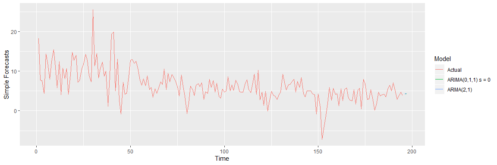

### ASE values across Batches

``` r
ASEs = mdl_compare$get_tabular_metrics(ases = TRUE)
print(ASEs)
```

    ## # A tibble: 146 x 5
    ##    Model        ASE Time_Test_Start Time_Test_End Batch
    ##    <chr>      <dbl>           <dbl>         <dbl> <dbl>
    ##  1 ARMA(2,1) 10.4                49            50     1
    ##  2 ARMA(2,1)  8.41               51            52     2
    ##  3 ARMA(2,1)  3.38               53            54     3
    ##  4 ARMA(2,1)  9.24               55            56     4
    ##  5 ARMA(2,1)  4.28               57            58     5
    ##  6 ARMA(2,1)  6.57               59            60     6
    ##  7 ARMA(2,1) 15.1                61            62     7
    ##  8 ARMA(2,1)  6.68               63            64     8
    ##  9 ARMA(2,1)  0.689              65            66     9
    ## 10 ARMA(2,1)  4.69               67            68    10
    ## # ... with 136 more rows

``` r
ASEs %>% 
  group_by(Model) %>% 
  summarise(ASE_mean = mean(ASE),
            ASE_median = median(ASE),
            ASE_sd = sd(ASE),
            num_batches = n())
```

    ## # A tibble: 2 x 5
    ##   Model              ASE_mean ASE_median ASE_sd num_batches
    ##   <chr>                 <dbl>      <dbl>  <dbl>       <int>
    ## 1 ARIMA(0,1,1) s = 0     6.65       3.58   10.7          73
    ## 2 ARMA(2,1)              6.23       3.38   10.6          73

``` r
mdl_compare$plot_histogram_ases()
```

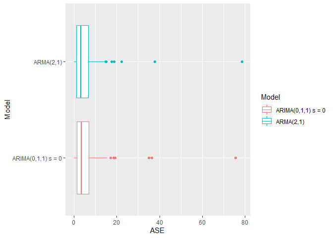

### Forecasts across Batches

``` r
mdl_compare$plot_batch_forecasts(only_sliding = TRUE)
```

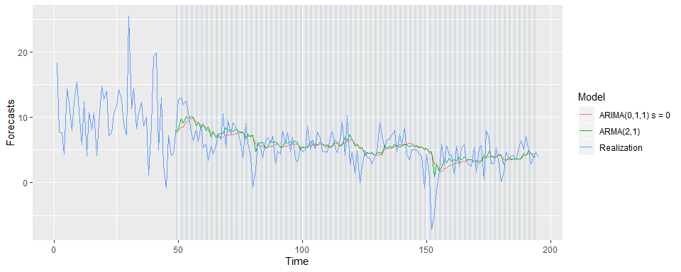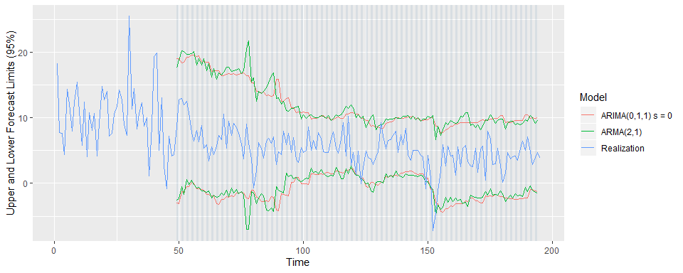

``` r
mdl_compare$plot_batch_ases(only_sliding = TRUE)
```

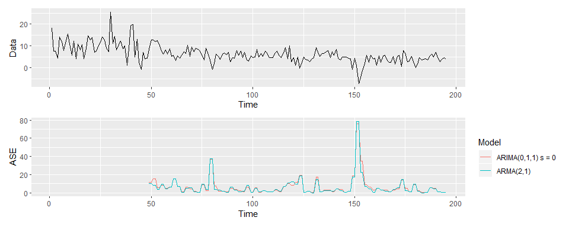

``` r
forecasts = mdl_compare$get_tabular_metrics(ases = FALSE)
print(forecasts)
```

    ## # A tibble: 585 x 5
    ##    Model      Time     f    ll    ul
    ##    <chr>     <dbl> <dbl> <dbl> <dbl>
    ##  1 ARMA(2,1)     1    NA    NA    NA
    ##  2 ARMA(2,1)     2    NA    NA    NA
    ##  3 ARMA(2,1)     3    NA    NA    NA
    ##  4 ARMA(2,1)     4    NA    NA    NA
    ##  5 ARMA(2,1)     5    NA    NA    NA
    ##  6 ARMA(2,1)     6    NA    NA    NA
    ##  7 ARMA(2,1)     7    NA    NA    NA
    ##  8 ARMA(2,1)     8    NA    NA    NA
    ##  9 ARMA(2,1)     9    NA    NA    NA
    ## 10 ARMA(2,1)    10    NA    NA    NA
    ## # ... with 575 more rows

### Statistical Comparison

``` r
mdl_compare$statistical_compare()  
```

    ##              Df Sum Sq Mean Sq F value Pr(>F)
    ## Model         1      7    6.52   0.058   0.81
    ## Residuals   144  16252  112.86               
    ## 
    ## 
    ##   Tukey multiple comparisons of means
    ##     95% family-wise confidence level
    ## 
    ## Fit: aov(formula = ASE ~ Model, data = results)
    ## 
    ## $Model
    ##                                   diff       lwr      upr     p adj
    ## ARMA(2,1)-ARIMA(0,1,1) s = 0 -0.422677 -3.898345 3.052991 0.8103839

    ## Call:
    ##    aov(formula = ASE ~ Model, data = results)
    ## 
    ## Terms:
    ##                     Model Residuals
    ## Sum of Squares      6.521 16251.941
    ## Deg. of Freedom         1       144
    ## 
    ## Residual standard error: 10.62359
    ## Estimated effects may be unbalanced

Higher ordered Models
---------------------

### Stationary Model

Since the ARMA(2, 1) does not appear to be sufficient to whiten the residuals, a higher order model, ARMA(13, 1) was fit. The models suggested by BIC are not sufficient to whiten the residuals.

``` r
aicbic(x, p = 0:16, silent = T, merge = TRUE, sort_by = 'aic')
```

    ## Error in tswge::aic.wge(x, p, q, type) : object 'j_aic' not found
    ## Error in tswge::aic.wge(x, p, q, type) : object 'j_bic' not found

    ##     p q      aic      bic
    ## 1  12 5 2.294954       NA
    ## 2  14 1 2.295388       NA
    ## 3  13 1 2.301076       NA
    ## 4  15 1 2.305607       NA
    ## 5  14 0 2.307973       NA
    ## 6   2 1       NA 2.467879
    ## 7   1 2       NA 2.474865
    ## 8   1 1       NA 2.477624
    ## 9   1 3       NA 2.488470
    ## 10  3 1       NA 2.489430

#### ARMA(13, 1) Parameter Estimation

``` r
est.arma.13.1 <- est.arma.wge(x, p = 13, q = 1)
```

    ## 
    ## Coefficients of Original polynomial:  
    ## 1.1957 -0.1012 -0.1049 -0.0276 -0.0421 0.0804 -0.0428 -0.2072 0.3985 -0.0524 0.0103 -0.3949 0.2810 
    ## 
    ## Factor                 Roots                Abs Recip    System Freq 
    ## 1-0.9928B              1.0073               0.9928       0.0000
    ## 1-0.6044B+0.8884B^2    0.3401+-1.0049i      0.9426       0.1981
    ## 1+1.7937B+0.8782B^2   -1.0213+-0.3094i      0.9371       0.4532
    ## 1+0.5388B+0.8414B^2   -0.3202+-1.0421i      0.9173       0.2974
    ## 1-1.4240B+0.8065B^2    0.8828+-0.6787i      0.8981       0.1043
    ## 1-1.6618B+0.7424B^2    1.1192+-0.3072i      0.8616       0.0426
    ## 1+1.1548B+0.7202B^2   -0.8017+-0.8636i      0.8487       0.3691
    ##   
    ## 

``` r
est.arma.13.1$theta
```

    ## [1] 0.8821771

#### Factored Form

``` r
est.arma.13.1$avar
```

    ## [1] 8.561111

**(1-0.993*B*)(1-0.604*B*+0.888*B*<sup>2</sup>)(1+1.794*B*+0.878*B*<sup>2</sup>)(1+0.539*B*+0.841*B*<sup>2</sup>)(1-1.424B+0.807*B*<sup>2</sup>)(1-1.662*B*+0.742*B*<sup>2</sup>)(1+1.155*B*+0.720*B*<sup>2</sup>)(*X*<sub>*t*</sub> + 6.3887179) = (1-0.882B) *a*<sub>*t*</sub> with *σ*<sub>*a*</sub><sup>2</sup> = 8.5611114**

### Non Stationary Model

BIC suggests an AR(11) and AIC suggests an ARMA(12, 1) of models with options up to ARMA(16, 5). We will continue with the smaller model AR(11).

``` r
aicbic(dif1, p = 0:16, silent = T, merge = TRUE, sort_by = 'bic')
```

    ##     p q      aic      bic
    ## 1   0 1       NA 2.448261
    ## 2   1 1       NA 2.460657
    ## 3   0 2       NA 2.523776
    ## 4  11 0       NA 2.528362
    ## 5   8 1       NA 2.536991
    ## 6  12 1 2.310990       NA
    ## 7  13 0 2.313124       NA
    ## 8  15 0 2.313580       NA
    ## 9  15 1 2.314657       NA
    ## 10 13 1 2.320861       NA

#### AR(11) Parameter Estimation

``` r
est.arima.11.1.0.0 <- est.arma.wge(dif1, p = 11, q = 0)
```

    ## 
    ## Coefficients of Original polynomial:  
    ## -0.6641 -0.4666 -0.3855 -0.3183 -0.3228 -0.2462 -0.2154 -0.3929 -0.1376 0.0322 0.2086 
    ## 
    ## Factor                 Roots                Abs Recip    System Freq 
    ## 1-0.6227B+0.8766B^2    0.3552+-1.0073i      0.9363       0.1960
    ## 1+1.7743B+0.8617B^2   -1.0295+-0.3171i      0.9283       0.4524
    ## 1-1.5025B+0.8361B^2    0.8985+-0.6235i      0.9144       0.0966
    ## 1+0.5210B+0.8091B^2   -0.3220+-1.0641i      0.8995       0.2968
    ## 1+1.0965B+0.6776B^2   -0.8092+-0.9062i      0.8231       0.3660
    ## 1-0.6025B              1.6598               0.6025       0.0000
    ##   
    ## 

#### Factored Form

``` r
est.arima.11.1.0.0$avar
```

    ## [1] 9.047744

**(1-0.6227*B*+0.8766*B*<sup>2</sup>)(1+1.7743*B*+0.8617*B*<sup>2</sup>)(1-1.5025*B*+0.8361*B*<sup>2</sup>)(1+0.5210*B*+0.8091*B*<sup>2</sup>)(1+1.0965*B*+0.6776*B*<sup>2</sup>)(1-0.6025*B*)(1 - *B*)(*X*<sub>*t*</sub> + 6.3887179) = *a*<sub>*t*</sub> with *σ*<sub>*a*</sub><sup>2</sup> = 9.0477442**

Visualizing Model Comparison
----------------------------

``` r
models = list("ARMA(13,1)" = list(phi = est.arma.13.1$phi,
                                  theta = est.arma.13.1$theta,
                                  vara = est.arma.13.1$avar,
                                  res = est.arma.13.1$res,
                                  sliding_ase = TRUE),
              "ARIMA(11,1,0) s = 0" = list(phi = est.arima.11.1.0.0$phi,
                                     theta = est.arima.11.1.0.0$theta,
                                     d = 1,
                                     s = 0,
                                     vara = est.arima.11.1.0.0$avar,
                                     res = est.arima.11.1.0.0$res,
                                     sliding_ase = TRUE)
              )
```

``` r
mdl_compare = tswgewrapped::ModelCompareUnivariate$new(x = x, mdl_list = models,
                                                       n.ahead = n.ahead, batch_size = batch_size)
```

    ## 
    ## 
    ## 
    ## Computing metrics for:  ARMA(13,1) 
    ## Number of batches expected:  73 
    ## 
    ## 
    ## 
    ## Computing metrics for:  ARIMA(11,1,0) s = 0 
    ## Number of batches expected:  73

### Compare Residuals for White Noise

``` r
table = mdl_compare$evaluate_residuals()
```

    ## 
    ## 
    ## Evaluating residuals for model: 'ARMA(13,1)'

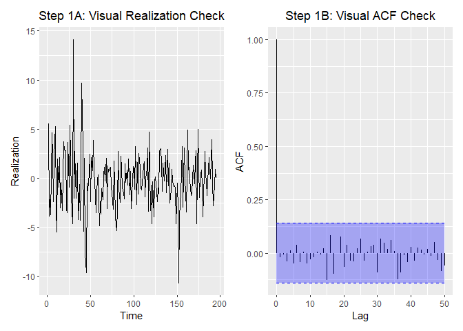

    ## None of the 'ljung_box' tests rejected the null hypothesis that the data is consistent with white noise at an significance level of  0.05  
    ## 
    ## 
    ## Evaluating residuals for model: 'ARIMA(11,1,0) s = 0'

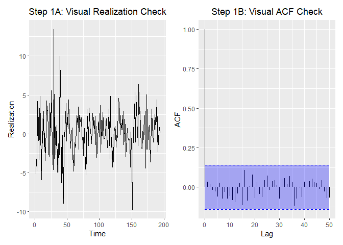

    ## None of the 'ljung_box' tests rejected the null hypothesis that the data is consistent with white noise at an significance level of  0.05

``` r
print(table)
```

    ## # A tibble: 4 x 7
    ##   test               K chi.square    df  pval Model               Decision
    ##   <chr>          <dbl>      <dbl> <dbl> <dbl> <chr>               <chr>   
    ## 1 Ljung-Box test    24       12.8    10 0.236 ARMA(13,1)          FTR NULL
    ## 2 Ljung-Box test    48       27.2    34 0.789 ARMA(13,1)          FTR NULL
    ## 3 Ljung-Box test    24       19.3    13 0.114 ARIMA(11,1,0) s = 0 FTR NULL
    ## 4 Ljung-Box test    48       33.7    37 0.625 ARIMA(11,1,0) s = 0 FTR NULL

### Compare Multiple Realizations

``` r
mdl_compare$plot_multiple_realizations(n.realizations = 4, seed = 100, plot = "realization", scales = 'fixed')
```

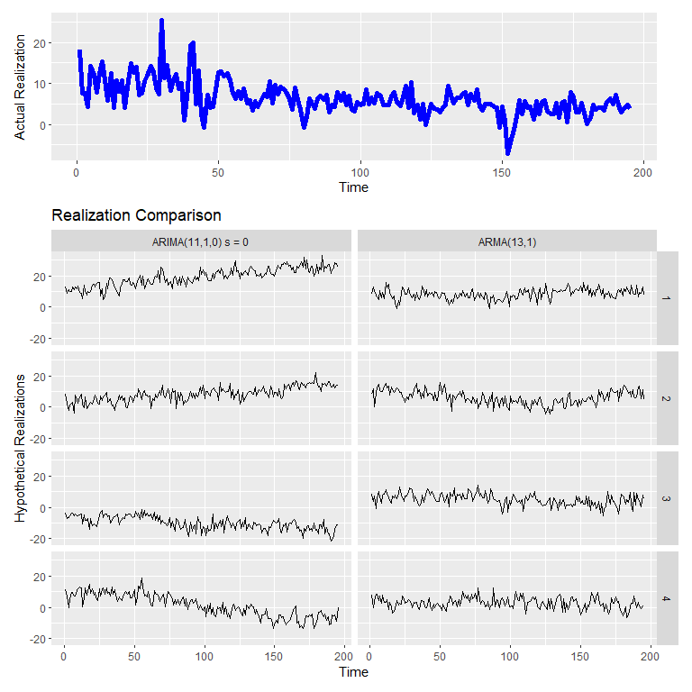

``` r
mdl_compare$plot_multiple_realizations(n.realizations = 4, seed = 100, plot = c("acf", "spectrum"), scales = 'fixed')
```

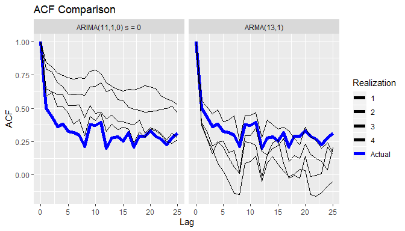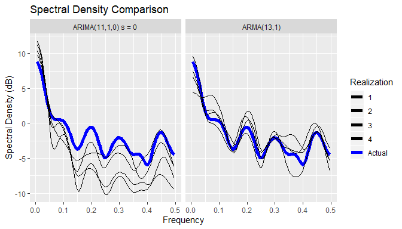

### Compare Simple Forecasts

``` r
mdl_compare$plot_simple_forecasts(lastn = FALSE, limits = FALSE)
```

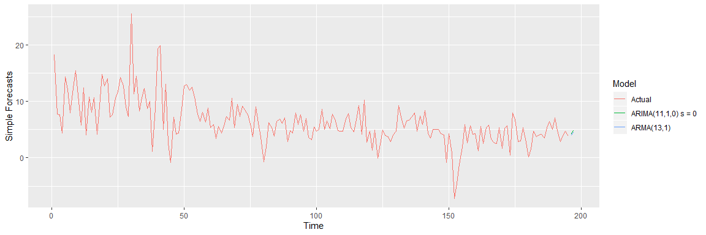

### ASE values across Batches

``` r
ASEs = mdl_compare$get_tabular_metrics(ases = TRUE)
print(ASEs)
```

    ## # A tibble: 146 x 5
    ##    Model         ASE Time_Test_Start Time_Test_End Batch
    ##    <chr>       <dbl>           <dbl>         <dbl> <dbl>
    ##  1 ARMA(13,1)  4.35               49            50     1
    ##  2 ARMA(13,1)  2.60               51            52     2
    ##  3 ARMA(13,1)  7.58               53            54     3
    ##  4 ARMA(13,1)  7.93               55            56     4
    ##  5 ARMA(13,1)  1.62               57            58     5
    ##  6 ARMA(13,1) 12.4                59            60     6
    ##  7 ARMA(13,1) 13.7                61            62     7
    ##  8 ARMA(13,1)  4.75               63            64     8
    ##  9 ARMA(13,1)  0.609              65            66     9
    ## 10 ARMA(13,1)  1.64               67            68    10
    ## # ... with 136 more rows

``` r
ASEs %>% 
  group_by(Model) %>% 
  summarise(ASE_mean = mean(ASE),
            ASE_median = median(ASE),
            ASE_sd = sd(ASE),
            num_batches = n())
```

    ## # A tibble: 2 x 5
    ##   Model               ASE_mean ASE_median ASE_sd num_batches
    ##   <chr>                  <dbl>      <dbl>  <dbl>       <int>
    ## 1 ARIMA(11,1,0) s = 0     6.40       3.55   9.12          73
    ## 2 ARMA(13,1)              5.77       3.73   9.42          73

``` r
mdl_compare$plot_histogram_ases()
```

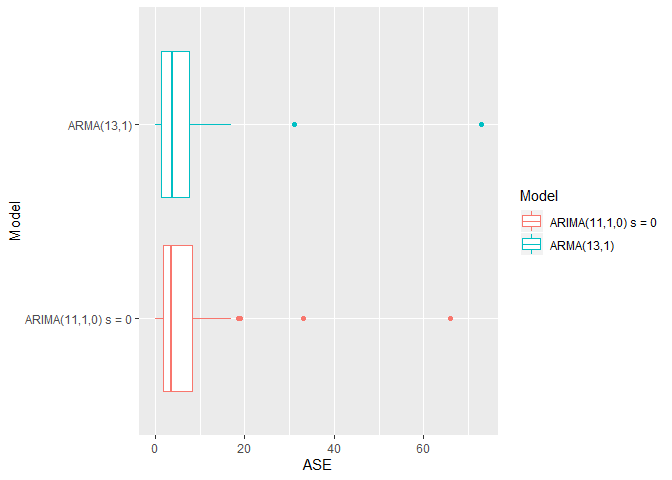

### Forecasts across Batches

``` r
mdl_compare$plot_batch_forecasts(only_sliding = TRUE)
```

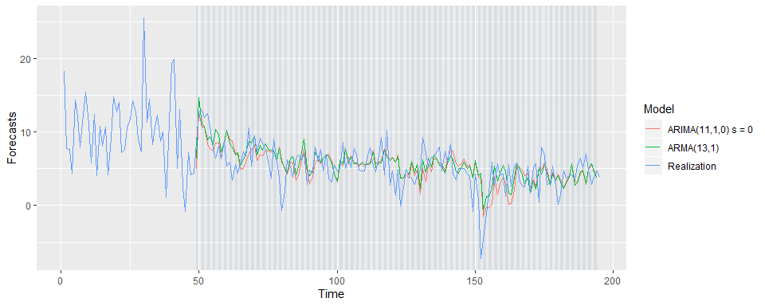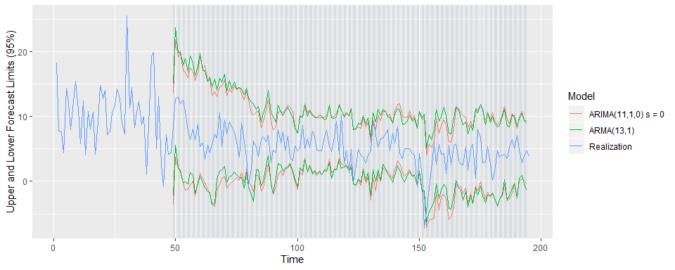

``` r
mdl_compare$plot_batch_ases(only_sliding = TRUE)
```

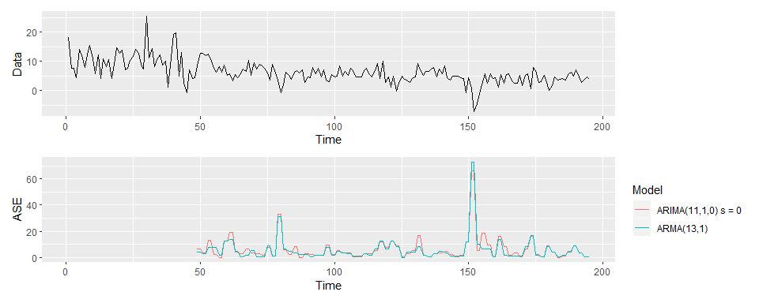

``` r
forecasts = mdl_compare$get_tabular_metrics(ases = FALSE)
print(forecasts)
```

    ## # A tibble: 585 x 5
    ##    Model       Time     f    ll    ul
    ##    <chr>      <dbl> <dbl> <dbl> <dbl>
    ##  1 ARMA(13,1)     1    NA    NA    NA
    ##  2 ARMA(13,1)     2    NA    NA    NA
    ##  3 ARMA(13,1)     3    NA    NA    NA
    ##  4 ARMA(13,1)     4    NA    NA    NA
    ##  5 ARMA(13,1)     5    NA    NA    NA
    ##  6 ARMA(13,1)     6    NA    NA    NA
    ##  7 ARMA(13,1)     7    NA    NA    NA
    ##  8 ARMA(13,1)     8    NA    NA    NA
    ##  9 ARMA(13,1)     9    NA    NA    NA
    ## 10 ARMA(13,1)    10    NA    NA    NA
    ## # ... with 575 more rows

### Statistical Comparison

``` r
mdl_compare$statistical_compare()  
```

    ##              Df Sum Sq Mean Sq F value Pr(>F)
    ## Model         1     14   14.22   0.165  0.685
    ## Residuals   144  12382   85.98               
    ## 
    ## 
    ##   Tukey multiple comparisons of means
    ##     95% family-wise confidence level
    ## 
    ## Fit: aov(formula = ASE ~ Model, data = results)
    ## 
    ## $Model
    ##                                      diff       lwr     upr     p adj
    ## ARMA(13,1)-ARIMA(11,1,0) s = 0 -0.6242212 -3.657932 2.40949 0.6848298

    ## Call:
    ##    aov(formula = ASE ~ Model, data = results)
    ## 
    ## Terms:
    ##                     Model Residuals
    ## Sum of Squares     14.222 12381.610
    ## Deg. of Freedom         1       144
    ## 
    ## Residual standard error: 9.272723
    ## Estimated effects may be unbalanced

**CONCLUSION**

-   It looks like both model performs pooprly in predicting severe downturns (~ time point 80, 120, 150) and upturns (~ time points 48, 127, 172).
-   We may need to inclue exogenous variables into our model that are more indicative of these downturns and upturns in order to improve the model performance.
