GDP Prediction
================
Nikhil Gupta
2020-03-25 21:49:58

-   [Setup](#setup)
-   [GDP Growth (Seasonally Adjusted)](#gdp-growth-seasonally-adjusted)
    -   [Observations](#observations)
    -   [Fits](#fits)
        -   [Pure ARMA fit](#pure-arma-fit)
            -   [Observations](#observations-1)
        -   [ARIMA (no seasonality)](#arima-no-seasonality)
            -   [Observations](#observations-2)
        -   [ARIMA with d = 0 and Seasonality != 0](#arima-with-d-0-and-seasonality-0)
            -   [Observations](#observations-3)
    -   [Predictions](#predictions)
        -   [Pure ARMA](#pure-arma)
        -   [ARIMA()](#arima)
-   [Conclusion](#conclusion)
-   [Collecting more correlated data](#collecting-more-correlated-data)
    -   [GDP](#gdp)
    -   [LABOR MARKET](#labor-market)
        -   [Unemployment Rate](#unemployment-rate)
        -   [Non Farm Jobs (Seasonally Adjusted)](#non-farm-jobs-seasonally-adjusted)
    -   [MONITORY POLICY](#monitory-policy)
        -   [10 yr Treasury Rate](#yr-treasury-rate)
        -   [3 mo Treasury Rate](#mo-treasury-rate)
        -   [10yr - 3mo Treasury](#yr---3mo-treasury)
        -   [Federal Funds Interest Rate](#federal-funds-interest-rate)
        -   [3 month LIBOR](#month-libor)
    -   [CONSUMER RELATED](#consumer-related)
        -   [Real Disposable Personal Income Change](#real-disposable-personal-income-change)
        -   [Consumer Price Index (inflation)](#consumer-price-index-inflation)
        -   [Population](#population)
    -   [BUSINESS ENVIRONMENT](#business-environment)
        -   [Corporate Profits](#corporate-profits)
        -   [Crude Oil](#crude-oil)
        -   [Producer Price Index](#producer-price-index)
    -   [MACRO ECONOMIC FACTORS](#macro-economic-factors)
        -   [Gold](#gold)
        -   [Exchange Rate](#exchange-rate)
            -   [China](#china)
            -   [Japan](#japan)
            -   [UK](#uk)
-   [Merge Data](#merge-data)
-   [TODO](#todo)
    -   [Questions for Dr. Sadler](#questions-for-dr.-sadler)
    -   [Things to Consider](#things-to-consider)
    -   [Data Collection](#data-collection)
    -   [EDA](#eda)
    -   [Model Analysis](#model-analysis)

Setup
=====

``` r
library(tswge)
```

    ## Warning: package 'tswge' was built under R version 3.5.3

``` r
library(tidyverse)
```

    ## Warning: package 'tidyverse' was built under R version 3.5.3

    ## -- Attaching packages --------------------------------------- tidyverse 1.2.1 --

    ## v ggplot2 3.2.0     v purrr   0.3.3
    ## v tibble  2.1.3     v dplyr   0.8.5
    ## v tidyr   0.8.3     v stringr 1.4.0
    ## v readr   1.3.1     v forcats 0.4.0

    ## Warning: package 'ggplot2' was built under R version 3.5.3

    ## Warning: package 'tibble' was built under R version 3.5.3

    ## Warning: package 'tidyr' was built under R version 3.5.3

    ## Warning: package 'readr' was built under R version 3.5.2

    ## Warning: package 'purrr' was built under R version 3.5.3

    ## Warning: package 'dplyr' was built under R version 3.5.3

    ## Warning: package 'stringr' was built under R version 3.5.3

    ## Warning: package 'forcats' was built under R version 3.5.3

    ## -- Conflicts ------------------------------------------ tidyverse_conflicts() --
    ## x dplyr::filter() masks stats::filter()
    ## x dplyr::lag()    masks stats::lag()

``` r
library(tidyquant)
```

    ## Warning: package 'tidyquant' was built under R version 3.5.3

    ## Loading required package: lubridate

    ## 
    ## Attaching package: 'lubridate'

    ## The following object is masked from 'package:base':
    ## 
    ##     date

    ## Loading required package: PerformanceAnalytics

    ## Warning: package 'PerformanceAnalytics' was built under R version 3.5.3

    ## Loading required package: xts

    ## Warning: package 'xts' was built under R version 3.5.2

    ## Loading required package: zoo

    ## Warning: package 'zoo' was built under R version 3.5.3

    ## 
    ## Attaching package: 'zoo'

    ## The following objects are masked from 'package:base':
    ## 
    ##     as.Date, as.Date.numeric

    ## 
    ## Attaching package: 'xts'

    ## The following objects are masked from 'package:dplyr':
    ## 
    ##     first, last

    ## 
    ## Attaching package: 'PerformanceAnalytics'

    ## The following object is masked from 'package:graphics':
    ## 
    ##     legend

    ## Loading required package: quantmod

    ## Warning: package 'quantmod' was built under R version 3.5.3

    ## Loading required package: TTR

    ## Warning: package 'TTR' was built under R version 3.5.2

    ## Version 0.4-0 included new data defaults. See ?getSymbols.

``` r
library(skimr)
```

    ## Warning: package 'skimr' was built under R version 3.5.3

    ## 
    ## Attaching package: 'skimr'

    ## The following object is masked from 'package:stats':
    ## 
    ##     filter

``` r
library(plyr)
```

    ## Warning: package 'plyr' was built under R version 3.5.3

    ## -------------------------------------------------------------------------

    ## You have loaded plyr after dplyr - this is likely to cause problems.
    ## If you need functions from both plyr and dplyr, please load plyr first, then dplyr:
    ## library(plyr); library(dplyr)

    ## -------------------------------------------------------------------------

    ## 
    ## Attaching package: 'plyr'

    ## The following object is masked from 'package:lubridate':
    ## 
    ##     here

    ## The following objects are masked from 'package:dplyr':
    ## 
    ##     arrange, count, desc, failwith, id, mutate, rename, summarise,
    ##     summarize

    ## The following object is masked from 'package:purrr':
    ## 
    ##     compact

``` r
library(ggplot2)
source("common_functions_tq.R")
```

``` r
from = "1970-01-01"
```

GDP Growth (Seasonally Adjusted)
================================

``` r
ID = "A191RP1Q027SBEA"
data = tqw_get_fred(ID = ID, from = from)
data %>% glimpse()
```

    ## Observations: 200
    ## Variables: 2
    ## $ date  <date> 1970-01-01, 1970-04-01, 1970-07-01, 1970-10-01, 1971-01...
    ## $ price <dbl> 5.1, 6.3, 7.2, 0.9, 18.2, 7.7, 7.6, 4.4, 14.3, 12.1, 7.9...

``` r
data = data %>%    
    tq_transmute(mutate_fun = to.period,
                 period = "quarters", 
                 col_rename = "gdp_change")
data %>% glimpse()
```

    ## Observations: 200
    ## Variables: 2
    ## $ date       <date> 1970-01-01, 1970-04-01, 1970-07-01, 1970-10-01, 19...
    ## $ gdp_change <dbl> 5.1, 6.3, 7.2, 0.9, 18.2, 7.7, 7.6, 4.4, 14.3, 12.1...

``` r
data %>%
    ggplot(aes(x = date, y = gdp_change)) +
    geom_line() +
    #labs(title = title, y = y_label, x = x_label) + 
    theme_tq()
```

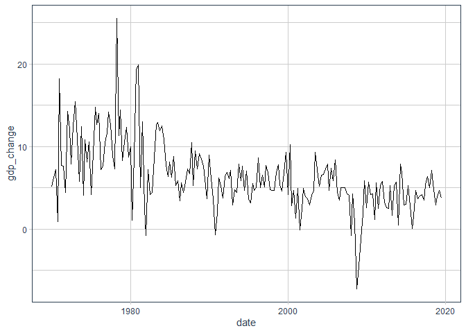

``` r
px = plotts.sample.wge(data$gdp_change, lag.max = 40)
```


Observations
------------

-   Looks like there are several peaks, but if we note carefully, the magnitude is less than 0.
-   Peak at f = 0 is the most appreciable --&gt; so this could come from an ARMA, ARIMA (no seasonality) or an ARIMA (with seasonality model)
-   ACF's have not died down even after lag of at least 32 (8 years!!) --&gt; some indication of extended autocorrelations pointing to a ARIMA model (--&gt; this is using older data)

Let's see various fits to see.

Fits
----

### Pure ARMA fit

``` r
grid = aic5.wge(data$gdp_change)
```

    ## ---------WORKING... PLEASE WAIT... 
    ## 
    ## 
    ## Five Smallest Values of  aic

``` r
grid 
```

    ##       p    q        aic
    ## 8     2    1   2.447463
    ## 11    3    1   2.447746
    ## 6     1    2   2.451632
    ## 5     1    1   2.454758
    ## 14    4    1   2.457580

``` r
arma_fit = aic.wge(data$gdp_change)

factor.wge(phi = arma_fit$phi)
```

    ## 
    ## Coefficients of Original polynomial:  
    ## 1.1575 -0.1713 
    ## 
    ## Factor                 Roots                Abs Recip    System Freq 
    ## 1-0.9833B              1.0169               0.9833       0.0000
    ## 1-0.1742B              5.7407               0.1742       0.0000
    ##   
    ## 

``` r
factor.wge(phi = arma_fit$theta)
```

    ## 
    ## Coefficients of Original polynomial:  
    ## 0.8901 
    ## 
    ## Factor                 Roots                Abs Recip    System Freq 
    ## 1-0.8901B              1.1234               0.8901       0.0000
    ##   
    ## 

#### Observations

-   This solves a lot of the open questions
-   The factor table for the fitted phi's shows that the value of the dominant root is very close to 1 hence the realization is displaying ARIMA type of properties.

### ARIMA (no seasonality)

``` r
results = tribble(~d, ~best_p, ~best_q, ~best_aic)


data_diff = artrans.wge(data$gdp_change, phi.tr = 1, plottr = TRUE)
```

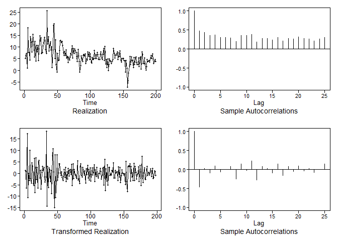

``` r
# px = plotts.sample.wge(data_no_season)
grid = aic5.wge(data_diff)
```

    ## ---------WORKING... PLEASE WAIT... 
    ## 
    ## 
    ## Five Smallest Values of  aic

``` r
best_aic = grid$`       aic`[1]
best_p = grid$`   p`[1]
best_q = grid$`   q`[1]
  
results = results %>% 
  add_row(d = 1, best_p = best_p, best_q = best_q, best_aic = best_aic)

results %>% 
  arrange(best_aic)
```

    ## # A tibble: 1 x 4
    ##       d best_p best_q best_aic
    ##   <dbl>  <dbl>  <dbl>    <dbl>
    ## 1     1      0      2     2.44

``` r
px = plotts.sample.wge(data_diff)
```

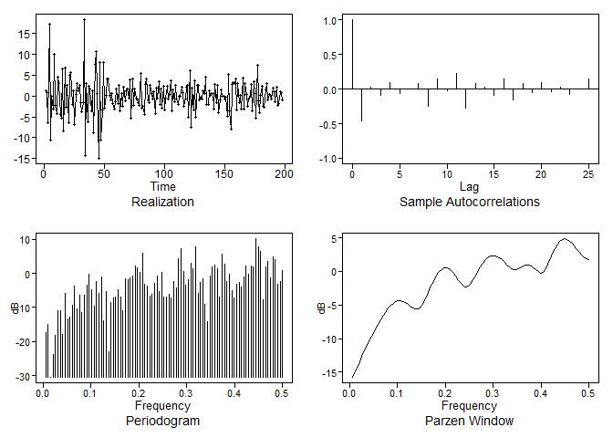

``` r
arima_fit = aic.wge(data_diff)

if (arima_fit$p != 0){ factor.wge(phi = arima_fit$phi)   }
if (arima_fit$q != 0){ factor.wge(phi = arima_fit$theta) }
```

    ## 
    ## Coefficients of Original polynomial:  
    ## 0.7690 0.1484 
    ## 
    ## Factor                 Roots                Abs Recip    System Freq 
    ## 1-0.9288B              1.0766               0.9288       0.0000
    ## 1+0.1598B             -6.2589               0.1598       0.5000
    ##   
    ## 

#### Observations

-   Best AIC is for ARIMA(0,1,2) with s = 0.
-   Best AIC = 2.444 which is very close to the pure ARMA model since that has a dominant root very close to 1 anyway.

### ARIMA with d = 0 and Seasonality != 0

``` r
results = tribble(~seasonality, ~best_p, ~best_q, ~best_aic)

for (s in 2:12){
  # Note when s = 1, this returns a ARIMA model with d = 1 and no seasonality
  # For s > 1, this returns a ARIMA model with d = 0 and seasonality = s
  data_no_season = artrans.wge(data$gdp_change, phi.tr = c(rep(0, s-1),1), plottr = TRUE)
  # px = plotts.sample.wge(data_no_season)
  grid = aic5.wge(data_no_season)
  best_aic = grid$`       aic`[1]
  best_p = grid$`   p`[1]
  best_q = grid$`   q`[1]
  
  results = results %>% 
    add_row(seasonality = s, best_p = best_p, best_q = best_q, best_aic = best_aic)
}
```

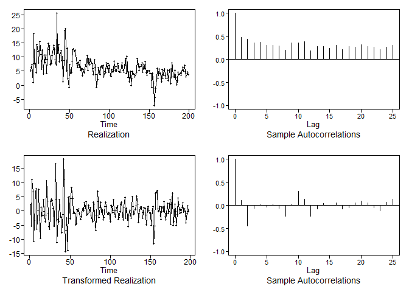

    ## ---------WORKING... PLEASE WAIT... 
    ## 
    ## 
    ## Five Smallest Values of  aic


    ## ---------WORKING... PLEASE WAIT... 
    ## 
    ## 
    ## Five Smallest Values of  aic


    ## ---------WORKING... PLEASE WAIT... 
    ## 
    ## 
    ## Five Smallest Values of  aic

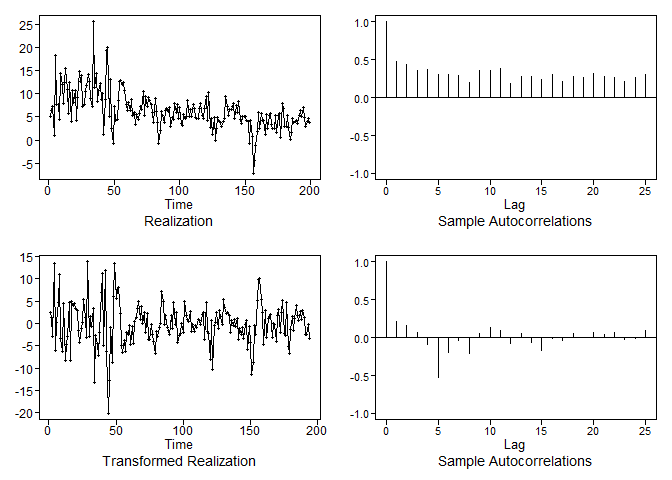

    ## ---------WORKING... PLEASE WAIT... 
    ## 
    ## 
    ## Five Smallest Values of  aic


    ## ---------WORKING... PLEASE WAIT... 
    ## 
    ## 
    ## Five Smallest Values of  aic


    ## ---------WORKING... PLEASE WAIT... 
    ## 
    ## 
    ## Five Smallest Values of  aic

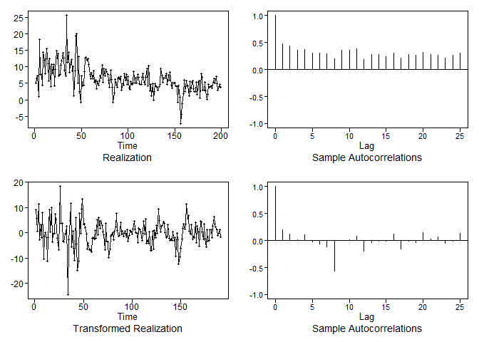

    ## ---------WORKING... PLEASE WAIT... 
    ## 
    ## 
    ## Five Smallest Values of  aic

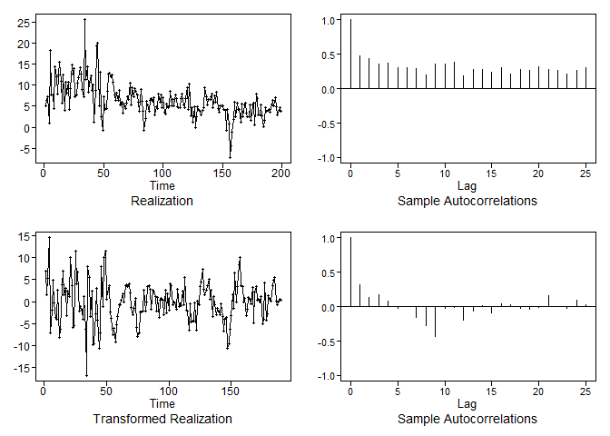

    ## ---------WORKING... PLEASE WAIT... 
    ## 
    ## 
    ## Five Smallest Values of  aic


    ## ---------WORKING... PLEASE WAIT... 
    ## 
    ## 
    ## Five Smallest Values of  aic


    ## ---------WORKING... PLEASE WAIT... 
    ## 
    ## 
    ## Five Smallest Values of  aic


    ## ---------WORKING... PLEASE WAIT... 
    ## 
    ## 
    ## Five Smallest Values of  aic

``` r
results %>% 
  arrange(best_aic)
```

    ## # A tibble: 11 x 4
    ##    seasonality best_p best_q best_aic
    ##          <int>  <dbl>  <dbl>    <dbl>
    ##  1           2      5      2     2.54
    ##  2           5      5      2     2.66
    ##  3           3      5      1     2.71
    ##  4          10      4      1     2.75
    ##  5          11      4      2     2.77
    ##  6           9      3      2     2.86
    ##  7           4      4      0     2.87
    ##  8           7      2      2     2.91
    ##  9           6      5      1     2.97
    ## 10           8      5      2     3.15
    ## 11          12      3      1     3.21

#### Observations

-   Best Model including Seasonality is ARIMA(5,0,2) with s = 2
-   However, this is not as good as the pure ARMA model or the ARIMA with no seasonality model.
-   We will exclude this from the final consideration.

Predictions
-----------

``` r
n.ahead = 4

compute_ase = function(data, forecast, n.ahead){
  n = length(data)
  ase = mean((data[(n-n.ahead+1):n] - forecast$f)^2)
  return(ase)
}

results = tribble(~model, ~ase)
```

### Pure ARMA

``` r
model = "ARMA"
fore_arma = fore.arma.wge(data$gdp_change, phi = arma_fit$phi, theta = arma_fit$theta, n.ahead = n.ahead, lastn = TRUE)
```


``` r
ase_arma = compute_ase(data = data$gdp_change, forecast = fore_arma, n.ahead = n.ahead)

results = results %>% 
    add_row(model = model, ase = ase_arma)
```

### ARIMA()

``` r
model = "ARIMA"
fore_arima = fore.aruma.wge(data$gdp_change, phi = arima_fit$phi, theta = arima_fit$theta, n.ahead = n.ahead, lastn = TRUE) 
```


``` r
ase_arima = compute_ase(data = data$gdp_change, forecast = fore_arima, n.ahead = n.ahead)

results = results %>% 
    add_row(model = model, ase = ase_arima)
```

``` r
results
```

    ## # A tibble: 2 x 2
    ##   model     ase
    ##   <chr>   <dbl>
    ## 1 ARMA    0.605
    ## 2 ARIMA 186.

Conclusion
==========

-   ARMA(2,1) and ARIMA(0,1,2) seem to give similar results based on AIC
-   However, ARIMA fails terribly at predicton and the ASE is huge especially for immediate predictons.
-   Hence we would recommend using the ARMA model in this case.
-   This model only takes 'time' into consideration while building the model. There may be other exogenous variables that may impact GDP which we have not considered at all. We will do that next with VAR models and Neural Networks.

Collecting more correlated data
===============================

``` r
aggregate.period = "quarters"
index.at = "yearqtr"
from = "1900-01-01"  ## Going to increase the horizon since we need more data for NN models
```

GDP
---

``` r
ID = "A191RP1Q027SBEA"

gdp_change = tqw_get_fred(ID = ID, from = from)
gdp_change %>% glimpse()
```

    ## Observations: 291
    ## Variables: 2
    ## $ date  <date> 1947-04-01, 1947-07-01, 1947-10-01, 1948-01-01, 1948-04...
    ## $ price <dbl> 4.7, 6.0, 17.3, 9.6, 10.7, 10.1, 1.7, -7.4, -5.2, 2.3, -...

``` r
gdp_change = gdp_change %>%    
    tq_transmute(mutate_fun = to.period,
                 period = aggregate.period, 
                 indexAt = index.at,
                 col_rename = "gdp_change")

gdp_change %>% glimpse()
```

    ## Observations: 291
    ## Variables: 2
    ## $ date       <yearqtr> 1947 Q2, 1947 Q3, 1947 Q4, 1948 Q1, 1948 Q2, 19...
    ## $ gdp_change <dbl> 4.7, 6.0, 17.3, 9.6, 10.7, 10.1, 1.7, -7.4, -5.2, 2...

``` r
gdp_change %>%
    ggplot(aes(x = date, y = gdp_change)) +
    geom_line() +
    #labs(title = title, y = y_label, x = x_label) + 
    theme_tq()
```

    ## Don't know how to automatically pick scale for object of type yearqtr. Defaulting to continuous.

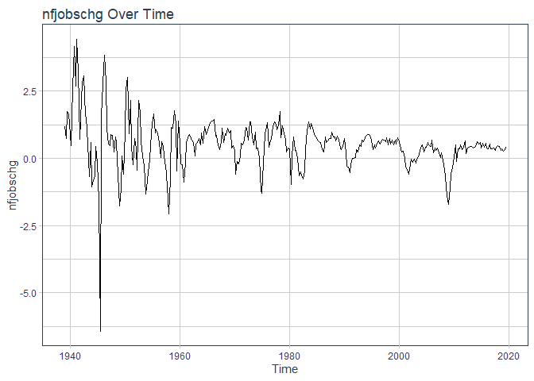

LABOR MARKET
------------

### Unemployment Rate

``` r
ID = "UNRATE"

unrate = tqw_get_fred(ID = ID, from = from)
unrate %>% glimpse()
```

    ## Observations: 866
    ## Variables: 2
    ## $ date  <date> 1948-01-01, 1948-02-01, 1948-03-01, 1948-04-01, 1948-05...
    ## $ price <dbl> 3.4, 3.8, 4.0, 3.9, 3.5, 3.6, 3.6, 3.9, 3.8, 3.7, 3.8, 4...

``` r
unrate = unrate %>%    
    tq_transmute(mutate_fun = to.period,
                 period = aggregate.period, 
                 indexAt = index.at,
                 col_rename = "unrate")

unrate %>% glimpse()
```

    ## Observations: 289
    ## Variables: 2
    ## $ date   <yearqtr> 1948 Q1, 1948 Q2, 1948 Q3, 1948 Q4, 1949 Q1, 1949 Q...
    ## $ unrate <dbl> 4.0, 3.6, 3.8, 4.0, 5.0, 6.2, 6.6, 6.6, 6.3, 5.4, 4.4, ...

``` r
unrate %>%
    ggplot(aes(x = date, y = unrate)) +
    geom_line() +
    #labs(title = title, y = y_label, x = x_label) + 
    theme_tq()
```

    ## Don't know how to automatically pick scale for object of type yearqtr. Defaulting to continuous.


### Non Farm Jobs (Seasonally Adjusted)

``` r
ID = "PAYEMS"

nfjobs = tqw_get_fred(ID = ID, from = from)
nfjobs %>% glimpse()
```

    ## Observations: 974
    ## Variables: 2
    ## $ date  <date> 1939-01-01, 1939-02-01, 1939-03-01, 1939-04-01, 1939-05...
    ## $ price <int> 29923, 30100, 30280, 30094, 30299, 30502, 30419, 30663, ...

``` r
nfjobschg = nfjobs %>%    
  tq_transmute(mutate_fun = periodReturn,  # Note this is different from others as I am converting raw values to % changes
                 period = "quarterly", 
                 col_rename = "nfjobschg") %>% 
  mutate(nfjobschg = nfjobschg * 100) %>% 
  tq_transmute(mutate_fun = to.period,
                 period = aggregate.period, 
                 indexAt = index.at,
                 col_rename = "nfjobschg")

nfjobschg %>% glimpse()
```

    ## Observations: 325
    ## Variables: 2
    ## $ date      <yearqtr> 1939 Q1, 1939 Q2, 1939 Q3, 1939 Q4, 1940 Q1, 194...
    ## $ nfjobschg <dbl> 1.1930622, 0.7331572, 1.7343125, 1.6467404, 0.897216...

``` r
nfjobschg %>%
    ggplot(aes(x = date, y = nfjobschg)) +
    geom_line() +
    #labs(title = title, y = y_label, x = x_label) + 
    theme_tq()
```

    ## Don't know how to automatically pick scale for object of type yearqtr. Defaulting to continuous.

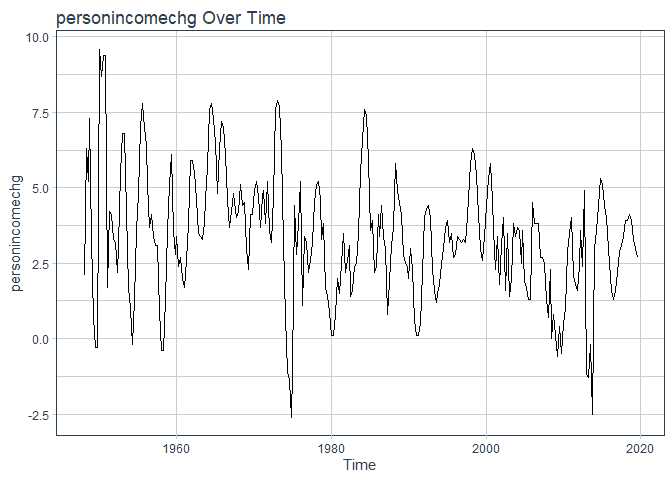

MONITORY POLICY
---------------

### 10 yr Treasury Rate

``` r
ID = "DGS10"

treas10yr = tqw_get_fred(ID = ID, from = from)
treas10yr %>% glimpse()
```

    ## Observations: 15,191
    ## Variables: 2
    ## $ date  <date> 1962-01-02, 1962-01-03, 1962-01-04, 1962-01-05, 1962-01...
    ## $ price <dbl> 4.06, 4.03, 3.99, 4.02, 4.03, 4.05, 4.07, 4.08, 4.08, 4....

``` r
treas10yr %>% skim()  # Few missing values
```

    ## Skim summary statistics
    ##  n obs: 15191 
    ##  n variables: 2 
    ## 
    ## -- Variable type:Date ----------------------------------------------------------
    ##  variable missing complete     n        min        max     median n_unique
    ##      date       0    15191 15191 1962-01-02 2020-03-24 1991-02-12    15191
    ## 
    ## -- Variable type:numeric -------------------------------------------------------
    ##  variable missing complete     n mean   sd   p0  p25  p50  p75  p100
    ##     price     650    14541 15191  6.1 2.91 0.54 4.03 5.86 7.78 15.84
    ##      hist
    ##  <U+2583><U+2587><U+2587><U+2587><U+2583><U+2582><U+2581><U+2581>

``` r
treas10yr = treas10yr %>%    
    tq_transmute(mutate_fun = to.period,
                 period = aggregate.period, 
                 indexAt = index.at,
                 col_rename = "treas10yr")
```

    ## Warning in fun_transmute(., OHLC = FALSE, ...): missing values removed from
    ## data

``` r
treas10yr %>% glimpse()
```

    ## Observations: 233
    ## Variables: 2
    ## $ date      <yearqtr> 1962 Q1, 1962 Q2, 1962 Q3, 1962 Q4, 1963 Q1, 196...
    ## $ treas10yr <dbl> 3.86, 4.00, 3.94, 3.85, 3.95, 4.00, 4.07, 4.14, 4.23...

``` r
# treas10yr %>% skim() # No missing values
```

``` r
treas10yr %>%
    ggplot(aes(x = date, y = treas10yr)) +
    geom_line() +
    #labs(title = title, y = y_label, x = x_label) + 
    theme_tq()
```

    ## Don't know how to automatically pick scale for object of type yearqtr. Defaulting to continuous.


### 3 mo Treasury Rate

``` r
ID = "DGS3MO"

treas3mo = tqw_get_fred(ID = ID, from = from)
treas3mo %>% glimpse()
```

    ## Observations: 9,972
    ## Variables: 2
    ## $ date  <date> 1982-01-04, 1982-01-05, 1982-01-06, 1982-01-07, 1982-01...
    ## $ price <dbl> 11.87, 12.20, 12.16, 12.17, 11.98, 12.49, 12.52, 12.70, ...

``` r
treas3mo = treas3mo %>%    
    tq_transmute(mutate_fun = to.period,
                 period = aggregate.period, 
                 indexAt = index.at,
                 col_rename = "treas3mo")
```

    ## Warning in fun_transmute(., OHLC = FALSE, ...): missing values removed from
    ## data

``` r
treas3mo %>% glimpse()
```

    ## Observations: 153
    ## Variables: 2
    ## $ date     <yearqtr> 1982 Q1, 1982 Q2, 1982 Q3, 1982 Q4, 1983 Q1, 1983...
    ## $ treas3mo <dbl> 13.99, 13.36, 7.88, 8.20, 8.96, 9.15, 9.04, 9.33, 10....

``` r
treas3mo %>%
    ggplot(aes(x = date, y = treas3mo)) +
    geom_line() +
    #labs(title = title, y = y_label, x = x_label) + 
    theme_tq()
```

    ## Don't know how to automatically pick scale for object of type yearqtr. Defaulting to continuous.

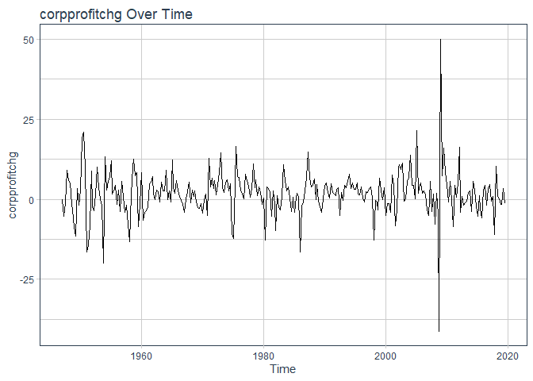

### 10yr - 3mo Treasury

``` r
ID = "T10Y3M"

treas10yr3mo = tqw_get_fred(ID = ID, from = from)
treas10yr3mo %>% glimpse()
```

    ## Observations: 9,973
    ## Variables: 2
    ## $ date  <date> 1982-01-04, 1982-01-05, 1982-01-06, 1982-01-07, 1982-01...
    ## $ price <dbl> 2.32, 2.24, 2.43, 2.46, 2.50, 2.32, 2.10, 2.13, 1.53, 2....

``` r
treas10yr3mo = treas10yr3mo %>%    
    tq_transmute(mutate_fun = to.period,
                 period = aggregate.period, 
                 indexAt = index.at,
                 col_rename = "treas10yr3mo")
```

    ## Warning in fun_transmute(., OHLC = FALSE, ...): missing values removed from
    ## data

``` r
treas10yr3mo %>% glimpse()
```

    ## Observations: 153
    ## Variables: 2
    ## $ date         <yearqtr> 1982 Q1, 1982 Q2, 1982 Q3, 1982 Q4, 1983 Q1, ...
    ## $ treas10yr3mo <dbl> 0.19, 1.08, 3.85, 2.16, 1.66, 1.81, 2.40, 2.49, 2...

``` r
treas10yr3mo %>%
    ggplot(aes(x = date, y = treas10yr3mo)) +
    geom_line() +
    #labs(title = title, y = y_label, x = x_label) + 
    theme_tq()
```

    ## Don't know how to automatically pick scale for object of type yearqtr. Defaulting to continuous.

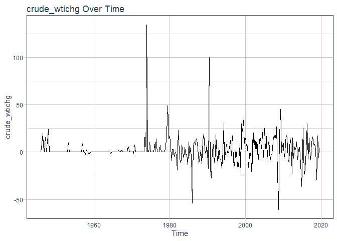

### Federal Funds Interest Rate

``` r
ID = "FEDFUNDS"

fedintrate = tqw_get_fred(ID = ID, from = from)
fedintrate %>% glimpse()
```

    ## Observations: 788
    ## Variables: 2
    ## $ date  <date> 1954-07-01, 1954-08-01, 1954-09-01, 1954-10-01, 1954-11...
    ## $ price <dbl> 0.80, 1.22, 1.06, 0.85, 0.83, 1.28, 1.39, 1.29, 1.35, 1....

``` r
fedintrate = fedintrate %>%    
    tq_transmute(mutate_fun = to.period,
                 period = aggregate.period, 
                 indexAt = index.at,
                 col_rename = "fedintrate")

fedintrate %>% glimpse()
```

    ## Observations: 263
    ## Variables: 2
    ## $ date       <yearqtr> 1954 Q3, 1954 Q4, 1955 Q1, 1955 Q2, 1955 Q3, 19...
    ## $ fedintrate <dbl> 1.06, 1.28, 1.35, 1.64, 2.18, 2.48, 2.50, 2.71, 2.9...

``` r
fedintrate %>%
    ggplot(aes(x = date, y = fedintrate)) +
    geom_line() +
    #labs(title = title, y = y_label, x = x_label) + 
    theme_tq()
```

    ## Don't know how to automatically pick scale for object of type yearqtr. Defaulting to continuous.

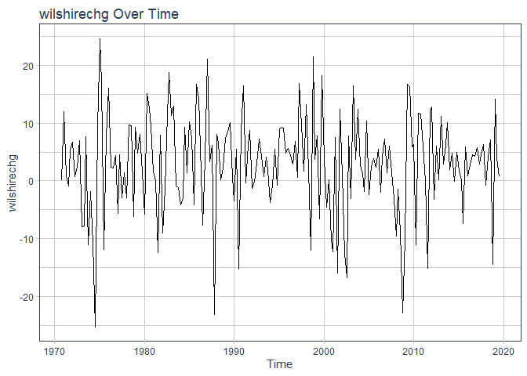

### 3 month LIBOR

``` r
ID = "USD3MTD156N"

libor3mo = tqw_get_fred(ID = ID, from = from)
libor3mo %>% glimpse()
```

    ## Observations: 8,925
    ## Variables: 2
    ## $ date  <date> 1986-01-02, 1986-01-03, 1986-01-06, 1986-01-07, 1986-01...
    ## $ price <dbl> 8.0000, 8.0625, 8.1250, 8.1250, 8.0000, 8.1875, 8.2500, ...

``` r
libor3mo = libor3mo %>%    
    tq_transmute(mutate_fun = to.period,
                 period = aggregate.period, 
                 indexAt = index.at,
                 col_rename = "libor3mo")
```

    ## Warning in fun_transmute(., OHLC = FALSE, ...): missing values removed from
    ## data

``` r
libor3mo %>% glimpse()
```

    ## Observations: 137
    ## Variables: 2
    ## $ date     <yearqtr> 1986 Q1, 1986 Q2, 1986 Q3, 1986 Q4, 1987 Q1, 1987...
    ## $ libor3mo <dbl> 7.43750, 6.87500, 6.12500, 6.43750, 6.68750, 7.18750,...

``` r
libor3mo %>%
    ggplot(aes(x = date, y = libor3mo)) +
    geom_line() +
    #labs(title = title, y = y_label, x = x_label) + 
    theme_tq()
```

    ## Don't know how to automatically pick scale for object of type yearqtr. Defaulting to continuous.


CONSUMER RELATED
----------------

### Real Disposable Personal Income Change

``` r
ID = "A067RO1Q156NBEA"

personincomechg = tqw_get_fred(ID = ID, from = from)
personincomechg %>% glimpse()
```

    ## Observations: 288
    ## Variables: 2
    ## $ date  <date> 1948-01-01, 1948-04-01, 1948-07-01, 1948-10-01, 1949-01...
    ## $ price <dbl> 2.1, 6.3, 5.2, 7.3, 3.3, 0.7, -0.3, -0.3, 9.6, 8.7, 9.4,...

``` r
personincomechg = personincomechg %>%    
    tq_transmute(mutate_fun = to.period,
                 period = aggregate.period, 
                 indexAt = index.at,
                 col_rename = "personincomechg")

personincomechg %>% glimpse()
```

    ## Observations: 288
    ## Variables: 2
    ## $ date            <yearqtr> 1948 Q1, 1948 Q2, 1948 Q3, 1948 Q4, 1949 Q...
    ## $ personincomechg <dbl> 2.1, 6.3, 5.2, 7.3, 3.3, 0.7, -0.3, -0.3, 9.6,...

``` r
personincomechg %>%
    ggplot(aes(x = date, y = personincomechg)) +
    geom_line() +
    #labs(title = title, y = y_label, x = x_label) + 
    theme_tq()
```

    ## Don't know how to automatically pick scale for object of type yearqtr. Defaulting to continuous.

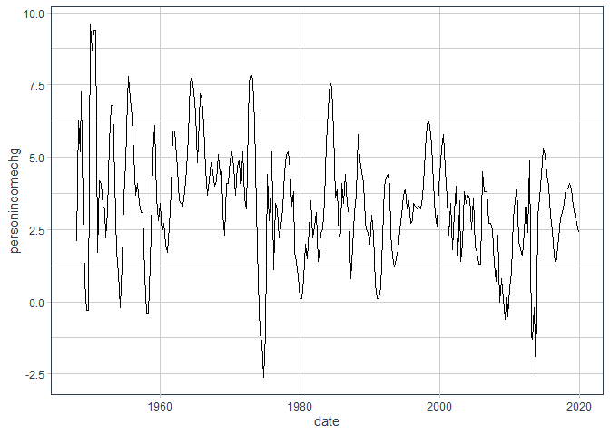

### Consumer Price Index (inflation)

``` r
ID = "CPIAUCNS"

cpi = tqw_get_fred(ID = ID, from = from)
cpi %>% glimpse()
```

    ## Observations: 1,286
    ## Variables: 2
    ## $ date  <date> 1913-01-01, 1913-02-01, 1913-03-01, 1913-04-01, 1913-05...
    ## $ price <dbl> 9.8, 9.8, 9.8, 9.8, 9.7, 9.8, 9.9, 9.9, 10.0, 10.0, 10.1...

``` r
cpichg = cpi %>%  
  tq_transmute(mutate_fun = periodReturn,  # Note this is different from others as I am converting raw values to % changes
                 period = "quarterly", 
                 col_rename = "cpichg") %>% 
  mutate(cpichg = cpichg * 100) %>% 
  tq_transmute(mutate_fun = to.period,
                 period = aggregate.period, 
                 indexAt = index.at,
                 col_rename = "cpichg")

cpichg %>% glimpse()
```

    ## Observations: 429
    ## Variables: 2
    ## $ date   <yearqtr> 1913 Q1, 1913 Q2, 1913 Q3, 1913 Q4, 1914 Q1, 1914 Q...
    ## $ cpichg <dbl> 0.0000000, 0.0000000, 2.0408163, 0.0000000, -1.0000000,...

``` r
cpichg %>%
    ggplot(aes(x = date, y = cpichg)) +
    geom_line() +
    #labs(title = title, y = y_label, x = x_label) + 
    theme_tq()
```

    ## Don't know how to automatically pick scale for object of type yearqtr. Defaulting to continuous.

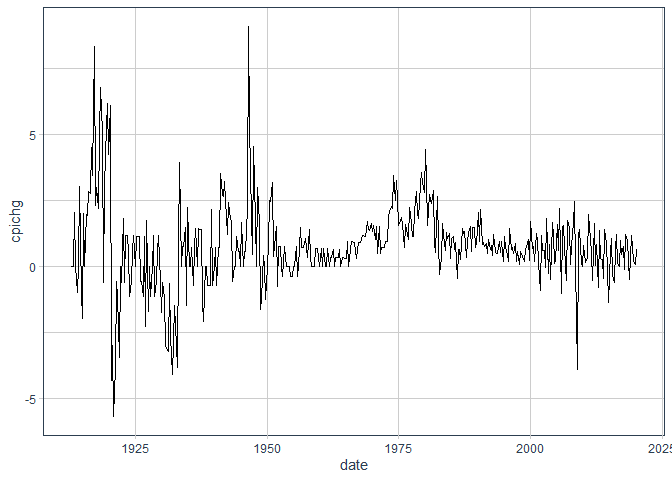

### Population

``` r
ID = "POPTHM"

population = tqw_get_fred(ID = ID, from = from)
population %>% glimpse()
```

    ## Observations: 733
    ## Variables: 2
    ## $ date  <date> 1959-01-01, 1959-02-01, 1959-03-01, 1959-04-01, 1959-05...
    ## $ price <int> 175818, 176044, 176274, 176503, 176723, 176954, 177208, ...

``` r
popchg = population %>%  
  tq_transmute(mutate_fun = periodReturn,  # Note this is different from others as I am converting raw values to % changes
                 period = "quarterly", 
                 col_rename = "popchg") %>% 
  mutate(popchg = popchg * 100) %>% 
  tq_transmute(mutate_fun = to.period,
                 period = aggregate.period, 
                 indexAt = index.at,
                 col_rename = "popchg")

popchg %>% glimpse()
```

    ## Observations: 245
    ## Variables: 2
    ## $ date   <yearqtr> 1959 Q1, 1959 Q2, 1959 Q3, 1959 Q4, 1960 Q1, 1960 Q...
    ## $ popchg <dbl> 0.2593591, 0.3857631, 0.4526600, 0.4213665, 0.6739345, ...

``` r
popchg %>%
    ggplot(aes(x = date, y = popchg)) +
    geom_line() +
    #labs(title = title, y = y_label, x = x_label) + 
    theme_tq()
```

    ## Don't know how to automatically pick scale for object of type yearqtr. Defaulting to continuous.

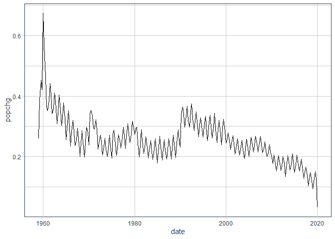

BUSINESS ENVIRONMENT
--------------------

### Corporate Profits

``` r
ID = "CP"

corpprofit = tqw_get_fred(ID = ID, from = from)
corpprofit %>% glimpse()
```

    ## Observations: 291
    ## Variables: 2
    ## $ date  <date> 1947-01-01, 1947-04-01, 1947-07-01, 1947-10-01, 1948-01...
    ## $ price <dbl> 21.970, 20.788, 20.564, 22.451, 23.739, 24.941, 24.551, ...

``` r
corpprofitchg = corpprofit %>%    
  tq_transmute(mutate_fun = periodReturn,  # Note this is different from others as I am converting raw values to % changes
                 period = "quarterly", 
                 col_rename = "corpprofitchg") %>% 
  mutate(corpprofitchg = corpprofitchg * 100) %>% 
  tq_transmute(mutate_fun = to.period,
                 period = aggregate.period, 
                 indexAt = index.at,
                 col_rename = "corpprofitchg")

corpprofitchg %>% glimpse()
```

    ## Observations: 291
    ## Variables: 2
    ## $ date          <yearqtr> 1947 Q1, 1947 Q2, 1947 Q3, 1947 Q4, 1948 Q1,...
    ## $ corpprofitchg <dbl> 0.000000, -5.380064, -1.077545, 9.176230, 5.7369...

``` r
corpprofitchg %>%
    ggplot(aes(x = date, y = corpprofitchg)) +
    geom_line() +
    #labs(title = title, y = y_label, x = x_label) + 
    theme_tq()
```

    ## Don't know how to automatically pick scale for object of type yearqtr. Defaulting to continuous.

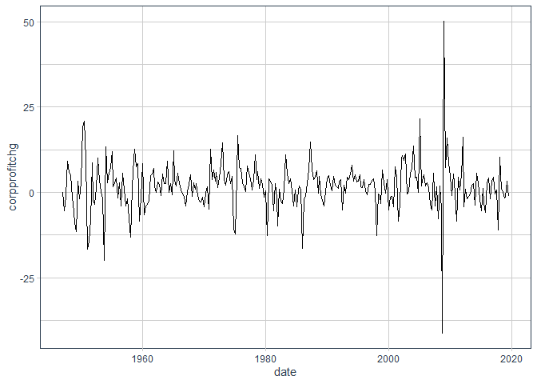

### Crude Oil

``` r
ID = "WTISPLC"

crude_wti = tqw_get_fred(ID = ID, from = from)
crude_wti %>% glimpse()
```

    ## Observations: 889
    ## Variables: 2
    ## $ date  <date> 1946-01-01, 1946-02-01, 1946-03-01, 1946-04-01, 1946-05...
    ## $ price <dbl> 1.17, 1.17, 1.17, 1.27, 1.27, 1.27, 1.27, 1.52, 1.52, 1....

``` r
crude_wtichg = crude_wti %>%    
  tq_transmute(mutate_fun = periodReturn,  # Note this is different from others as I am converting raw values to % changes
                 period = "quarterly", 
                 col_rename = "crude_wtichg") %>% 
  mutate(crude_wtichg = crude_wtichg * 100) %>% 
  tq_transmute(mutate_fun = to.period,
                 period = aggregate.period, 
                 indexAt = index.at,
                 col_rename = "crude_wtichg")

crude_wtichg %>% glimpse()
```

    ## Observations: 297
    ## Variables: 2
    ## $ date         <yearqtr> 1946 Q1, 1946 Q2, 1946 Q3, 1946 Q4, 1947 Q1, ...
    ## $ crude_wtichg <dbl> 0.000000, 8.547009, 19.685039, 6.578947, 0.000000...

``` r
crude_wtichg %>%
    ggplot(aes(x = date, y = crude_wtichg)) +
    geom_line() +
    #labs(title = title, y = y_label, x = x_label) + 
    theme_tq()
```

    ## Don't know how to automatically pick scale for object of type yearqtr. Defaulting to continuous.

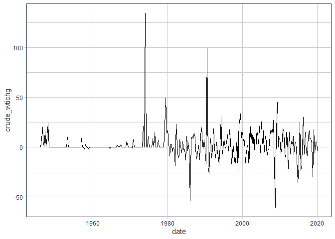

### Producer Price Index

``` r
ID = "PPIACO"

ppi = tqw_get_fred(ID = ID, from = from)
ppi %>% glimpse()
```

    ## Observations: 1,286
    ## Variables: 2
    ## $ date  <date> 1913-01-01, 1913-02-01, 1913-03-01, 1913-04-01, 1913-05...
    ## $ price <dbl> 12.1, 12.0, 12.0, 12.0, 11.9, 11.9, 12.0, 12.0, 12.2, 12...

``` r
ppichg = ppi %>%    
  tq_transmute(mutate_fun = periodReturn,  # Note this is different from others as I am converting raw values to % changes
                 period = "quarterly", 
                 col_rename = "ppichg") %>% 
  mutate(ppichg = ppichg * 100) %>% 
  tq_transmute(mutate_fun = to.period,
                 period = aggregate.period, 
                 indexAt = index.at,
                 col_rename = "ppichg")

ppichg %>% glimpse()
```

    ## Observations: 429
    ## Variables: 2
    ## $ date   <yearqtr> 1913 Q1, 1913 Q2, 1913 Q3, 1913 Q4, 1914 Q1, 1914 Q...
    ## $ ppichg <dbl> -0.8264463, -0.8333333, 2.5210084, -2.4590164, -1.68067...

``` r
ppichg %>%
    ggplot(aes(x = date, y = ppichg)) +
    geom_line() +
    #labs(title = title, y = y_label, x = x_label) + 
    theme_tq()
```

    ## Don't know how to automatically pick scale for object of type yearqtr. Defaulting to continuous.

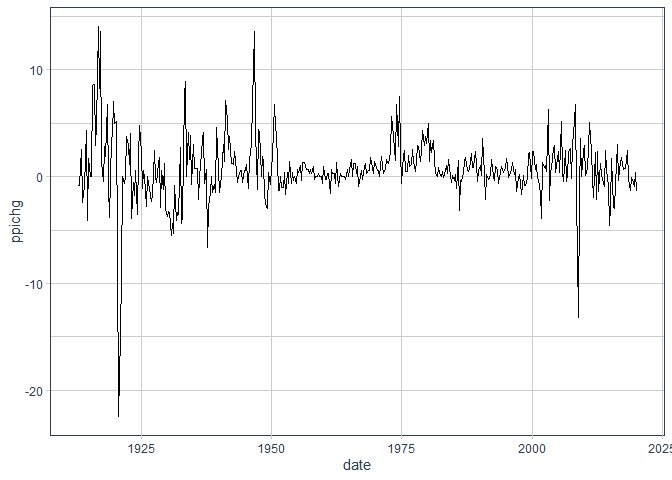

MACRO ECONOMIC FACTORS
----------------------

### Gold

``` r
ID = "GOLDAMGBD228NLBM"

gold = tqw_get_fred(ID = ID, from = from)
gold %>% glimpse()
```

    ## Observations: 13,563
    ## Variables: 2
    ## $ date  <date> 1968-04-01, 1968-04-02, 1968-04-03, 1968-04-04, 1968-04...
    ## $ price <dbl> 38.00, 37.60, 37.70, 36.70, 37.20, 37.00, 37.25, 37.60, ...

``` r
goldchg = gold %>%    
  tq_transmute(mutate_fun = periodReturn,  # Note this is different from others as I am converting raw values to % changes
                 period = "quarterly", 
                 col_rename = "goldchg") %>% 
  mutate(goldchg = goldchg * 100) %>% 
  tq_transmute(mutate_fun = to.period,
                 period = aggregate.period, 
                 indexAt = index.at,
                 col_rename = "goldchg")
```

    ## Warning in to_period(xx, period = on.opts[[period]], ...): missing values
    ## removed from data

``` r
goldchg %>% glimpse()
```

    ## Observations: 208
    ## Variables: 2
    ## $ date    <yearqtr> 1968 Q2, 1968 Q3, 1968 Q4, 1969 Q1, 1969 Q2, 1969 ...
    ## $ goldchg <dbl> 7.7631579, -3.0525031, 5.6675063, 2.7413588, -4.350348...

``` r
goldchg %>%
    ggplot(aes(x = date, y = goldchg)) +
    geom_line() +
    #labs(title = title, y = y_label, x = x_label) + 
    theme_tq()
```

    ## Don't know how to automatically pick scale for object of type yearqtr. Defaulting to continuous.

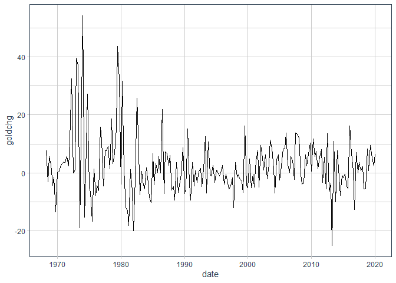

### Exchange Rate

#### China

``` r
ID = "EXCHUS"

china = tqw_get_fred(ID = ID, from = from)
china %>% glimpse()
```

    ## Observations: 470
    ## Variables: 2
    ## $ date  <date> 1981-01-01, 1981-02-01, 1981-03-01, 1981-04-01, 1981-05...
    ## $ price <dbl> 1.5518, 1.6131, 1.6314, 1.6660, 1.7270, 1.7605, 1.7647, ...

``` r
japanchg = china %>% 
  tq_transmute(mutate_fun = periodReturn,  # Note this is different from others as I am converting raw values to % changes
                 period = "quarterly", 
                 col_rename = "japanchg") %>% 
  mutate(japanchg = japanchg * 100) %>% 
  tq_transmute(mutate_fun = to.period,
                 period = aggregate.period, 
                 indexAt = index.at,
                 col_rename = "japanchg")
 
japanchg %>% glimpse()
```

    ## Observations: 157
    ## Variables: 2
    ## $ date     <yearqtr> 1981 Q1, 1981 Q2, 1981 Q3, 1981 Q4, 1982 Q1, 1982...
    ## $ japanchg <dbl> 5.1295270, 7.9134486, -0.3578529, -0.7809828, 5.88336...

``` r
japanchg %>%
    ggplot(aes(x = date, y = japanchg)) +
    geom_line() +
    #labs(title = title, y = y_label, x = x_label) + 
    theme_tq()
```

    ## Don't know how to automatically pick scale for object of type yearqtr. Defaulting to continuous.

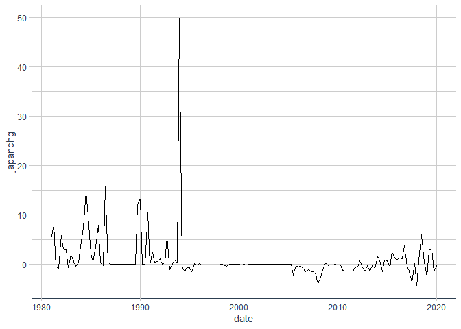

#### Japan

``` r
ID = "EXJPUS"

japan = tqw_get_fred(ID = ID, from = from)
japan %>% glimpse()
```

    ## Observations: 590
    ## Variables: 2
    ## $ date  <date> 1971-01-01, 1971-02-01, 1971-03-01, 1971-04-01, 1971-05...
    ## $ price <dbl> 358.0200, 357.5450, 357.5187, 357.5032, 357.4130, 357.41...

``` r
japanchg = japan %>%    
  tq_transmute(mutate_fun = periodReturn,  # Note this is different from others as I am converting raw values to % changes
                 period = "quarterly", 
                 col_rename = "japanchg") %>% 
  mutate(japanchg = japanchg * 100) %>% 
  tq_transmute(mutate_fun = to.period,
                 period = aggregate.period, 
                 indexAt = index.at,
                 col_rename = "japanchg")

japanchg %>% glimpse()
```

    ## Observations: 197
    ## Variables: 2
    ## $ date     <yearqtr> 1971 Q1, 1971 Q2, 1971 Q3, 1971 Q4, 1972 Q1, 1972...
    ## $ japanchg <dbl> -0.14002011, -0.02990053, -5.42533850, -5.30981803, -...

``` r
japanchg %>%
    ggplot(aes(x = date, y = japanchg)) +
    geom_line() +
    #labs(title = title, y = y_label, x = x_label) + 
    theme_tq()
```

    ## Don't know how to automatically pick scale for object of type yearqtr. Defaulting to continuous.

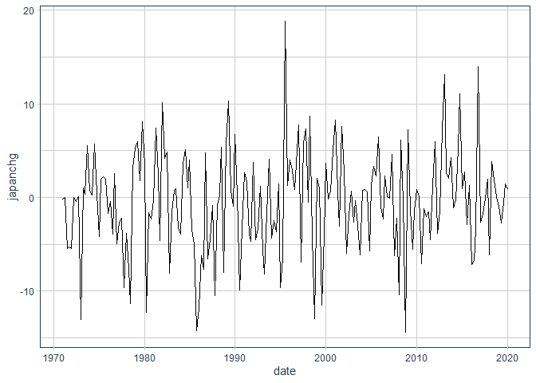

#### UK

``` r
ID = "EXUSUK"

uk = tqw_get_fred(ID = ID, from = from)
uk %>% glimpse()
```

    ## Observations: 590
    ## Variables: 2
    ## $ date  <date> 1971-01-01, 1971-02-01, 1971-03-01, 1971-04-01, 1971-05...
    ## $ price <dbl> 2.4058, 2.4178, 2.4187, 2.4179, 2.4187, 2.4188, 2.4185, ...

``` r
ukchg = uk %>%  
  tq_transmute(mutate_fun = periodReturn,  # Note this is different from others as I am converting raw values to % changes
               period = "quarterly", 
               col_rename = "ukchg") %>% 
  mutate(ukchg = ukchg * 100) %>% 
  tq_transmute(mutate_fun = to.period,
                 period = aggregate.period, 
                 indexAt = index.at,
                 col_rename = "ukchg")

ukchg %>% glimpse()
```

    ## Observations: 197
    ## Variables: 2
    ## $ date  <yearqtr> 1971 Q1, 1971 Q2, 1971 Q3, 1971 Q4, 1972 Q1, 1972 Q2...
    ## $ ukchg <dbl> 0.536204173, 0.004134452, 2.091946420, 2.316352150, 3.62...

``` r
ukchg %>%
    ggplot(aes(x = date, y = ukchg)) +
    geom_line() +
    #labs(title = title, y = y_label, x = x_label) + 
    theme_tq()
```

    ## Don't know how to automatically pick scale for object of type yearqtr. Defaulting to continuous.

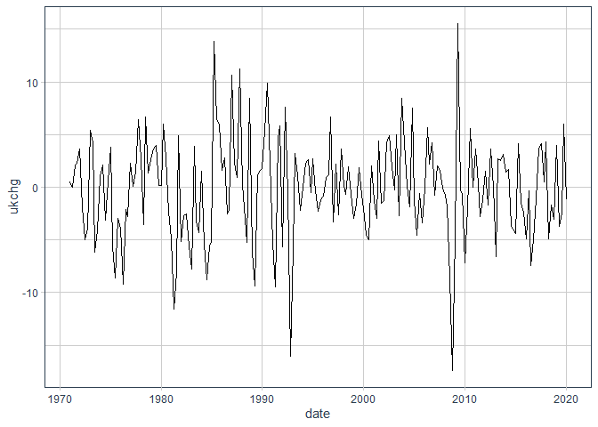

Merge Data
==========

``` r
dfs = list(gdp_change = gdp_change,
           labor_unrate = unrate,
           labor_nfjobschg = nfjobschg,
           monitory_treas10yr = treas10yr,
           # monitory_treas3mo = treas3mo,
           # monitory_treas10yr3mo = treas10yr3mo,
           monitory_fedintrate = fedintrate,
           # monitory_libor3mo = libor3mo,
           consumer_personincomechg = personincomechg,
           consumer_cpichg = cpichg,
           consumer_popchg = popchg,
           business_corpprofitchg = corpprofitchg,
           business_crude_wtichg = crude_wtichg,
           business_ppichg = ppichg,
           macro_goldchg = goldchg,
           macro_exc_japanchg = japanchg,
           # macro_exc_chinachg = chinachg,
           macro_exc_ukchg = ukchg
           )

for (i in 1:length(dfs)){
  print(paste0("Number of observations in ", names(dfs[i]), " = ", nrow(dfs[[i]])))
}
```

    ## [1] "Number of observations in gdp_change = 291"
    ## [1] "Number of observations in labor_unrate = 289"
    ## [1] "Number of observations in labor_nfjobschg = 325"
    ## [1] "Number of observations in monitory_treas10yr = 233"
    ## [1] "Number of observations in monitory_fedintrate = 263"
    ## [1] "Number of observations in consumer_personincomechg = 288"
    ## [1] "Number of observations in consumer_cpichg = 429"
    ## [1] "Number of observations in consumer_popchg = 245"
    ## [1] "Number of observations in business_corpprofitchg = 291"
    ## [1] "Number of observations in business_crude_wtichg = 297"
    ## [1] "Number of observations in business_ppichg = 429"
    ## [1] "Number of observations in macro_goldchg = 208"
    ## [1] "Number of observations in macro_exc_japanchg = 197"
    ## [1] "Number of observations in macro_exc_ukchg = 197"

``` r
# We may want to remove some of these variables if that is reducing the number of observations 
# and is already highly correlated to other features. Example: libor3mo is related to fedintrate
```

``` r
data = join_all(dfs, by='date', type='full') %>% 
  arrange(date) %>% 
  drop_na()
  
data %>% glimpse()
```

    ## Observations: 195
    ## Variables: 15
    ## $ date            <yearqtr> 1971 Q1, 1971 Q2, 1971 Q3, 1971 Q4, 1972 Q...
    ## $ gdp_change      <dbl> 18.2, 7.7, 7.6, 4.4, 14.3, 12.1, 7.9, 12.4, 15...
    ## $ unrate          <dbl> 6.0, 5.9, 6.0, 6.0, 5.8, 5.7, 5.5, 5.2, 4.9, 4...
    ## $ nfjobschg       <dbl> 0.096056052, 0.556025967, 0.505234794, 0.69120...
    ## $ treas10yr       <dbl> 5.53, 6.70, 6.00, 5.89, 6.12, 6.15, 6.54, 6.41...
    ## $ fedintrate      <dbl> 3.71, 4.91, 5.55, 4.14, 3.83, 4.46, 4.87, 5.33...
    ## $ personincomechg <dbl> 4.7, 4.9, 3.8, 5.2, 3.6, 3.2, 4.7, 7.6, 7.9, 7...
    ## $ cpichg          <dbl> 0.5025126, 1.5000000, 0.4926108, 0.7352941, 0....
    ## $ popchg          <dbl> 0.2946422, 0.2908775, 0.3218315, 0.2876627, 0....
    ## $ corpprofitchg   <dbl> 12.7497657, 3.7704482, 6.6068568, 3.2925583, 5...
    ## $ crude_wtichg    <dbl> 0.0000000, 0.0000000, 0.0000000, 0.0000000, 0....
    ## $ ppichg          <dbl> 1.8867925, 1.0582011, 0.2617801, 0.7832898, 1....
    ## $ goldchg         <dbl> 3.8127090, 3.6082474, 5.6592040, 2.4131842, 11...
    ## $ japanchg        <dbl> -0.14002011, -0.02990053, -5.42533850, -5.3098...
    ## $ ukchg           <dbl> 0.536204173, 0.004134452, 2.091946420, 2.31635...

``` r
data %>% skim()
```

    ## Warning: No summary functions for vectors of class: yearqtr.
    ## Coercing to character

    ## Skim summary statistics
    ##  n obs: 195 
    ##  n variables: 15 
    ## 
    ## -- Variable type:character -----------------------------------------------------
    ##  variable missing complete   n min max empty n_unique
    ##      date       0      195 195   7   7     0      195
    ## 
    ## -- Variable type:numeric -------------------------------------------------------
    ##         variable missing complete   n  mean     sd      p0    p25   p50
    ##    corpprofitchg       0      195 195  2.09  7.12  -41.16  -0.6    2.21
    ##           cpichg       0      195 195  0.97  0.99   -3.91   0.44   0.87
    ##     crude_wtichg       0      195 195  2.95 18.5   -60.52  -5.82   0   
    ##       fedintrate       0      195 195  5.14  3.96    0.07   1.78   5.25
    ##       gdp_change       0      195 195  6.39  4.1    -7.2    4.2    5.7 
    ##          goldchg       0      195 195  2.42 10.65  -24.91  -4.14   0.94
    ##         japanchg       0      195 195 -0.47  5.39  -14.36  -3.86  -0.12
    ##        nfjobschg       0      195 195  0.39  0.53   -1.73   0.22   0.43
    ##  personincomechg       0      195 195  2.95  1.85   -2.6    1.85   3.1 
    ##           popchg       0      195 195  0.24  0.055   0.092  0.2    0.24
    ##           ppichg       0      195 195  0.89  2.11  -13.2   -0.099  0.7 
    ##        treas10yr       0      195 195  6.3   3.11    1.49   3.85   6.15
    ##            ukchg       0      195 195 -0.23  4.74  -17.35  -3.07  -0.11
    ##           unrate       0      195 195  6.24  1.6     3.5    5      5.9 
    ##    p75   p100     hist
    ##   4.69  50.08 <U+2581><U+2581><U+2581><U+2587><U+2583><U+2581><U+2581><U+2581>
    ##   1.48   4.43 <U+2581><U+2581><U+2581><U+2583><U+2587><U+2583><U+2581><U+2581>
    ##  10.33 134.57 <U+2581><U+2581><U+2587><U+2582><U+2581><U+2581><U+2581><U+2581>
    ##   7.39  19.1  <U+2587><U+2585><U+2587><U+2583><U+2582><U+2581><U+2581><U+2581>
    ##   8     25.5  <U+2581><U+2581><U+2587><U+2587><U+2582><U+2581><U+2581><U+2581>
    ##   6.74  54.12 <U+2581><U+2583><U+2587><U+2585><U+2581><U+2581><U+2581><U+2581>
    ##   2.61  18.8  <U+2581><U+2582><U+2585><U+2587><U+2585><U+2582><U+2581><U+2581>
    ##   0.68   1.74 <U+2581><U+2581><U+2581><U+2582><U+2587><U+2587><U+2582><U+2581>
    ##   3.95   7.9  <U+2581><U+2581><U+2582><U+2586><U+2587><U+2583><U+2581><U+2581>
    ##   0.27   0.37 <U+2581><U+2582><U+2585><U+2587><U+2587><U+2586><U+2582><U+2581>
    ##   2.16   7.5  <U+2581><U+2581><U+2581><U+2581><U+2582><U+2587><U+2582><U+2581>
    ##   8.03  15.84 <U+2587><U+2586><U+2587><U+2587><U+2583><U+2582><U+2582><U+2581>
    ##   2.64  15.52 <U+2581><U+2581><U+2582><U+2586><U+2587><U+2583><U+2581><U+2581>
    ##   7.3   10.8  <U+2583><U+2586><U+2587><U+2583><U+2585><U+2582><U+2582><U+2581>

``` r
head(data)
```

    ##        date gdp_change unrate  nfjobschg treas10yr fedintrate
    ## 233 1971 Q1       18.2    6.0 0.09605605      5.53       3.71
    ## 234 1971 Q2        7.7    5.9 0.55602597      6.70       4.91
    ## 235 1971 Q3        7.6    6.0 0.50523479      6.00       5.55
    ## 236 1971 Q4        4.4    6.0 0.69120563      5.89       4.14
    ## 237 1972 Q1       14.3    5.8 1.15796919      6.12       3.83
    ## 238 1972 Q2       12.1    5.7 1.11592454      6.15       4.46
    ##     personincomechg    cpichg    popchg corpprofitchg crude_wtichg
    ## 233             4.7 0.5025126 0.2946422     12.749766            0
    ## 234             4.9 1.5000000 0.2908775      3.770448            0
    ## 235             3.8 0.4926108 0.3218315      6.606857            0
    ## 236             5.2 0.7352941 0.2876627      3.292558            0
    ## 237             3.6 0.7299270 0.2250645      5.892195            0
    ## 238             3.2 0.7246377 0.2446261      1.428866            0
    ##        ppichg   goldchg    japanchg        ukchg
    ## 233 1.8867925  3.812709 -0.14002011  0.536204173
    ## 234 1.0582011  3.608247 -0.02990053  0.004134452
    ## 235 0.2617801  5.659204 -5.42533850  2.091946420
    ## 236 0.7832898  2.413184 -5.30981803  2.316352150
    ## 237 1.5544041 11.206897 -5.47881778  3.621467585
    ## 238 1.2755102 32.506460 -0.04032571 -1.871586265

``` r
tail(data)
```

    ##        date gdp_change unrate nfjobschg treas10yr fedintrate
    ## 422 2018 Q2        7.1    4.0 0.4276444      2.85       1.82
    ## 423 2018 Q3        4.8    3.7 0.3089571      3.05       1.95
    ## 424 2018 Q4        2.9    3.9 0.3461714      2.69       2.27
    ## 425 2019 Q1        3.9    3.8 0.2782504      2.41       2.41
    ## 426 2019 Q2        4.7    3.7 0.3174033      2.00       2.38
    ## 427 2019 Q3        3.8    3.5 0.4039560      1.68       2.04
    ##     personincomechg     cpichg     popchg corpprofitchg crude_wtichg
    ## 422             3.9  0.9757407 0.12559851     0.9507799     8.193847
    ## 423             4.1  0.1785792 0.14716366     0.1634533     3.477236
    ## 424             3.9 -0.4777392 0.12036856    -1.5463943   -29.488822
    ## 425             3.3  1.1817715 0.09245641    -1.5322271    17.427302
    ## 426             3.0  0.7635660 0.11553997     3.3161893    -6.001720
    ## 427             2.7  0.2404907 0.15011997    -1.2422698     4.189535
    ##          ppichg   goldchg   japanchg     ukchg
    ## 422  2.45860512 -5.540449  3.7879502 -4.879794
    ## 423 -0.29382958 -5.361641  1.8476556 -1.715059
    ## 424 -1.27701375  8.293198  0.0909923 -3.076688
    ## 425 -0.09950249  0.741232 -0.9403794  3.971889
    ## 426 -0.24900398  9.452813 -2.7673934 -3.736614
    ## 427 -0.94857713  5.264648 -0.4890417 -2.414201

-   But wait. We need to predict the GDP in the future quarters using data available in this quarter.
-   So we may need to change the gdp column to a lagged gdp column (for next quarter). We will evaluate how to do this.

``` r
write.csv(data, "../data/economic_indicators_all_ex_3mo_china.csv", row.names = FALSE)
```

TODO
====

Questions for Dr. Sadler
------------------------

1.  Some data is quarterly and some if monthly. How do we not lose the monthly granularity and still use the quarterly data? Is this still possible, since our output (GDP) is measured quarterly, i.e. our can we predict quarterly data using monthly frequency of certain variables?
2.  If we expect certain predictors to themselves be non-stationary (such as $ corporate profits), should we convert this to a stationary signal such as % change from las period?
3.  When collecting the data (predictors), some are seasonally adjusted and some are not. If we have a choice, which one should we pick? Does it matter?

Things to Consider
------------------

1.  Consider removing the data related to the 3mo Treasury Rate (since it only has 137 quarterly observations) and China Exchange Rate (it only has &lt; 160 quarterly observations and also this data was controlled artificially for a while). If we remove these we can increase our dataset to close to 200 observations (almost 50% increase).

Data Collection
---------------

1.  See if the value used during the resampling can be converted to the median value during that period.

-   <https://cran.r-project.org/web/packages/tidyquant/vignettes/TQ02-quant-integrations-in-tidyquant.html#example-2-use-xts-to.period-to-change-the-periodicity-from-daily-to-monthly>

<!-- -->

    unrate2 = unrate %>%    
        tq_transmute(mutate_fun = apply.quarterly,
                     indexAt = index.at,
                     FUN = median,
                     col_rename = "unrate") %>% 
        mutate(date = paste0(year(date), " Q", quarter(date))) 
    # Need to convert date to type 'datetime'

    unrate2 %>% glimpse()

EDA
---

1.  Plot correlation plots with lagged variables to gain insight into what features might be useful predictors.

Model Analysis
--------------

1.  If I take GDP data from way back (1946), the resultsfor ARMA and ARIMA analysis are very different (spectral densities, etc). So, while fitting, should we not do something like 5 fold cross validation?
2.  Use Rolling Window to calculate the ASE inistead of just the last n values. This will give a more robust estimate.
